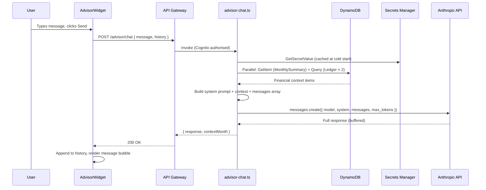

# Design Document — AI Financial Advisor

## Overview

This design covers the AI Financial Advisor: a single Lambda handler (`advisor-chat.ts`) and a frontend `AdvisorWidget` component. The handler fetches financial context from DynamoDB, constructs a prompt with a financial advisor system prompt, calls the Anthropic API synchronously, and returns the full response as a buffered JSON body.

The implementation is deliberately simple. There is no streaming, no tool use, no agent loop, and no server-side conversation storage. The frontend owns conversation history and sends it with every request. The Lambda is fully stateless.

## Architecture



### Key Design Decisions

1. **Buffered response, not streaming** — Lambda response streaming through API Gateway REST API requires: a different invocation URI (`/response-streaming-invocations`), a `responseTransferMode: "STREAM"` property on the CDK integration, special handler signature (`awslambda.streamifyResponse`), and incompatibility with the existing Cognito User Pool Authorizer approach. For a personal finance app where responses are 200–400 words, the perceptible difference between streaming and buffered is seconds — acceptable for v1. The upgrade path (Lambda Function URLs with `RESPONSE_STREAM` invoke mode) is documented at the end of this file.

2. **API key retrieved from Secrets Manager at cold start, cached in module scope** — Calling Secrets Manager inside the handler function on every invocation adds 50–200 ms latency per request and incurs unnecessary API costs. Module-level initialisation runs once per execution environment and is reused for all subsequent invocations in that environment. If the key rotates, a new Lambda deployment (or waiting for the next cold start) picks up the new value.

3. **Financial context fetched in parallel with `Promise.all`** — Three DynamoDB calls (balance summary GetItem, current-month transactions Query, top-categories aggregation) are independent and can proceed concurrently. Total fetch latency is max(t1, t2, t3) rather than t1 + t2 + t3. A failure in any one call propagates immediately rather than silently returning partial data to the model.

4. **Conversation history is client-owned** — Storing multi-turn history in DynamoDB would require a sessions table, a session ID flow, TTL management, and additional IAM grants. For a personal finance app, the conversation context needed is short (a few turns) and session-scoped — the user does not need to resume conversations across device reboots. React state is the correct store.

5. **30 s Lambda timeout with a 25 s Anthropic call timeout** — The 5-second gap allows the handler to catch an Anthropic timeout, log it, and return a structured HTTP 504 rather than letting API Gateway's 29 s integration timeout cut the connection with an unstructured error.

6. **512 MB memory instead of the standard 256 MB** — The Anthropic SDK and the financial context processing require more memory than a simple DynamoDB handler. 512 MB also gives the Lambda more CPU time (Lambda CPU allocation scales proportionally with memory), which reduces the time spent constructing the prompt and processing the response.

7. **`max_tokens: 1024`** — Sufficient for 3–5 paragraphs of financial advice. Keeps response times predictable and costs bounded. If a user asks something that warrants a longer answer, Claude will produce a complete response within this limit rather than truncating mid-sentence (Claude respects response length guidance in the system prompt).

## Backend Component

### File Structure

```
back/lambdas/src/
└── advisor/
    ├── advisor-chat.ts        # Handler entrypoint
    ├── system-prompt.ts       # System prompt constant
    ├── context-fetcher.ts     # DynamoDB context retrieval
    └── prompt-builder.ts      # Context formatting + message construction
```

### `system-prompt.ts`

```typescript
export const SYSTEM_PROMPT = `
You are LASKI Advisor, a professional personal finance advisor embedded in LASKI Finances — a personal finance management app for Brazilian users.

Your role:
- Analyse the user's actual financial data provided below and give specific, grounded, actionable advice.
- Speak directly and concisely. No unnecessary preamble. No filler phrases like "Great question!".
- Respond in the same language as the user's message. If the user writes in Portuguese, respond in Portuguese.
- Limit responses to 3–5 paragraphs unless a structured list or table is genuinely more helpful for that specific question.
- Avoid excessive disclaimers. You are a knowledgeable advisor, not a liability-averse chatbot.

Data you have access to (injected below as JSON):
- Current month balance: total income, total expenses, net balance, transaction count.
- Current month transactions: up to 50 most recent entries with date, description, amount, type (INC/EXP), category, and source.
- Top 5 expense categories for the current month with totals and shares.

Rules you must follow:
- Only reference amounts, categories, sources, and dates that appear in the data below. Never invent numbers.
- If the user asks about data you do not have (a different month, a specific transaction not in the list, historical trends), say explicitly: "I don't have that information in the current context."
- If the data shows no transactions, acknowledge this and suggest the user start recording their income and expenses.
- Income entries have type "INC". Expense entries have type "EXP". Installment purchases appear as multiple entries sharing a groupId.
- Amounts are in Brazilian Reais (BRL).

Financial context for this user:
{{FINANCIAL_CONTEXT}}
`.trim();
```

The `{{FINANCIAL_CONTEXT}}` placeholder is replaced by `prompt-builder.ts` before the system prompt is sent to the API.

### `context-fetcher.ts`

```typescript
export interface FinancialContext {
  month: string;               // YYYY-MM
  balance: {
    totalIncome: number;
    totalExpenses: number;
    balance: number;
    transactionCount: number;
  } | null;                    // null if no summary item exists for this month
  transactions: TransactionSummary[];  // up to 50, most recent first
  topCategories: CategorySummary[];    // up to 5
}

interface TransactionSummary {
  date: string;
  description: string;
  amount: number;
  type: 'INC' | 'EXP';
  category: string;
  source: string;
}

interface CategorySummary {
  category: string;
  total: number;
  share: number;
}

export async function fetchFinancialContext(
  client: DynamoDBDocumentClient,
  userId: string,
  month: string
): Promise<FinancialContext> {
  const [balanceResult, transactionResult] = await Promise.all([
    fetchBalanceSummary(client, userId, month),
    fetchRecentTransactions(client, userId, month),
  ]);

  const topCategories = deriveTopCategories(
    transactionResult.filter(t => t.type === 'EXP'),
    5
  );

  return {
    month,
    balance: balanceResult,
    transactions: transactionResult,
    topCategories,
  };
}

async function fetchBalanceSummary(
  client: DynamoDBDocumentClient,
  userId: string,
  month: string
): Promise<FinancialContext['balance']> {
  const result = await client.send(new GetCommand({
    TableName: process.env.SUMMARY_TABLE_NAME,
    Key: { pk: userId, sk: `SUMMARY#${month}` },
  }));

  if (!result.Item) return null;

  const item = result.Item;
  const totalIncome   = (item.totalIncome   as number | undefined) ?? 0;
  const totalExpenses = (item.totalExpenses as number | undefined) ?? 0;
  return {
    totalIncome,
    totalExpenses,
    balance: totalIncome - totalExpenses,
    transactionCount: (item.transactionCount as number | undefined) ?? 0,
  };
}

async function fetchRecentTransactions(
  client: DynamoDBDocumentClient,
  userId: string,
  month: string
): Promise<TransactionSummary[]> {
  const result = await client.send(new QueryCommand({
    TableName: process.env.TABLE_NAME,
    KeyConditionExpression: 'pk = :pk AND begins_with(sk, :prefix)',
    ExpressionAttributeValues: {
      ':pk':     userId,
      ':prefix': `TRANS#${month}#`,
    },
    ScanIndexForward: false,  // most recent first
    Limit: 50,
  }));

  return (result.Items ?? []).map(item => ({
    date:        item.date        as string,
    description: item.description as string,
    amount:      item.amount      as number,
    type:        item.type        as 'INC' | 'EXP',
    category:    item.category    as string,
    source:      item.source      as string,
  }));
}

function deriveTopCategories(
  expenseItems: TransactionSummary[],
  limit: number
): CategorySummary[] {
  const totals = new Map<string, number>();
  for (const item of expenseItems) {
    totals.set(item.category, (totals.get(item.category) ?? 0) + item.amount);
  }
  const totalExpenses = [...totals.values()].reduce((a, b) => a + b, 0);
  return [...totals.entries()]
    .sort(([, a], [, b]) => b - a)
    .slice(0, limit)
    .map(([category, total]) => ({
      category,
      total,
      share: totalExpenses > 0
        ? Math.round((total / totalExpenses) * 10000) / 10000
        : 0,
    }));
}
```

### `prompt-builder.ts`

```typescript
import { SYSTEM_PROMPT } from './system-prompt.js';
import type { FinancialContext } from './context-fetcher.js';

const MAX_CONTEXT_CHARS = 8000;

export function buildSystemPrompt(context: FinancialContext): string {
  const contextJson = formatContext(context);
  const truncated   = truncateToLimit(contextJson, MAX_CONTEXT_CHARS);
  return SYSTEM_PROMPT.replace('{{FINANCIAL_CONTEXT}}', truncated);
}

function formatContext(ctx: FinancialContext): string {
  const obj = {
    month: ctx.month,
    balance: ctx.balance ?? {
      totalIncome: 0, totalExpenses: 0, balance: 0, transactionCount: 0,
    },
    topExpenseCategories: ctx.topCategories,
    recentTransactions: ctx.transactions,
  };
  return JSON.stringify(obj, null, 2);
}

function truncateToLimit(json: string, maxChars: number): string {
  if (json.length <= maxChars) return json;

  // Re-parse and progressively trim the transactions array
  const obj = JSON.parse(json) as {
    recentTransactions: unknown[];
    [key: string]: unknown;
  };

  while (obj.recentTransactions.length > 0) {
    obj.recentTransactions.pop();
    const candidate = JSON.stringify(obj, null, 2);
    if (candidate.length <= maxChars) return candidate;
  }

  // If still over limit with empty transactions (shouldn't happen in practice):
  return JSON.stringify({ ...obj, recentTransactions: [] }, null, 2);
}

export function buildMessages(
  history: ConversationTurn[],
  currentMessage: string
): Anthropic.MessageParam[] {
  const messages: Anthropic.MessageParam[] = history.map(turn => ({
    role:    turn.role,
    content: turn.content,
  }));
  messages.push({ role: 'user', content: currentMessage });
  return messages;
}
```

### `advisor-chat.ts`

```typescript
import Anthropic from '@anthropic-ai/sdk';
import {
  SecretsManagerClient,
  GetSecretValueCommand,
} from '@aws-sdk/client-secrets-manager';
import { DynamoDBClient } from '@aws-sdk/client-dynamodb';
import { DynamoDBDocumentClient } from '@aws-sdk/lib-dynamodb';
import type { APIGatewayProxyEvent, APIGatewayProxyResult } from 'aws-lambda';
import { z } from 'zod';
import { fetchFinancialContext } from './context-fetcher.js';
import { buildSystemPrompt, buildMessages } from './prompt-builder.js';

// ── Module-level initialisation (runs once per execution environment) ─────────

const secretsClient = new SecretsManagerClient({});
const dynamoClient  = DynamoDBDocumentClient.from(new DynamoDBClient({}));

let anthropicClient: Anthropic;

async function getAnthropicClient(): Promise<Anthropic> {
  if (anthropicClient) return anthropicClient;

  const result = await secretsClient.send(new GetSecretValueCommand({
    SecretId: process.env.ANTHROPIC_SECRET_NAME,
  }));

  if (!result.SecretString) {
    throw new Error('ANTHROPIC_SECRET_NAME resolved to empty secret');
  }

  anthropicClient = new Anthropic({ apiKey: result.SecretString });
  return anthropicClient;
}

// ── Zod validation ────────────────────────────────────────────────────────────

const ConversationTurnSchema = z.object({
  role:    z.enum(['user', 'assistant']),
  content: z.string().min(1),
});

const RequestSchema = z.object({
  message: z.string().min(1).max(2000),
  history: z.array(ConversationTurnSchema).max(40),  // 20 turns × 2 roles
});

// ── Handler ───────────────────────────────────────────────────────────────────

export const handler = async (
  event: APIGatewayProxyEvent
): Promise<APIGatewayProxyResult> => {
  try {
    const userId = event.requestContext.authorizer?.claims.sub;
    if (!userId) {
      return { statusCode: 401, body: JSON.stringify({ error: 'Unauthorized' }) };
    }

    // Validate request body
    let parsed: z.infer<typeof RequestSchema>;
    try {
      parsed = RequestSchema.parse(JSON.parse(event.body ?? '{}'));
    } catch {
      return {
        statusCode: 400,
        body: JSON.stringify({ error: 'Invalid request body' }),
      };
    }

    const { message, history } = parsed;

    // Fetch financial context and Anthropic client in parallel
    const month = currentYearMonth();
    const [client, context] = await Promise.all([
      getAnthropicClient(),
      fetchFinancialContext(dynamoClient, `USER#${userId}`, month),
    ]);

    // Build prompt
    const systemPrompt = buildSystemPrompt(context);
    const messages     = buildMessages(history, message);

    // Call Anthropic API with explicit timeout
    const startMs = Date.now();
    const apiResponse = await Promise.race([
      client.messages.create({
        model:      'claude-sonnet-4-6',
        max_tokens: 1024,
        system:     systemPrompt,
        messages,
      }),
      timeoutAfter(25_000),
    ]);

    if (apiResponse === 'TIMEOUT') {
      console.error('Anthropic API timed out after 25s');
      return {
        statusCode: 504,
        body: JSON.stringify({
          error: 'The advisor took too long to respond. Please try again.',
        }),
      };
    }

    const elapsedMs   = Date.now() - startMs;
    const inputTokens  = apiResponse.usage.input_tokens;
    const outputTokens = apiResponse.usage.output_tokens;

    // Log cost metrics only — never log message content
    console.log(JSON.stringify({
      event:        'anthropic_api_call',
      model:        'claude-sonnet-4-6',
      elapsedMs,
      inputTokens,
      outputTokens,
    }));

    const responseText = apiResponse.content
      .filter(block => block.type === 'text')
      .map(block => (block as Anthropic.TextBlock).text)
      .join('');

    return {
      statusCode: 200,
      body: JSON.stringify({
        response:     responseText,
        contextMonth: month,
      }),
    };

  } catch (err) {
    console.error('Unexpected error in advisor-chat:', err);

    // Distinguish Anthropic API errors from unexpected errors
    if (err instanceof Anthropic.APIError) {
      return {
        statusCode: 502,
        body: JSON.stringify({
          error: 'The advisor is temporarily unavailable. Please try again in a moment.',
        }),
      };
    }

    return {
      statusCode: 500,
      body: JSON.stringify({ error: 'Internal server error' }),
    };
  }
};

// ── Helpers ───────────────────────────────────────────────────────────────────

function currentYearMonth(): string {
  return new Date().toISOString().slice(0, 7);
}

function timeoutAfter(ms: number): Promise<'TIMEOUT'> {
  return new Promise(resolve => setTimeout(() => resolve('TIMEOUT'), ms));
}
```

### Zod Schemas

**Request validation:**

```typescript
const RequestSchema = z.object({
  message: z.string().min(1).max(2000),
  history: z.array(z.object({
    role:    z.enum(['user', 'assistant']),
    content: z.string().min(1),
  })).max(40),
});
```

### Response Shape

```typescript
interface AdvisorChatResponse {
  response:     string;   // The advisor's reply text
  contextMonth: string;   // YYYY-MM of the financial context used
}
```

### New Dependency

`@anthropic-ai/sdk` must be added to `back/lambdas/package.json` with an exact version (per coding standards). At the time of writing the current version is `0.82.0`. Confirm the latest stable version before adding:

```json
{
  "dependencies": {
    "@anthropic-ai/sdk": "0.82.0"
  }
}
```

`@aws-sdk/client-secrets-manager` is also required. It must use the same exact version as all other `@aws-sdk/*` packages already in `back/lambdas/package.json` to avoid version conflicts.

## Frontend Component

### `api/advisor.ts` — API Client

```typescript
export interface ConversationTurn {
  role:    'user' | 'assistant';
  content: string;
}

export interface AdvisorChatRequest {
  message: string;
  history: ConversationTurn[];
}

export interface AdvisorChatResponse {
  response:     string;
  contextMonth: string;
}

export async function sendAdvisorMessage(
  request: AdvisorChatRequest
): Promise<AdvisorChatResponse>;
```

Attaches the Cognito ID token as the `Authorization` header via `useAuth()`.

### `components/AdvisorWidget.tsx`

Self-contained component with no props. Mounts in `DashboardPage` below `InsightsWidget`.

```typescript
interface Message {
  role:         'user' | 'assistant' | 'error';
  content:      string;
  contextMonth?: string;   // present on assistant messages
}

interface AdvisorState {
  messages:  Message[];
  input:     string;
  isLoading: boolean;
}
```

#### Suggested prompts (shown when `messages` is empty)

```typescript
const SUGGESTED_PROMPTS = [
  'What are my biggest expenses this month?',
  'How does my income compare to my spending?',
  'Where can I reduce my spending?',
  'Give me a summary of my financial health this month.',
] as const;
```

Rendered as Chakra UI `Button` chips with `variant="outline"`. Clicking calls `handleSend(prompt)` directly, bypassing the text input.

#### Send flow

```typescript
async function handleSend(messageText: string) {
  const userMessage: Message = { role: 'user', content: messageText };
  const updatedMessages = [...state.messages, userMessage];

  setState(s => ({ ...s, messages: updatedMessages, input: '', isLoading: true }));

  try {
    const history: ConversationTurn[] = updatedMessages
      .filter(m => m.role === 'user' || m.role === 'assistant')
      .slice(0, -1)  // exclude the message just added — it's the current turn
      .map(m => ({ role: m.role as 'user' | 'assistant', content: m.content }));

    const res = await sendAdvisorMessage({
      message: messageText,
      history,
    });

    setState(s => ({
      ...s,
      isLoading: false,
      messages: [
        ...s.messages,
        { role: 'assistant', content: res.response, contextMonth: res.contextMonth },
      ],
    }));
  } catch (err) {
    const errorMsg = err instanceof ApiError ? err.message
      : 'Something went wrong. Please try again.';

    setState(s => ({
      ...s,
      isLoading: false,
      messages: [
        ...s.messages,
        { role: 'error', content: errorMsg },
      ],
    }));
  }
}
```

#### Layout

```
┌─────────────────────────────────────────────────────────────┐
│  LASKI Advisor                          [New conversation ✕] │
├─────────────────────────────────────────────────────────────┤
│                                                             │
│  [Suggested prompt chip] [Suggested prompt chip]           │
│  [Suggested prompt chip] [Suggested prompt chip]           │
│                                                             │
│                      ┌──────────────────────────┐          │
│                      │ What are my biggest…     │ [user]   │
│                      └──────────────────────────┘          │
│  ┌──────────────────────────────────┐                       │
│  │ Your top expense category this   │ [assistant]           │
│  │ month is Food at R$ 1.200,00…   │                       │
│  │ Based on your June 2024 data.   │ [muted label]         │
│  └──────────────────────────────────┘                       │
│                                                             │
│  ● ● ●  (typing indicator, shown during isLoading)         │
│                                                             │
├─────────────────────────────────────────────────────────────┤
│  [Type your question…                        ] [Send →]     │
│                                         1847/2000           │
└─────────────────────────────────────────────────────────────┘
```

Character counter appears only when `input.length > 1800`.

Typing indicator: three `Spinner` or animated `Box` elements in the assistant's bubble position, visible only when `isLoading` is true.

Error messages render in the assistant's position with a Chakra UI `Alert` component and a "Try again" button that calls `handleSend(lastUserMessage)`.

"New conversation" button sets `messages: []`, `input: ''`, `isLoading: false`.

Auto-scroll: a `ref` on a `<div>` at the bottom of the message list, called with `scrollIntoView({ behavior: 'smooth' })` after every state update that adds a message.

### `pages/DashboardPage.tsx` — updated

```typescript
export default function DashboardPage() {
  return (
    <Box>
      <PageHeader title="Dashboard" />
      <BalanceWidget />
      <InsightsWidget />
      <AdvisorWidget />
    </Box>
  );
}
```

### Frontend Project Structure — additions

```
front/src/
├── api/
│   └── advisor.ts                # New API client module
└── components/
    └── AdvisorWidget.tsx          # New self-contained chat widget
```

## Infrastructure Changes

### `ApiStack` (`infra/lib/api-stack.ts`)

```typescript
import { Secret } from 'aws-cdk-lib/aws-secretsmanager';

const anthropicSecret = Secret.fromSecretNameV2(
  this, 'AnthropicSecret', 'laski/anthropic-api-key'
);

const advisorResource     = api.root.addResource('advisor');
const advisorChatResource = advisorResource.addResource('chat');

const advisorChatHandler = new NodejsFunction(this, 'AdvisorChatHandler', {
  entry: path.resolve(__dirname, '../../back/lambdas/src/advisor/advisor-chat.ts'),
  runtime: Runtime.NODEJS_22_X,
  memorySize: 512,           // Higher than standard — Anthropic SDK + context processing
  timeout: Duration.seconds(30),
  bundling: { minify: true, sourceMap: true },
  environment: {
    TABLE_NAME:           props.ledgerTableName,
    SUMMARY_TABLE_NAME:   props.summaryTableName,
    ANTHROPIC_SECRET_NAME: 'laski/anthropic-api-key',
    // API key is NOT here — retrieved from Secrets Manager at cold start
  },
});

// DynamoDB — read-only on both tables
props.ledgerTable.grantReadData(advisorChatHandler);
props.summaryTable.grantReadData(advisorChatHandler);

// Secrets Manager — scoped to the specific secret only
anthropicSecret.grantRead(advisorChatHandler);

advisorChatResource.addMethod('POST', new LambdaIntegration(advisorChatHandler), {
  authorizer,
});
```

### Pre-deployment manual step

Store the Anthropic API key in Secrets Manager before deploying `ApiStack`:

```bash
# Dev (us-west-2)
aws secretsmanager create-secret \
  --name laski/anthropic-api-key \
  --secret-string "sk-ant-..." \
  --region us-west-2

# Prod (us-west-1)
aws secretsmanager create-secret \
  --name laski/anthropic-api-key \
  --secret-string "sk-ant-..." \
  --region us-west-1
```

If the secret already exists, use `put-secret-value` instead of `create-secret`. Add this step to the deployment runbook.

## Correctness Properties

### Property 1: Financial context contains only the authenticated user's data

*For any* request authenticated as user A, the Financial_Context injected into the system prompt must contain only DynamoDB items where `pk = USER#A`. No item belonging to any other user may appear in the context. This is enforced by the DynamoDB query's `pk` condition, which is derived from the Cognito sub claim.

**Validates: Requirement 2.1**

### Property 2: API key never appears in any observable output

*For any* execution of the Advisor_Handler, the Anthropic API key must not appear in: the HTTP response body, CloudWatch logs, any Lambda environment variable returned by `GetFunctionConfiguration`, or any DynamoDB item. The key is retrieved from Secrets Manager and used only as the `apiKey` parameter to the Anthropic client constructor.

**Validates: Requirements 6.3, 6.4**

### Property 3: History length cap is enforced before any DynamoDB or API call

*For any* request where `history.length > 40`, the Advisor_Handler must return HTTP 400 without making any DynamoDB queries or Anthropic API calls.

**Validates: Requirement 1.4**

### Property 4: Message length cap is enforced before any DynamoDB or API call

*For any* request where `message.length > 2000`, the Advisor_Handler must return HTTP 400 without making any DynamoDB queries or Anthropic API calls.

**Validates: Requirement 1.5**

### Property 5: Context truncation never removes balance or category data

*For any* Financial_Context where the serialised JSON exceeds 8000 characters, the truncation algorithm must remove entries from the `recentTransactions` array only — never from `balance` or `topExpenseCategories`. After truncation, both of those fields must be present and unmodified.

**Validates: Requirement 2.5**

### Property 6: Anthropic timeout returns HTTP 504, not 500

*For any* execution where the Anthropic API call does not respond within 25 seconds, the Advisor_Handler must return HTTP 504 (not 500 or any other code) with the exact message: "The advisor took too long to respond. Please try again."

**Validates: Requirement 1.10**

### Property 7: Anthropic API errors return HTTP 502, not 500

*For any* execution where the Anthropic SDK throws an `Anthropic.APIError`, the Advisor_Handler must return HTTP 502 with the user-facing message: "The advisor is temporarily unavailable. Please try again in a moment." The internal error detail must not appear in the response body.

**Validates: Requirement 1.9**

### Property 8: Conversation history round-trip fidelity

*For any* sequence of N turns (user + assistant pairs), the `history` array constructed by the frontend and sent on turn N+1 must contain exactly N `{ role, content }` pairs in the same order and with the same content as the messages displayed in the chat UI. No message may be dropped, duplicated, or reordered.

**Validates: Requirement 5 (implicit)**

### Property 9: Suggested prompts disappear after first send

*For any* AdvisorWidget session where `messages` transitions from empty to non-empty (i.e. the first message is sent), the suggested prompt chips must not be rendered in any subsequent render of the component.

**Validates: Requirement 4.4**

### Property 10: No user message content is logged

*For any* execution of the Advisor_Handler, the `message` field from the request body and the `content` field of any `history` entry must not appear in any `console.log`, `console.error`, or `console.warn` call. Only the structured cost metrics object (`elapsedMs`, `inputTokens`, `outputTokens`, `model`) is logged.

**Validates: Requirement 1.12**

## Error Handling

### Backend Error Table

| Scenario | HTTP Status | Response Body |
|---|---|---|
| Missing Cognito sub | 401 | `{ "error": "Unauthorized" }` |
| Invalid or missing JSON body | 400 | `{ "error": "Invalid request body" }` |
| `message` > 2000 chars | 400 | `{ "error": "Invalid request body" }` |
| `history` > 40 entries | 400 | `{ "error": "Invalid request body" }` |
| Malformed history entry | 400 | `{ "error": "Invalid request body" }` |
| Anthropic API error (`APIError`) | 502 | `{ "error": "The advisor is temporarily unavailable. Please try again in a moment." }` |
| Anthropic API timeout (> 25 s) | 504 | `{ "error": "The advisor took too long to respond. Please try again." }` |
| DynamoDB error during context fetch | 500 | `{ "error": "Internal server error" }` |
| Secrets Manager failure at cold start | 500 | `{ "error": "Internal server error" }` |

### Frontend Error Strategy

Errors are displayed as message bubbles in the assistant's position in the chat thread — not as toasts or alerts outside the chat. The `role: 'error'` message variant renders with a Chakra UI `Alert` component inside the bubble and a "Try again" button that re-sends the last user message.

## Testing Strategy

### Approach

Property-based tests (one per correctness property, minimum 100 iterations, `fast-check` with Vitest), unit tests for specific cases and integration points, and CDK assertions. All test files carry the tag comment:

```
// Feature: ai-advisor, Property {N}: {property_text}
```

The Anthropic API and Secrets Manager are always mocked in tests — no live API calls are made. Mocks use `vi.mock()` in Vitest.

### Backend Property-Based Tests (`back/lambdas/test/advisor/`)

| Property | Generator strategy |
|---|---|
| Property 1 | `fc.uuid()` for userId — verify DynamoDB calls always use `USER#<userId>` as pk |
| Property 2 | Inspect mock calls — verify `apiKey` is never stringified into any log or response |
| Property 3 | `fc.array(turn, { minLength: 41 })` for history — verify HTTP 400, no DynamoDB or API calls |
| Property 4 | `fc.string({ minLength: 2001 })` for message — verify HTTP 400, no downstream calls |
| Property 5 | `fc.array(transaction, { minLength: 200 })` — verify truncated context has non-empty `balance` and `topExpenseCategories` |
| Property 6 | Mock Anthropic to never resolve — verify HTTP 504 with correct message |
| Property 7 | Mock Anthropic to throw `APIError` — verify HTTP 502 with correct message |
| Property 8 | `fc.array(turn)` of N turns — verify `buildMessages` output length = N + 1, order preserved |
| Property 9 | Not applicable to backend |
| Property 10 | Intercept `console.log`/`console.error` — verify no call contains message or history content |

### Backend Unit Tests (`back/lambdas/test/advisor/advisor-chat.test.ts`)

- Missing auth sub → HTTP 401.
- Invalid JSON body → HTTP 400.
- Empty history, valid message → successful call with correct `messages` array structure.
- History with 40 entries (limit) → successful call.
- History with 41 entries → HTTP 400.
- Message of exactly 2000 chars → successful call.
- Message of 2001 chars → HTTP 400.
- DynamoDB context fetch succeeds, Anthropic mock returns response → HTTP 200 with `response` and `contextMonth`.
- No transactions in context (empty month) → still calls Anthropic, returns 200.
- Context exceeds 8000 chars → `buildSystemPrompt` truncates transactions, `balance` and categories remain.
- `getAnthropicClient` called twice in same process → Secrets Manager called only once (cache test).

**`back/lambdas/test/advisor/context-fetcher.test.ts`:**
- Balance GetItem returns item → correctly mapped to `FinancialContext.balance`.
- Balance GetItem returns nothing → `balance` is null.
- Transactions Query returns items → correctly mapped and limited to 50.
- `deriveTopCategories` correctly sums by category and ranks descending.
- `deriveTopCategories` returns empty array for no EXP items.

**`back/lambdas/test/advisor/prompt-builder.test.ts`:**
- `buildSystemPrompt` replaces `{{FINANCIAL_CONTEXT}}` placeholder.
- Context under 8000 chars → not truncated.
- Context over 8000 chars → truncated to ≤ 8000 chars, `balance` and `topExpenseCategories` preserved.
- `buildMessages` correctly concatenates history + current message.
- `buildMessages` with empty history → single user message.

### Frontend Property-Based Tests

| Property | Test file | Generator strategy |
|---|---|---|
| Property 8 | `AdvisorWidget.property.test.tsx` | `fc.array(turn, { minLength: 1, maxLength: 20 })` — verify history array sent to API matches messages state |
| Property 9 | `AdvisorWidget.property.test.tsx` | `fc.boolean()` — verify chips not rendered when `messages.length > 0` |

### Frontend Unit Tests (`front/src/components/__tests__/AdvisorWidget.test.tsx`)

- Renders suggested prompt chips when messages is empty.
- Clicking a chip calls the API with that prompt as the message.
- Chips disappear after first message is sent.
- Typing in the input and clicking Send calls the API.
- Send button is disabled during isLoading.
- Typing indicator is shown during isLoading.
- Successful response appends assistant message to chat.
- "Based on [Month Year] data" label appears below assistant message.
- API error renders error bubble with "Try again" button.
- "Try again" button re-sends the last user message.
- "New conversation" button resets messages to empty and chips reappear.
- Character counter is hidden when input < 1800 chars.
- Character counter is visible when input > 1800 chars.
- Auto-scroll ref is called after each new message.

### Infrastructure Tests (`infra/test/advisor-stack.test.ts`)

- `POST /advisor/chat` route exists.
- Cognito authoriser attached to the route.
- Lambda has 512 MB memory.
- Lambda has 30 s timeout.
- Lambda has `grantReadData` on Ledger.
- Lambda has `grantReadData` on MonthlySummary.
- Lambda has `secretsmanager:GetSecretValue` policy scoped to `laski/anthropic-api-key`.
- `TABLE_NAME` env var is set.
- `SUMMARY_TABLE_NAME` env var is set.
- `ANTHROPIC_SECRET_NAME` env var is set.
- No env var with a name containing "KEY" or "SECRET" has a value starting with `sk-`.

### Test File Structure

```
back/
└── lambdas/
    └── test/
        └── advisor/
            ├── advisor-chat.test.ts
            ├── advisor-chat.property.test.ts
            ├── context-fetcher.test.ts
            ├── prompt-builder.test.ts
            └── prompt-builder.property.test.ts

front/
└── src/
    └── components/
        └── __tests__/
            ├── AdvisorWidget.test.tsx
            └── AdvisorWidget.property.test.tsx

infra/
└── test/
    └── advisor-stack.test.ts
```

## Streaming Upgrade Path (future)

If user feedback indicates that the response latency (typically 5–15 s) is unacceptable, streaming can be introduced without changing the frontend API contract or the Anthropic call logic. The upgrade involves:

1. **Switch from API Gateway REST integration to a Lambda Function URL** with `invokeMode: RESPONSE_STREAM` and `authType: AWS_IAM`. The frontend calls the Function URL directly instead of API Gateway.
2. **Rewrite the handler signature** from `APIGatewayProxyEvent → APIGatewayProxyResult` to `awslambda.streamifyResponse(async (event, responseStream) => { ... })`.
3. **Use `client.messages.stream()`** from the Anthropic SDK and pipe text delta events into the response stream.
4. **Update Cognito authorisation** — Function URLs with `AWS_IAM` auth require the frontend to sign requests with SigV4, which requires exposing temporary AWS credentials to the browser via Cognito Identity Pools. This is the primary complexity of the upgrade.

The buffered v1 approach is fully correct and appropriate for launch. Streaming is a UX enhancement, not a correctness requirement.
