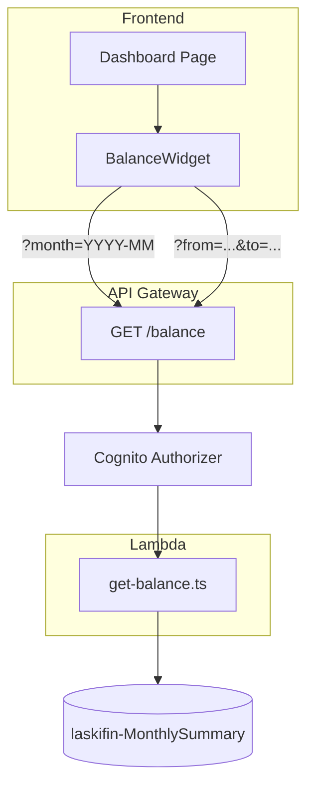

# Design Document — Balance Overview

## Overview

This design covers the balance overview feature: a single read-only Lambda handler (`get-balance.ts`) and a frontend `BalanceWidget` component mounted on the dashboard. The handler reads exclusively from `laskifin-MonthlySummary` — never from the Ledger — making every balance request O(1) per month regardless of a user's transaction volume.

The design is intentionally lean. There is one handler, one API route, one frontend component, and one supporting API module. The complexity budget is low: this feature's job is to read pre-computed data and present it clearly.

## Architecture



### Key Design Decisions

1. **`balance` is always recomputed in Lambda, never read from the stored attribute** — The `balance` attribute on `laskifin-MonthlySummary` is a write-time convenience. Under concurrent writes (e.g. two transactions created in the same second), DynamoDB `ADD` operations on `totalIncome` and `totalExpenses` are atomic per field, but the derived `SET balance = totalIncome - totalExpenses` may not reflect both updates consistently. The handler always computes `balance = totalIncome - totalExpenses` from the freshly read values. This adds zero latency.

2. **Empty_Month zero-fill is done in Lambda, not in DynamoDB** — The `QueryCommand` with `BETWEEN` only returns months that have at least one summary item. The handler builds the full calendar sequence between `from` and `to`, matches DynamoDB results by `sk`, and fills any gap with a zero-valued month object. This keeps the response shape consistent regardless of how sparse a user's data is.

3. **Range capped at 24 months** — Prevents runaway queries. 24 months × 1 DynamoDB item is trivially fast. A Lambda function building a 2-year breakdown in memory is well within the 10 s timeout and 256 MB allocation. Beyond 24 months the user is better served by an export feature (out of scope).

4. **Single-month default is UTC server time** — `new Date().toISOString().slice(0, 7)` always returns the current YYYY-MM in UTC. This is consistent with all `date` fields written to the Ledger, which are user-provided ISO 8601 strings also parsed in UTC context.

5. **No caching layer** — `laskifin-MonthlySummary` reads are O(1) `GetItem` or small `Query` operations. API Gateway caching would introduce staleness risk (a transaction created after a cached response would not appear in the balance). The DynamoDB read cost is negligible.

6. **`BalanceWidget` is self-contained** — It manages its own fetch state, mode (single/range), and month navigation. It receives no props from `DashboardPage` and bootstraps itself on mount. This keeps `DashboardPage` clean and makes `BalanceWidget` independently testable.

## Backend Component

### `get-balance.ts`

```typescript
// GET /balance                        → single month, defaults to current
// GET /balance?month=YYYY-MM          → single month, specified
// GET /balance?from=YYYY-MM&to=YYYY-MM → range
```

#### Parameter parsing and validation

```typescript
function parseAndValidateParams(params: Record<string, string | undefined>): BalanceQuery {
  const { month, from, to } = params;

  if (month && (from || to)) {
    throw new ValidationError('month is mutually exclusive with from/to');
  }
  if ((from && !to) || (!from && to)) {
    throw new ValidationError('Both from and to are required for range queries');
  }
  if (from && to) {
    validateYearMonth(from, 'from');
    validateYearMonth(to, 'to');
    if (from > to) throw new ValidationError('from must not be after to');
    if (monthsBetween(from, to) > 24) throw new ValidationError('Range must not exceed 24 months');
    return { mode: 'range', from, to };
  }

  const target = month ?? currentYearMonth();
  validateYearMonth(target, 'month');
  return { mode: 'single', month: target };
}

function validateYearMonth(value: string, field: string): void {
  if (!/^\d{4}-(0[1-9]|1[0-2])$/.test(value)) {
    throw new ValidationError(`${field} must be a valid YYYY-MM string`);
  }
}

function currentYearMonth(): string {
  return new Date().toISOString().slice(0, 7);
}

function monthsBetween(from: string, to: string): number {
  const [fy, fm] = from.split('-').map(Number);
  const [ty, tm] = to.split('-').map(Number);
  return (ty - fy) * 12 + (tm - fm) + 1;
}
```

#### Single-month query path

```typescript
async function getSingleMonth(
  client: DynamoDBDocumentClient,
  userId: string,
  month: string
): Promise<SingleMonthResponse> {
  const result = await client.send(new GetCommand({
    TableName: process.env.SUMMARY_TABLE_NAME,
    Key: { pk: userId, sk: `SUMMARY#${month}` },
  }));

  const item = result.Item;
  const totalIncome      = (item?.totalIncome      as number | undefined) ?? 0;
  const totalExpenses    = (item?.totalExpenses    as number | undefined) ?? 0;
  const transactionCount = (item?.transactionCount as number | undefined) ?? 0;

  return {
    month,
    totalIncome,
    totalExpenses,
    balance: totalIncome - totalExpenses,  // always recomputed, never from stored attribute
    transactionCount,
  };
}
```

#### Range query path

```typescript
async function getRangeMonths(
  client: DynamoDBDocumentClient,
  userId: string,
  from: string,
  to: string
): Promise<RangeResponse> {
  const result = await client.send(new QueryCommand({
    TableName: process.env.SUMMARY_TABLE_NAME,
    KeyConditionExpression: 'pk = :pk AND sk BETWEEN :from AND :to',
    ExpressionAttributeValues: {
      ':pk':   userId,
      ':from': `SUMMARY#${from}`,
      ':to':   `SUMMARY#${to}`,
    },
    ScanIndexForward: true,  // ascending — earliest month first
  }));

  // O(1) lookup map: sk → item
  const itemMap = new Map<string, Record<string, unknown>>();
  for (const item of result.Items ?? []) {
    itemMap.set(item.sk as string, item);
  }

  // Build the full calendar sequence, zero-filling gaps
  const months: MonthSummary[] = [];
  let totalIncome   = 0;
  let totalExpenses = 0;

  for (const month of enumerateMonths(from, to)) {
    const item = itemMap.get(`SUMMARY#${month}`);
    const inc = (item?.totalIncome   as number | undefined) ?? 0;
    const exp = (item?.totalExpenses as number | undefined) ?? 0;
    const cnt = (item?.transactionCount as number | undefined) ?? 0;

    months.push({
      month,
      totalIncome:      inc,
      totalExpenses:    exp,
      balance:          inc - exp,  // always recomputed per month
      transactionCount: cnt,
    });

    totalIncome   += inc;
    totalExpenses += exp;
  }

  return {
    from,
    to,
    months,
    totals: {
      totalIncome,
      totalExpenses,
      balance: totalIncome - totalExpenses,
    },
  };
}

// Enumerate every YYYY-MM from start to end inclusive
function enumerateMonths(from: string, to: string): string[] {
  const months: string[] = [];
  const [fy, fm] = from.split('-').map(Number);
  const [ty, tm] = to.split('-').map(Number);
  let y = fy, m = fm;
  while (y < ty || (y === ty && m <= tm)) {
    months.push(`${y}-${String(m).padStart(2, '0')}`);
    m++;
    if (m > 12) { m = 1; y++; }
  }
  return months;
}
```

#### Full handler structure

```typescript
export const handler = async (event: APIGatewayProxyEvent): Promise<APIGatewayProxyResult> => {
  try {
    const userId = event.requestContext.authorizer?.claims.sub;
    if (!userId) return { statusCode: 401, body: JSON.stringify({ error: 'Unauthorized' }) };

    const query = parseAndValidateParams(event.queryStringParameters ?? {});
    const client = DynamoDBDocumentClient.from(new DynamoDBClient({}));

    if (query.mode === 'single') {
      const data = await getSingleMonth(client, `USER#${userId}`, query.month);
      return { statusCode: 200, body: JSON.stringify(data) };
    }

    const data = await getRangeMonths(client, `USER#${userId}`, query.from, query.to);
    return { statusCode: 200, body: JSON.stringify(data) };

  } catch (err) {
    if (err instanceof ValidationError) {
      return { statusCode: 400, body: JSON.stringify({ error: err.message }) };
    }
    console.error('Unexpected error in get-balance:', err);
    return { statusCode: 500, body: JSON.stringify({ error: 'Internal server error' }) };
  }
};
```

### Response Shapes

**Single-month**:

```typescript
interface SingleMonthResponse {
  month: string;            // "2024-06"
  totalIncome: number;      // 5000.00
  totalExpenses: number;    // 3200.50
  balance: number;          // 1799.50 — always totalIncome - totalExpenses
  transactionCount: number; // 24
}
```

**Range**:

```typescript
interface MonthSummary {
  month: string;
  totalIncome: number;
  totalExpenses: number;
  balance: number;
  transactionCount: number;
}

interface RangeResponse {
  from: string;
  to: string;
  months: MonthSummary[];  // every month in range, zero-filled for Empty_Months
  totals: {
    totalIncome: number;
    totalExpenses: number;
    balance: number;       // always totalIncome - totalExpenses
  };
}
```

## Frontend Components

### `api/balance.ts` — API Client

```typescript
export async function getSingleMonthBalance(month?: string): Promise<SingleMonthResponse>;
export async function getRangeBalance(from: string, to: string): Promise<RangeResponse>;
```

Both functions attach the Cognito ID token as the `Authorization` header via `useAuth()`. `getSingleMonthBalance()` with no argument omits the `month` query parameter, letting the handler default to the current month.

### `components/BalanceWidget.tsx`

The widget manages three internal states: loading, single-month, and range. It is mounted directly in `DashboardPage` with no props.

```typescript
type WidgetMode = 'single' | 'range';

interface WidgetState {
  mode: WidgetMode;
  isLoading: boolean;
  error: string | null;
  // Single-month mode
  singleData: SingleMonthResponse | null;
  displayedMonth: string;  // YYYY-MM currently shown
  currentMonth: string;    // YYYY-MM of today (client-side), used to cap next-navigation
  // Range mode
  rangeData: RangeResponse | null;
  rangeFrom: string;
  rangeTo: string;
  rangeError: string | null;  // client-side validation error before API call
}
```

#### Single-month layout

```
┌────────────────────────────────────────────┐
│  ◀  June 2024  ▶                [Range ▼]  │
├───────────────┬───────────────┬────────────┤
│  Income       │  Expenses     │  Balance   │
│  R$ 5.000,00  │  R$ 3.200,50  │ R$1.799,50 │
│               │               │  [green]   │
└───────────────┴───────────────┴────────────┘
```

- `◀` decrements `displayedMonth` by one month and fetches.
- `▶` increments `displayedMonth` by one month and fetches. Disabled when `displayedMonth === currentMonth`.
- Month label is formatted with `Intl.DateTimeFormat('pt-BR', { year: 'numeric', month: 'long' })` applied to `new Date(displayedMonth + '-01')`.
- Balance metric uses `color: var(--color-text-success)` when `balance >= 0`, `color: var(--color-text-danger)` when `balance < 0`.

#### Range layout

```
[← Back to month view]

From [▼ YYYY-MM]  To [▼ YYYY-MM]  [Show]

Month       Income         Expenses       Balance
─────────────────────────────────────────────────
Jan 2024    R$ 5.000,00    R$ 2.800,00    R$ 2.200,00
Feb 2024    R$ 5.000,00    R$ 3.100,00    R$ 1.900,00
Mar 2024    R$ 0,00        R$ 0,00        R$ 0,00
─────────────────────────────────────────────────
Total       R$ 30.000,00   R$ 18.600,00   R$ 11.400,00
```

Client-side range validation (runs before any API call):

```typescript
function validateRange(from: string, to: string): string | null {
  if (from > to) return 'Start month must not be after end month.';
  if (monthsBetween(from, to) > 24) return 'Range cannot exceed 24 months.';
  return null;
}
```

#### Loading skeleton

While `isLoading` is true, the widget renders three Chakra UI `Skeleton` blocks approximating the dimensions of the three metric cards. Shown on initial load and on each navigation step.

#### Error state

API failures render an inline Chakra UI `Alert` with `status="error"` and a "Retry" button that re-triggers the last fetch. No toast, no redirect. No other widget is affected.

### `pages/DashboardPage.tsx`

The existing `HomePage.tsx` is renamed to `DashboardPage.tsx` as part of this feature. `BalanceWidget` is the first content section.

```typescript
export default function DashboardPage() {
  return (
    <Box>
      <PageHeader title="Dashboard" />
      <BalanceWidget />
      {/* Future: InsightsWidget, RecentTransactionsWidget */}
    </Box>
  );
}
```

Route update in `routes.tsx`:

```typescript
// Before
{ path: '/', element: <ProtectedRoute><HomePage /></ProtectedRoute> }

// After
{ path: '/', element: <ProtectedRoute><DashboardPage /></ProtectedRoute> }
```

### Frontend Project Structure — additions

```
front/src/
├── api/
│   └── balance.ts               # New API client module
├── components/
│   └── BalanceWidget.tsx         # New self-contained widget
└── pages/
    └── DashboardPage.tsx         # Renamed from HomePage.tsx; mounts BalanceWidget
```

## Infrastructure Changes

### `ApiStack` (`infra/lib/api-stack.ts`)

```typescript
const balanceResource = api.root.addResource('balance');

const getBalanceHandler = new NodejsFunction(this, 'GetBalanceHandler', {
  entry: path.resolve(__dirname, '../../back/lambdas/src/balance/get-balance.ts'),
  runtime: Runtime.NODEJS_22_X,
  memorySize: 256,
  timeout: Duration.seconds(10),
  bundling: { minify: true, sourceMap: true },
  environment: {
    SUMMARY_TABLE_NAME: props.summaryTableName,
    // TABLE_NAME intentionally omitted — handler must not access laskifin-Ledger
  },
});

props.summaryTable.grantReadData(getBalanceHandler);

balanceResource.addMethod('GET', new LambdaIntegration(getBalanceHandler), { authorizer });
```

No `DataStack` changes are needed — `laskifin-MonthlySummary` was already specified in the income CRUD data changes.

### Lambda file structure

```
back/lambdas/src/
└── balance/
    └── get-balance.ts
```

## Correctness Properties

### Property 1: Balance is always recomputed, never read from stored attribute

*For any* `laskifin-MonthlySummary` item where the stored `balance` attribute differs from `totalIncome - totalExpenses`, the Balance_Handler must return `balance = totalIncome - totalExpenses` computed from the read values. The stored `balance` attribute must never appear literally in the response.

**Validates: Requirement 1.5**

### Property 2: Empty month returns zero-valued HTTP 200, not 404

*For any* YYYY-MM for which no `laskifin-MonthlySummary` item exists, `GET /balance?month=YYYY-MM` must return HTTP 200 with `totalIncome = 0`, `totalExpenses = 0`, `balance = 0`, and `transactionCount = 0`.

**Validates: Requirement 1.6**

### Property 3: Range response contains exactly the right number of months

*For any* valid `from` and `to` where `monthsBetween(from, to) = N` and N ≤ 24, the `months` array must contain exactly N entries, sorted in ascending chronological order, with no entry outside the `[from, to]` interval.

**Validates: Requirements 2.1, 2.3, 2.4**

### Property 4: Empty months are zero-filled in range responses

*For any* range `[from, to]` containing months with no `laskifin-MonthlySummary` item, those months must appear in `months` with all numeric fields equal to `0`. The total length of `months` must always equal `monthsBetween(from, to)`.

**Validates: Requirement 2.3**

### Property 5: Range totals equal the sum of month values

*For any* range response, `totals.totalIncome` must equal the arithmetic sum of `totalIncome` across all entries in `months`, `totals.totalExpenses` must equal the sum of `totalExpenses`, and `totals.balance` must equal `totals.totalIncome - totals.totalExpenses`.

**Validates: Requirement 2.5**

### Property 6: `month` and `from`/`to` are mutually exclusive

*For any* request containing both `month` and at least one of `from` or `to`, the Balance_Handler must return HTTP 400 and must never return HTTP 200.

**Validates: Requirement 1.8**

### Property 7: Range cap is enforced before any DynamoDB call

*For any* `from` and `to` where `monthsBetween(from, to) > 24`, the Balance_Handler must return HTTP 400 and must not execute a DynamoDB query.

**Validates: Requirement 2.7**

### Property 8: `from` after `to` is rejected

*For any* `from` and `to` where `from > to` lexicographically, the Balance_Handler must return HTTP 400.

**Validates: Requirement 2.6**

### Property 9: Invalid YYYY-MM values are rejected

*For any* `month`, `from`, or `to` value that does not match `^\d{4}-(0[1-9]|1[0-2])$`, the Balance_Handler must return HTTP 400.

**Validates: Requirements 1.7, 2.9**

### Property 10: No-params defaults to current UTC month

*For any* invocation of `GET /balance` with no query parameters, the `month` field in the response must equal the YYYY-MM of the current date in UTC at the time the Lambda executes.

**Validates: Requirement 1.1**

### Property 11: BRL formatting correctness

*For any* numeric amount rendered by `BalanceWidget`, the formatted string must match BRL currency format using `pt-BR` locale, currency style, and BRL currency code. Negative values must render with the sign preceding the currency symbol in the locale-appropriate form.

**Validates: Requirement 4.7**

### Property 12: Next-month navigation is capped at current month

*For any* widget state where `displayedMonth === currentMonth`, the next-month chevron must be disabled. For any state where `displayedMonth < currentMonth`, the next-month chevron must be enabled.

**Validates: Requirement 3.8**

## Error Handling

### Backend Error Table

| Scenario | HTTP Status | Response Body |
|---|---|---|
| Missing Cognito sub | 401 | `{ "error": "Unauthorized" }` |
| `month` + `from`/`to` together | 400 | `{ "error": "month is mutually exclusive with from/to" }` |
| `from` without `to`, or vice versa | 400 | `{ "error": "Both from and to are required for range queries" }` |
| `from` after `to` | 400 | `{ "error": "from must not be after to" }` |
| Range > 24 months | 400 | `{ "error": "Range must not exceed 24 months" }` |
| Invalid YYYY-MM on any field | 400 | `{ "error": "<field> must be a valid YYYY-MM string" }` |
| No summary item for requested month | 200 | Zero-valued `SingleMonthResponse` |
| DynamoDB error | 500 | `{ "error": "Internal server error" }` |

### Frontend Error Strategy

API failures render an inline Chakra UI `Alert` inside `BalanceWidget` with a "Retry" button. Client-side range validation errors render inline below the range inputs. Network errors display "Could not connect to server" inside the widget alert. No toasts, no page-level errors, no other widgets affected.

## Testing Strategy

### Approach

Property-based tests (one per correctness property, minimum 100 iterations, `fast-check` with Vitest), unit tests for specific cases, and CDK assertions. All test files carry the tag comment:

```
// Feature: balance-overview, Property {N}: {property_text}
```

### Backend Property-Based Tests (`back/lambdas/test/balance/`)

| Property | Generator strategy |
|---|---|
| Property 1 | `fc.record()` with `balance` field set to a wrong value — verify response `balance` equals `totalIncome - totalExpenses` |
| Property 2 | `fc.string()` of valid YYYY-MM values with no DynamoDB item — verify HTTP 200, all zeros |
| Property 3 | `fc.tuple(validYearMonth, fc.integer({ min: 1, max: 24 }))` — verify `months.length === N`, order, no out-of-range entries |
| Property 4 | `fc.array()` of months with sparse items — verify zero-fill for gaps, total length always equals range size |
| Property 5 | `fc.array(fc.record())` for month summaries — verify totals equal sums |
| Property 6 | `fc.record()` with both `month` and `from`/`to` — verify HTTP 400 always |
| Property 7 | Generate `from`/`to` pairs with `monthsBetween > 24` — verify HTTP 400, no DynamoDB call |
| Property 8 | `fc.tuple(validYearMonth, validYearMonth).filter(([a, b]) => a > b)` — verify HTTP 400 |
| Property 9 | `fc.string().filter(s => !/^\d{4}-(0[1-9]\|1[0-2])$/.test(s))` — verify HTTP 400 |
| Property 10 | Mock `Date` to fixed UTC moment — verify response `month` matches expected YYYY-MM |

### Backend Unit Tests

- No params → current month (mock `Date`).
- `?month=2024-06` → correct `GetCommand` key `SUMMARY#2024-06`.
- `?from=2024-01&to=2024-03` → correct `QueryCommand` with `BETWEEN`.
- Range with all months present → no zero-fill.
- Range with some months missing → correct zero-fill.
- `from === to` (single month as range) → `months.length === 1`.
- `month` + `from` together → HTTP 400.
- `from` without `to` → HTTP 400.
- `from` after `to` → HTTP 400.
- Range of exactly 24 months → HTTP 200.
- Range of 25 months → HTTP 400.
- Missing auth sub → HTTP 401.
- DynamoDB throws unexpectedly → HTTP 500.

### Frontend Property-Based Tests

| Property | Test file | Generator strategy |
|---|---|---|
| Property 11 | `BalanceWidget.property.test.tsx` | `fc.float({ min: -1e6, max: 1e6 })` — verify BRL format matches expected locale pattern |
| Property 12 | `BalanceWidget.property.test.tsx` | `fc.boolean()` for `displayedMonth === currentMonth` — verify chevron disabled state |

### Frontend Unit Tests

- Renders loading skeleton on mount before fetch resolves.
- Renders three metric cards after successful single-month fetch.
- Balance card is green (`color-text-success`) when `balance >= 0`.
- Balance card is red (`color-text-danger`) when `balance < 0`.
- `◀` fetches the previous month.
- `▶` is disabled when displaying the current month.
- `▶` fetches the next month when not at the current month.
- "View range" button transitions to range mode.
- Range submission with valid from/to calls `getRangeBalance` with correct params.
- Range client validation: `from > to` shows error, no API call made.
- Range client validation: range > 24 months shows error, no API call made.
- "Back to month view" returns to single-month mode showing the current calendar month.
- API error renders `Alert` with retry button.
- Retry button re-triggers the last fetch.
- Empty month data (all zeros) renders `R$ 0,00` values, not blank or undefined.
- Range table has a totals row with bold formatting.

### Infrastructure Tests (`infra/test/balance-stack.test.ts`)

- `GET /balance` route exists on the API Gateway.
- Cognito authoriser is attached to the route.
- Exactly one Lambda function is created for the balance domain.
- Lambda has `grantReadData` on `laskifin-MonthlySummary`.
- Lambda does not have any grant on `laskifin-Ledger`.
- `SUMMARY_TABLE_NAME` env var is set on the handler.
- `TABLE_NAME` env var is not set on the handler.

### Test File Structure

```
back/
└── lambdas/
    └── test/
        └── balance/
            ├── get-balance.test.ts
            └── get-balance.property.test.ts

front/
└── src/
    └── components/
        └── __tests__/
            ├── BalanceWidget.test.tsx
            └── BalanceWidget.property.test.tsx

infra/
└── test/
    └── balance-stack.test.ts
```

### No New Dependencies

All testing and production dependencies are already present. No new packages are needed for this feature.
