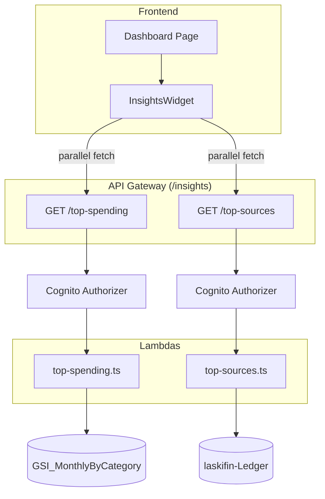

# Design Document — Top Spending Insights

## Overview

This design covers two read-only Lambda handlers — `top-spending.ts` and `top-sources.ts` — and a single frontend `InsightsWidget` component mounted on the dashboard. Both handlers query `laskifin-Ledger` directly, aggregate results in Lambda memory, and return ranked lists with pre-computed `share` values.

The design resolves a tension in the original `api-contract.md`: the spec suggests `top-sources.ts` should query `GSI_LookupBySource`, but that GSI has `source` as its partition key. To aggregate across all sources for a user in a given month, the handler would need to know every distinct source value in advance — which it does not. The correct implementation queries the main Ledger table directly using the sort key prefix `TRANS#YYYY-MM#INC#`, which returns all income entries for the month in one key-condition query. This is documented as a deliberate deviation from the original contract hint.

## Architecture



### Key Design Decisions

1. **`top-spending` uses `GSI_MonthlyByCategory`; `top-sources` uses the main Ledger table** — `GSI_MonthlyByCategory` has `pk = USER#sub` as its partition key and `categoryMonth` as its sort key. A `begins_with(categoryMonth, :monthSuffix)` condition is not directly expressible as a sort key range because the month is a suffix, not a prefix — the category name varies. Instead, the handler queries all items for the user on the GSI with a `FilterExpression` on the month embedded in `categoryMonth`. For `top-sources`, `GSI_LookupBySource` is not usable for cross-source aggregation (its PK is `source`, not `USER#sub`), so the main Ledger table is queried with the type-specific SK prefix `TRANS#YYYY-MM#INC#`.

2. **Aggregation is always done in Lambda** — Totals, ranking, and share computation happen in memory after DynamoDB returns results. DynamoDB has no native aggregation. For a personal finance app with realistic transaction volumes (hundreds to low thousands per month per user), in-memory aggregation is well within the 256 MB memory allocation and 10 s timeout.

3. **`share` is rounded to 4 decimal places in the handler** — Rounding in the handler guarantees consistent precision regardless of JavaScript float arithmetic in the frontend. `share` values are used directly as CSS progress bar widths (e.g. `width: ${share * 100}%`), so four decimal places (0.0001 resolution) is more than sufficient.

4. **`limit` defaults to 5, maximum 20** — 5 is the dashboard default. 20 is the cap to prevent the handler from returning an arbitrarily large payload on a public endpoint. Both values are validated before any DynamoDB call is made.

5. **Both fetches are parallel on the frontend** — `Promise.all([getTopSpending(), getTopSources()])` on page load and on month change. Failures are handled independently: if one request fails, the other section still renders. This gives each section its own loading state, error state, and retry button.

6. **`GSI_MonthlyByCategory` query strategy for `top-spending`** — The GSI SK is `categoryMonth` in the format `category#YYYY-MM`. To retrieve all expense entries for a given month across all categories, the handler queries with `pk = USER#sub` and no SK condition, then applies a `FilterExpression` of `contains(categoryMonth, :monthSuffix) AND #type = :exp` where `:monthSuffix = '#' + YYYY-MM`. This is a full GSI partition scan with post-query filtering. For realistic personal finance volumes (hundreds of entries per user across all time), this is acceptable. A future optimisation could invert the `categoryMonth` attribute to `YYYY-MM#category` — enabling `begins_with` on the month — but that would require a data migration and is out of scope.

7. **No DynamoDB Pagination loop required for realistic volumes** — DynamoDB returns up to 1 MB of data per query. A Ledger item is approximately 300–500 bytes. 1 MB / 400 bytes = ~2500 items per page. A user with more than 2500 transactions in a single month is an edge case that warrants a pagination loop. The handler SHALL implement `LastEvaluatedKey` pagination to handle this correctly regardless of volume.

## Backend Components

### `top-spending.ts`

```typescript
// GET /insights/top-spending?month=YYYY-MM&limit=5
// Returns: { month, totalExpenses, categories, limit }
```

#### Full handler structure

```typescript
export const handler = async (event: APIGatewayProxyEvent): Promise<APIGatewayProxyResult> => {
  try {
    const userId = event.requestContext.authorizer?.claims.sub;
    if (!userId) return unauthorized();

    const { month, limit } = parseParams(event.queryStringParameters ?? {});
    const client = DynamoDBDocumentClient.from(new DynamoDBClient({}));

    const items = await queryAllExpensesForMonth(client, `USER#${userId}`, month);
    const result = aggregateByCategory(items, limit);

    return {
      statusCode: 200,
      body: JSON.stringify({ month, ...result, limit }),
    };
  } catch (err) {
    if (err instanceof ValidationError) {
      return { statusCode: 400, body: JSON.stringify({ error: err.message }) };
    }
    console.error('Unexpected error in top-spending:', err);
    return { statusCode: 500, body: JSON.stringify({ error: 'Internal server error' }) };
  }
};
```

#### Parameter parsing

```typescript
function parseParams(params: Record<string, string | undefined>): { month: string; limit: number } {
  const month = params.month ?? currentYearMonth();
  validateYearMonth(month, 'month');

  const rawLimit = params.limit;
  if (rawLimit !== undefined) {
    const parsed = parseInt(rawLimit, 10);
    if (isNaN(parsed) || parsed < 1 || parsed > 20) {
      throw new ValidationError('limit must be an integer between 1 and 20');
    }
    return { month, limit: parsed };
  }
  return { month, limit: 5 };
}
```

#### GSI query with pagination

```typescript
async function queryAllExpensesForMonth(
  client: DynamoDBDocumentClient,
  userId: string,
  month: string
): Promise<LedgerItem[]> {
  const items: LedgerItem[] = [];
  let lastKey: Record<string, unknown> | undefined;

  do {
    const result = await client.send(new QueryCommand({
      TableName: process.env.TABLE_NAME,
      IndexName: 'GSI_MonthlyByCategory',
      KeyConditionExpression: 'pk = :pk',
      FilterExpression: 'contains(categoryMonth, :monthSuffix) AND #type = :exp',
      ExpressionAttributeNames: { '#type': 'type' },
      ExpressionAttributeValues: {
        ':pk':          userId,
        ':monthSuffix': `#${month}`,
        ':exp':         'EXP',
      },
      ExclusiveStartKey: lastKey,
    }));

    items.push(...(result.Items ?? []) as LedgerItem[]);
    lastKey = result.LastEvaluatedKey as Record<string, unknown> | undefined;
  } while (lastKey);

  return items;
}
```

#### In-Lambda aggregation

```typescript
interface CategoryResult {
  category: string;
  total: number;
  share: number;
}

interface TopSpendingResult {
  totalExpenses: number;
  categories: CategoryResult[];
}

function aggregateByCategory(items: LedgerItem[], limit: number): TopSpendingResult {
  const totals = new Map<string, number>();

  for (const item of items) {
    const prev = totals.get(item.category) ?? 0;
    totals.set(item.category, prev + item.amount);
  }

  const totalExpenses = [...totals.values()].reduce((acc, v) => acc + v, 0);

  const sorted = [...totals.entries()]
    .sort(([, a], [, b]) => b - a)  // descending by total
    .slice(0, limit)
    .map(([category, total]) => ({
      category,
      total,
      share: totalExpenses > 0
        ? Math.round((total / totalExpenses) * 10000) / 10000
        : 0,
    }));

  return { totalExpenses, categories: sorted };
}
```

### `top-sources.ts`

```typescript
// GET /insights/top-sources?month=YYYY-MM&limit=5
// Returns: { month, totalIncome, sources, limit }
```

#### Ledger query with pagination

```typescript
async function queryAllIncomeForMonth(
  client: DynamoDBDocumentClient,
  userId: string,
  month: string
): Promise<LedgerItem[]> {
  const items: LedgerItem[] = [];
  let lastKey: Record<string, unknown> | undefined;

  do {
    const result = await client.send(new QueryCommand({
      TableName: process.env.TABLE_NAME,
      // Main table — not a GSI. SK prefix gives us exactly INC entries for this month.
      KeyConditionExpression: 'pk = :pk AND begins_with(sk, :prefix)',
      ExpressionAttributeValues: {
        ':pk':     userId,
        ':prefix': `TRANS#${month}#INC#`,
      },
      ExclusiveStartKey: lastKey,
    }));

    items.push(...(result.Items ?? []) as LedgerItem[]);
    lastKey = result.LastEvaluatedKey as Record<string, unknown> | undefined;
  } while (lastKey);

  return items;
}
```

#### In-Lambda aggregation

```typescript
interface SourceResult {
  source: string;
  total: number;
  share: number;
}

interface TopSourcesResult {
  totalIncome: number;
  sources: SourceResult[];
}

function aggregateBySource(items: LedgerItem[], limit: number): TopSourcesResult {
  const totals = new Map<string, number>();

  for (const item of items) {
    const prev = totals.get(item.source) ?? 0;
    totals.set(item.source, prev + item.amount);
  }

  const totalIncome = [...totals.values()].reduce((acc, v) => acc + v, 0);

  const sorted = [...totals.entries()]
    .sort(([, a], [, b]) => b - a)
    .slice(0, limit)
    .map(([source, total]) => ({
      source,
      total,
      share: totalIncome > 0
        ? Math.round((total / totalIncome) * 10000) / 10000
        : 0,
    }));

  return { totalIncome, sources: sorted };
}
```

`top-sources.ts` reuses the same `parseParams` and error handling pattern as `top-spending.ts`. The only difference is the DynamoDB query function and aggregation key (`source` instead of `category`).

### Response Shapes

**`GET /insights/top-spending`**:

```typescript
interface TopSpendingResponse {
  month: string;           // "2024-06"
  totalExpenses: number;   // 3200.00
  categories: {
    category: string;      // "Food"
    total: number;         // 1200.00
    share: number;         // 0.375 — always totalExpenses > 0 ? total/totalExpenses : 0, 4 dp
  }[];
  limit: number;           // 5
}
```

**`GET /insights/top-sources`**:

```typescript
interface TopSourcesResponse {
  month: string;           // "2024-06"
  totalIncome: number;     // 5000.00
  sources: {
    source: string;        // "Employer"
    total: number;         // 5000.00
    share: number;         // 1.0
  }[];
  limit: number;           // 5
}
```

### Lambda File Structure

```
back/lambdas/src/
└── insights/
    ├── top-spending.ts
    └── top-sources.ts
```

### Deviation from `api-contract.md` — documented

The `api-contract.md` states that `top-sources.ts` uses `GSI_LookupBySource`. This is not implementable for the top-sources use case because `GSI_LookupBySource` has `source` as its partition key — querying it requires knowing the source value in advance. The handler instead queries the main Ledger table with `sk begins_with TRANS#YYYY-MM#INC#`, which returns all income entries for the month in a single efficient key-condition query. `GSI_LookupBySource` remains useful for the "filter transactions by source" pattern (e.g. show me all Nubank transactions) but is the wrong tool for cross-source aggregation. `api-contract.md` should be updated to reflect the correct query approach when this spec is merged into the project docs.

## Frontend Component

### `api/insights.ts` — API Client

```typescript
export async function getTopSpending(params?: {
  month?: string;
  limit?: number;
}): Promise<TopSpendingResponse>;

export async function getTopSources(params?: {
  month?: string;
  limit?: number;
}): Promise<TopSourcesResponse>;
```

Both functions attach the Cognito ID token as the `Authorization` header via `useAuth()`. When `month` is absent, the parameter is omitted from the request URL, letting the handler default to the current month.

### `components/InsightsWidget.tsx`

Self-contained component with no props. Manages its own fetch state for each section independently.

```typescript
interface InsightsState {
  displayedMonth: string;    // YYYY-MM shown in the month selector
  currentMonth: string;      // YYYY-MM of today (client-side), caps future navigation
  spending: {
    isLoading: boolean;
    error: string | null;
    data: TopSpendingResponse | null;
  };
  sources: {
    isLoading: boolean;
    error: string | null;
    data: TopSourcesResponse | null;
  };
}
```

#### Fetch strategy

```typescript
// On mount and on month change
async function fetchInsights(month: string) {
  setSpending(s => ({ ...s, isLoading: true, error: null }));
  setSources(s => ({ ...s, isLoading: true, error: null }));

  const [spendingResult, sourcesResult] = await Promise.allSettled([
    getTopSpending({ month }),
    getTopSources({ month }),
  ]);

  if (spendingResult.status === 'fulfilled') {
    setSpending({ isLoading: false, error: null, data: spendingResult.value });
  } else {
    setSpending({ isLoading: false, error: 'Could not load spending data.', data: null });
  }

  if (sourcesResult.status === 'fulfilled') {
    setSources({ isLoading: false, error: null, data: sourcesResult.value });
  } else {
    setSources({ isLoading: false, error: 'Could not load income data.', data: null });
  }
}
```

`Promise.allSettled` (not `Promise.all`) ensures one failed fetch does not prevent the other section from rendering.

#### Layout

```
┌─────────────────────────────────────────────────────────────┐
│  Top spending · Top sources            [◀ June 2024 ▶]      │
├─────────────────────────────┬───────────────────────────────┤
│  Top spending               │  Top income sources           │
│  ─────────────────────────  │  ────────────────────────     │
│  1  Food        R$1.200,00  │  1  Employer    R$5.000,00    │
│     ████████░░░░░ 37.5%     │     ████████████████ 100%     │
│  2  Transport   R$800,00    │                               │
│     █████░░░░░░░ 25.0%      │                               │
│  3  Health      R$600,00    │                               │
│     ████░░░░░░░░ 18.8%      │                               │
└─────────────────────────────┴───────────────────────────────┘
```

Each ranked row:
- Rank number (1, 2, 3…) — muted, 12px.
- Category/source name — primary text, 14px.
- Total amount — right-aligned, BRL formatted.
- Progress bar — `width: ${item.share * 100}%`, capped at 100% to guard against floating point rounding. Bar fill colour: coral/orange for spending, teal/green for sources.
- Percentage label — `(item.share * 100).toFixed(1) + '%'` — muted, 12px, below the bar.

Month navigation follows the same pattern as `BalanceWidget`: previous/next chevrons, next disabled at current month. The two widgets share the same displayed month by default but their month selectors are independent (changing one does not change the other).

#### Loading skeleton

While either section is loading, its column renders two Chakra UI `Skeleton` blocks approximating the height of the ranked list.

#### Empty state

When a section's data has an empty array:
- Spending empty: "No expenses recorded for [month label]."
- Sources empty: "No income recorded for [month label]."

#### Error state

Each section independently renders an inline `Alert` with `status="error"` and a "Retry" button that re-triggers only that section's fetch. The other section is unaffected.

### `pages/DashboardPage.tsx` — updated

```typescript
export default function DashboardPage() {
  return (
    <Box>
      <PageHeader title="Dashboard" />
      <BalanceWidget />
      <InsightsWidget />
    </Box>
  );
}
```

### Frontend Project Structure — additions

```
front/src/
├── api/
│   └── insights.ts               # New API client module
└── components/
    └── InsightsWidget.tsx          # New self-contained widget
```

## Infrastructure Changes

### `ApiStack` (`infra/lib/api-stack.ts`)

```typescript
const insightsResource    = api.root.addResource('insights');
const topSpendingResource = insightsResource.addResource('top-spending');
const topSourcesResource  = insightsResource.addResource('top-sources');

const topSpendingHandler = new NodejsFunction(this, 'TopSpendingHandler', {
  entry: path.resolve(__dirname, '../../back/lambdas/src/insights/top-spending.ts'),
  runtime: Runtime.NODEJS_22_X,
  memorySize: 256,
  timeout: Duration.seconds(10),
  bundling: { minify: true, sourceMap: true },
  environment: {
    TABLE_NAME: props.ledgerTableName,
    // SUMMARY_TABLE_NAME intentionally omitted — reads only Ledger
  },
});

const topSourcesHandler = new NodejsFunction(this, 'TopSourcesHandler', {
  entry: path.resolve(__dirname, '../../back/lambdas/src/insights/top-sources.ts'),
  runtime: Runtime.NODEJS_22_X,
  memorySize: 256,
  timeout: Duration.seconds(10),
  bundling: { minify: true, sourceMap: true },
  environment: {
    TABLE_NAME: props.ledgerTableName,
  },
});

// Read-only on Ledger only
props.ledgerTable.grantReadData(topSpendingHandler);
props.ledgerTable.grantReadData(topSourcesHandler);

// Routes
topSpendingResource.addMethod('GET', new LambdaIntegration(topSpendingHandler), { authorizer });
topSourcesResource.addMethod('GET',  new LambdaIntegration(topSourcesHandler),  { authorizer });
```

No `DataStack` changes are required — `GSI_MonthlyByCategory` was already added as part of the income CRUD data changes.

## Correctness Properties

### Property 1: top-spending returns only EXP entries

*For any* mix of INC and EXP entries for the same user and month in `laskifin-Ledger`, the Top_Spending_Handler must return a `categories` array built exclusively from entries where `type = "EXP"`. No INC entry's `amount` may contribute to any `Category_Total` or `totalExpenses`.

**Validates: Requirement 1.3**

### Property 2: Category totals are the exact sum of matching amounts

*For any* set of EXP entries for a given user and month, for each distinct `category` value, the `total` in the response must equal the arithmetic sum of `amount` across all entries with that category. No entry may be double-counted or omitted.

**Validates: Requirement 1.4**

### Property 3: Share values are correctly computed and bounded

*For any* response where `totalExpenses > 0`, each category's `share` must equal `category.total / totalExpenses` rounded to 4 decimal places. For any response where `totalExpenses = 0`, every `share` must be `0`. For any response, every `share` must be in the range `[0, 1]`.

**Validates: Requirement 1.6**

### Property 4: `categories` is sorted descending by total

*For any* response with two or more categories, every consecutive pair `(categories[i], categories[i+1])` must satisfy `categories[i].total >= categories[i+1].total`.

**Validates: Requirement 1.7**

### Property 5: `limit` controls the maximum number of returned categories

*For any* valid `limit` value L and any set of categories of size N, the `categories` array must contain `min(N, L)` entries — the top L by total. Entries beyond position L must not appear in the response.

**Validates: Requirement 1.8**

### Property 6: top-sources returns only INC entries

*For any* mix of INC and EXP entries in the Ledger for the same user and month, the Top_Sources_Handler must return a `sources` array built exclusively from entries where `type = "INC"` and `sk begins_with TRANS#YYYY-MM#INC#`. No EXP entry's `amount` may contribute to any `Source_Total` or `totalIncome`.

**Validates: Requirement 2.3**

### Property 7: Source totals are the exact sum of matching amounts

*For any* set of INC entries for a given user and month, for each distinct `source` value, the `total` in the response must equal the arithmetic sum of `amount` across all entries with that source. No entry may be double-counted or omitted.

**Validates: Requirement 2.4**

### Property 8: top-sources share values are correctly computed and bounded

*For any* response where `totalIncome > 0`, each source's `share` must equal `source.total / totalIncome` rounded to 4 decimal places. For any response where `totalIncome = 0`, every `share` must be `0`. Every `share` must be in `[0, 1]`.

**Validates: Requirement 2.6**

### Property 9: `sources` is sorted descending by total

*For any* response with two or more sources, every consecutive pair must satisfy `sources[i].total >= sources[i+1].total`.

**Validates: Requirement 2.7**

### Property 10: Invalid limit is rejected before DynamoDB is called

*For any* `limit` value that is not a positive integer, or that exceeds 20, both handlers must return HTTP 400 and must not execute any DynamoDB query.

**Validates: Requirements 1.9, 2.9**

### Property 11: Pagination covers all items

*For any* user and month where the number of matching Ledger entries exceeds a single DynamoDB page (i.e. results are paginated via `LastEvaluatedKey`), the aggregation result must be identical to a result computed from all entries combined — no entry from any page beyond the first may be omitted from the totals.

**Validates: Requirements 1.4, 2.4 — correctness under pagination**

### Property 12: Empty month returns HTTP 200 with zero totals and empty arrays

*For any* month with no matching EXP entries, `top-spending` must return HTTP 200 with `totalExpenses = 0` and `categories = []`. *For any* month with no matching INC entries, `top-sources` must return HTTP 200 with `totalIncome = 0` and `sources = []`.

**Validates: Requirements 1.10, 2.10**

### Property 13: BRL formatting correctness in InsightsWidget

*For any* numeric `total` value rendered by the InsightsWidget, the formatted string must match BRL currency format using `pt-BR` locale, currency style, and BRL currency code.

**Validates: Requirement 3.9**

### Property 14: Progress bar share is capped at 100%

*For any* `share` value (including values slightly above 1.0 due to floating-point rounding), the rendered progress bar width must be capped at 100% — `Math.min(item.share, 1) * 100 + '%'`.

**Design safety property — not directly in requirements**

## Error Handling

### Backend Error Table

| Scenario | HTTP Status | Response Body |
|---|---|---|
| Missing Cognito sub | 401 | `{ "error": "Unauthorized" }` |
| Invalid YYYY-MM format | 400 | `{ "error": "month must be a valid YYYY-MM string" }` |
| `limit` not a positive integer | 400 | `{ "error": "limit must be an integer between 1 and 20" }` |
| `limit` > 20 | 400 | `{ "error": "limit must be an integer between 1 and 20" }` |
| No matching entries for month | 200 | `{ month, totalExpenses: 0, categories: [], limit }` or `{ month, totalIncome: 0, sources: [], limit }` |
| DynamoDB error | 500 | `{ "error": "Internal server error" }` |

### Frontend Error Strategy

Each InsightsWidget section manages its error state independently. A failure in one section renders an inline `Alert` with a "Retry" button for that section only — the other section continues to render its data. No toast notifications. No page-level errors.

## Testing Strategy

### Approach

Property-based tests (one per correctness property, minimum 100 iterations, `fast-check` with Vitest), unit tests for specific cases, and CDK assertions. All test files carry the tag comment:

```
// Feature: top-spending-insights, Property {N}: {property_text}
```

### Backend Property-Based Tests (`back/lambdas/test/insights/`)

| Property | Handler | Generator strategy |
|---|---|---|
| Property 1 | top-spending | `fc.array()` of mixed INC/EXP items — verify only EXP contributes |
| Property 2 | top-spending | `fc.array()` of EXP items with random categories and amounts — verify totals equal sums |
| Property 3 | top-spending | `fc.array()` of EXP items — verify share = total/totalExpenses (4 dp), bound [0,1], 0 when totalExpenses=0 |
| Property 4 | top-spending | `fc.array()` of EXP items with 2+ categories — verify descending order |
| Property 5 | top-spending | `fc.integer({ min: 1, max: 20 })` for limit, `fc.array()` for items — verify output length = min(categories, limit) |
| Property 6 | top-sources | `fc.array()` of mixed INC/EXP items — verify only INC contributes |
| Property 7 | top-sources | `fc.array()` of INC items with random sources and amounts — verify totals equal sums |
| Property 8 | top-sources | `fc.array()` of INC items — verify share computation, bound, zero case |
| Property 9 | top-sources | `fc.array()` of INC items with 2+ sources — verify descending order |
| Property 10 | both | `fc.oneof(fc.constant(0), fc.constant(21), fc.constant(-1), fc.float())` for limit — verify HTTP 400, no DynamoDB call |
| Property 11 | both | Simulate paginated DynamoDB responses — verify aggregation equals single-page equivalent |
| Property 12 | both | Invoke with no matching items — verify HTTP 200, zero totals, empty arrays |

### Backend Unit Tests

**`top-spending.test.ts`:**
- No params → current month, limit 5.
- `?month=2024-06` → correct GSI query FilterExpression.
- Single category in results → `share = 1.0`.
- Multiple categories → correctly ranked, share sums to ≤ 1.0.
- `limit=3` with 5 categories → returns 3.
- `limit=0` → HTTP 400.
- `limit=21` → HTTP 400.
- Invalid month → HTTP 400.
- No EXP entries → `{ totalExpenses: 0, categories: [] }`.
- Missing auth → HTTP 401.
- DynamoDB throws → HTTP 500.
- INC entries in DynamoDB result → filtered out, not counted.

**`top-sources.test.ts`:**
- No params → current month, limit 5.
- `?month=2024-06` → correct Ledger query with `TRANS#2024-06#INC#` prefix.
- Single source → `share = 1.0`.
- Multiple sources → correctly ranked.
- `limit=2` with 4 sources → returns 2.
- Invalid month → HTTP 400.
- No INC entries → `{ totalIncome: 0, sources: [] }`.
- Missing auth → HTTP 401.
- EXP entries not returned by SK prefix query (by design, not by FilterExpression).

### Frontend Property-Based Tests

| Property | Test file | Generator strategy |
|---|---|---|
| Property 13 | `InsightsWidget.property.test.tsx` | `fc.float({ min: 0, max: 1e6 })` — verify BRL format |
| Property 14 | `InsightsWidget.property.test.tsx` | `fc.float({ min: 0, max: 2 })` for share — verify rendered width is capped at 100% |

### Frontend Unit Tests (`front/src/components/__tests__/InsightsWidget.test.tsx`)

- Renders loading skeleton for both sections on mount.
- Fetches both endpoints in parallel on mount.
- Renders ranked list with rank numbers, names, amounts, and progress bars.
- Progress bar width equals `share * 100` percent.
- Progress bar width is capped at 100% for share values > 1.
- Empty spending → "No expenses recorded" message.
- Empty sources → "No income recorded" message.
- Spending fetch fails → spending section shows alert + retry; sources section renders normally.
- Sources fetch fails → sources section shows alert + retry; spending section renders normally.
- Retry button re-fetches only the failed section.
- Month navigation: previous chevron fetches previous month for both sections.
- Month navigation: next chevron disabled at current month.

### Infrastructure Tests (`infra/test/insights-stack.test.ts`)

- `GET /insights/top-spending` route exists.
- `GET /insights/top-sources` route exists.
- Cognito authoriser attached to both routes.
- Two separate Lambda functions created.
- Both Lambdas have `grantReadData` on Ledger.
- Neither Lambda has any grant on MonthlySummary.
- `TABLE_NAME` env var set on both handlers.
- `SUMMARY_TABLE_NAME` NOT set on either handler.

### Test File Structure

```
back/
└── lambdas/
    └── test/
        └── insights/
            ├── top-spending.test.ts
            ├── top-spending.property.test.ts
            ├── top-sources.test.ts
            └── top-sources.property.test.ts

front/
└── src/
    └── components/
        └── __tests__/
            ├── InsightsWidget.test.tsx
            └── InsightsWidget.property.test.tsx

infra/
└── test/
    └── insights-stack.test.ts
```

### No New Dependencies

All testing and production dependencies are already present.
