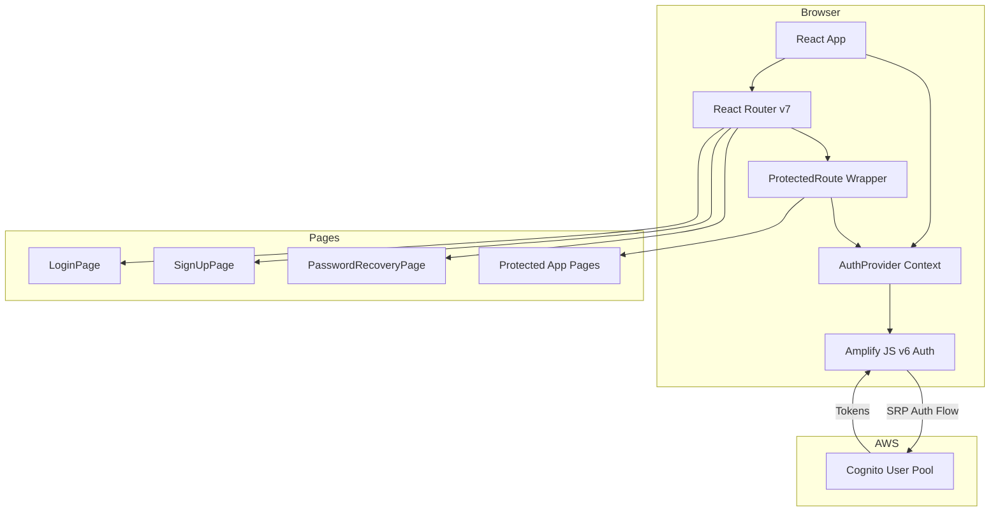
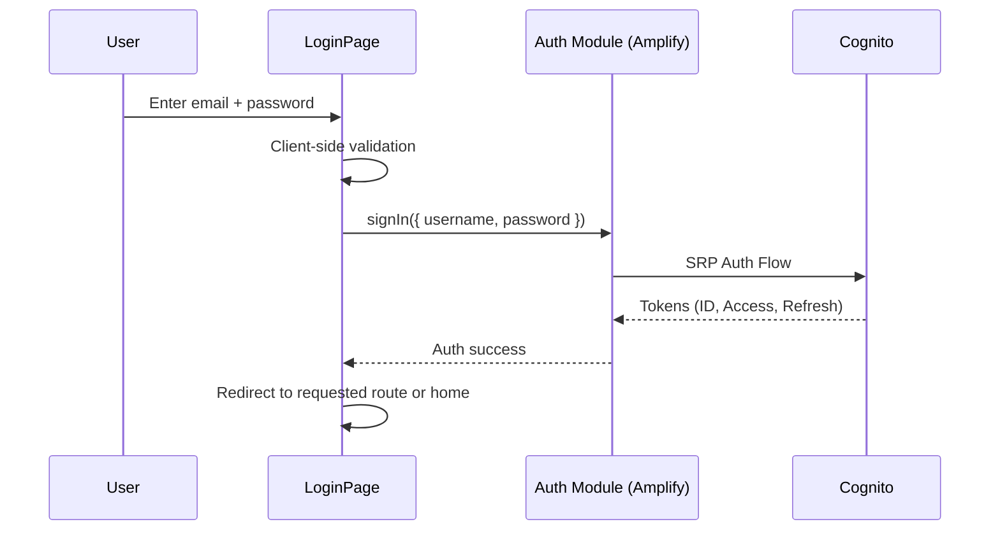

# Design Document: Login Feature

## Overview

This design covers the full authentication flow for LASKI Finances: sign-up, sign-in, password recovery, session management, protected routes, and form validation. The frontend is a React + TypeScript SPA (Vite) using Amplify JS v6 libraries to communicate with the existing Cognito User Pool defined in `InfraCoreStack`. The UI is built with Chakra UI.

The `front/` workspace does not exist yet and will be scaffolded as part of this feature. No backend changes are required — Cognito handles all auth operations directly from the client via Amplify JS.

### Key Design Decisions

1. **Amplify JS v6 (modular imports)** — Tree-shakeable, smaller bundle. We use `aws-amplify/auth` functions directly (`signUp`, `signIn`, `confirmSignUp`, `resetPassword`, `confirmResetPassword`, `fetchAuthSession`, `signOut`).
2. **No custom backend for auth** — Cognito + Amplify JS handle the entire auth lifecycle. No Lambda or API Gateway needed for login.
3. **React Router v7 for routing** — Industry standard for React SPAs. Protected routes are implemented via a wrapper component that checks auth state.
4. **React Context for auth state** — A single `AuthProvider` context manages the current user session and exposes auth status to the component tree. No external state management library needed for this feature.
5. **Chakra UI v3** — Prop-based component API for rapid form building. Consistent with project architecture docs.

## Architecture



### Auth Flow Sequence



## Components and Interfaces

### Auth Module (`src/auth/`)

| File | Responsibility |
|------|---------------|
| `amplify-config.ts` | Amplify.configure() with Cognito User Pool ID and Client ID |
| `AuthProvider.tsx` | React Context provider — exposes `user`, `isAuthenticated`, `isLoading`, auth actions |
| `useAuth.ts` | Hook to consume AuthContext |
| `auth-service.ts` | Thin wrappers around Amplify Auth functions for testability |

#### AuthContext Interface

```typescript
interface AuthContextValue {
  user: AuthUser | null;
  isAuthenticated: boolean;
  isLoading: boolean;
  signIn: (email: string, password: string) => Promise<SignInResult>;
  signUp: (email: string, password: string) => Promise<SignUpResult>;
  confirmSignUp: (email: string, code: string) => Promise<void>;
  resetPassword: (email: string) => Promise<void>;
  confirmResetPassword: (email: string, code: string, newPassword: string) => Promise<void>;
  signOut: () => Promise<void>;
  resendSignUpCode: (email: string) => Promise<void>;
}
```

#### SignInResult / SignUpResult

```typescript
interface SignInResult {
  success: boolean;
  nextStep?: 'CONFIRM_SIGN_UP' | 'DONE';
}

interface SignUpResult {
  success: boolean;
  nextStep: 'CONFIRM_SIGN_UP' | 'DONE';
}
```

### Auth Service (`auth-service.ts`)

Wraps Amplify Auth calls to decouple components from the Amplify SDK directly. This enables unit testing with mocks.

```typescript
// Thin wrappers — each function calls the corresponding Amplify Auth function
export async function cognitoSignIn(email: string, password: string): Promise<SignInOutput>;
export async function cognitoSignUp(email: string, password: string): Promise<SignUpOutput>;
export async function cognitoConfirmSignUp(email: string, code: string): Promise<ConfirmSignUpOutput>;
export async function cognitoResetPassword(email: string): Promise<ResetPasswordOutput>;
export async function cognitoConfirmResetPassword(email: string, code: string, newPassword: string): Promise<void>;
export async function cognitoSignOut(): Promise<void>;
export async function cognitoFetchSession(): Promise<FetchAuthSessionOutput>;
export async function cognitoResendSignUpCode(email: string): Promise<void>;
export async function cognitoGetCurrentUser(): Promise<AuthUser>;
```

### Routing (`src/router/`)

| File | Responsibility |
|------|---------------|
| `ProtectedRoute.tsx` | Checks `isAuthenticated` from AuthContext. Redirects to `/login` if false, saving the attempted path. |
| `routes.tsx` | Route definitions — public routes (login, signup, recovery) and protected routes (app pages) |

#### ProtectedRoute Component

```typescript
interface ProtectedRouteProps {
  children: React.ReactNode;
}

// If not authenticated → Navigate to /login?redirect={currentPath}
// If loading → show spinner
// If authenticated → render children
```

### Pages (`src/pages/`)

| Page | Route | Public? |
|------|-------|---------|
| `LoginPage.tsx` | `/login` | Yes |
| `SignUpPage.tsx` | `/signup` | Yes |
| `ConfirmSignUpPage.tsx` | `/confirm-signup` | Yes |
| `PasswordRecoveryPage.tsx` | `/forgot-password` | Yes |
| `ResetPasswordPage.tsx` | `/reset-password` | Yes |
| `HomePage.tsx` | `/` | No (protected) |

### Validation (`src/auth/validation.ts`)

Pure functions for client-side validation, decoupled from UI:

```typescript
export interface ValidationResult {
  valid: boolean;
  errors: string[];
}

export function validateEmail(email: string): ValidationResult;
export function validatePassword(password: string): ValidationResult;
export function validatePasswordMatch(password: string, confirmPassword: string): ValidationResult;
export function validateSignInForm(email: string, password: string): ValidationResult;
export function validateSignUpForm(email: string, password: string, confirmPassword: string): ValidationResult;
```

Password policy (matches Cognito config):
- Minimum 8 characters
- At least one uppercase letter
- At least one lowercase letter
- At least one digit
- At least one symbol

## Data Models

### Amplify Configuration

```typescript
// amplify-config.ts
const amplifyConfig = {
  Auth: {
    Cognito: {
      userPoolId: import.meta.env.VITE_COGNITO_USER_POOL_ID,
      userPoolClientId: import.meta.env.VITE_COGNITO_USER_POOL_CLIENT_ID,
    },
  },
};
```

Environment variables are injected at build time via Vite's `import.meta.env` and set in the Amplify Hosting environment configuration.

### Auth State

The auth state is managed in `AuthProvider` via React state:

```typescript
interface AuthState {
  user: AuthUser | null;       // Cognito user object (sub, email, etc.)
  isAuthenticated: boolean;    // Derived: user !== null
  isLoading: boolean;          // True during initial session check and auth operations
}
```

### AuthUser

```typescript
interface AuthUser {
  userId: string;    // Cognito sub (UUID)
  email: string;
}
```

### No Database Changes

This feature does not modify DynamoDB or any backend data models. All auth data lives in Cognito.

### Frontend Project Structure

```
front/
├── index.html
├── package.json
├── tsconfig.json
├── vite.config.ts
├── .env.example
└── src/
    ├── main.tsx
    ├── App.tsx
    ├── auth/
    │   ├── amplify-config.ts
    │   ├── AuthProvider.tsx
    │   ├── useAuth.ts
    │   ├── auth-service.ts
    │   └── validation.ts
    ├── router/
    │   ├── ProtectedRoute.tsx
    │   └── routes.tsx
    └── pages/
        ├── LoginPage.tsx
        ├── SignUpPage.tsx
        ├── ConfirmSignUpPage.tsx
        ├── PasswordRecoveryPage.tsx
        ├── ResetPasswordPage.tsx
        └── HomePage.tsx
```

## Correctness Properties

*A property is a characteristic or behavior that should hold true across all valid executions of a system — essentially, a formal statement about what the system should do. Properties serve as the bridge between human-readable specifications and machine-verifiable correctness guarantees.*

### Property 1: Password validation detects all policy violations

*For any* string, `validatePassword` should return `valid: true` if and only if the string has length ≥ 8 and contains at least one uppercase letter, one lowercase letter, one digit, and one symbol. Otherwise, it should return `valid: false` with `errors` listing every violated rule.

**Validates: Requirements 1.6, 3.6**

### Property 2: Password mismatch detection

*For any* two strings `a` and `b` where `a !== b`, `validatePasswordMatch(a, b)` should return `valid: false` with an error indicating the passwords do not match. *For any* string `s`, `validatePasswordMatch(s, s)` should return `valid: true`.

**Validates: Requirements 1.7**

### Property 3: Email validation rejects invalid formats

*For any* string that does not match a valid email format (e.g., missing `@`, missing domain, empty local part), `validateEmail` should return `valid: false`. *For any* string that is a well-formed email address, `validateEmail` should return `valid: true`.

**Validates: Requirements 6.3**

### Property 4: Sign-in form validation composes field validations

*For any* email string and password string, `validateSignInForm(email, password)` should return `valid: true` if and only if both `validateEmail(email).valid` and `validatePassword(password).valid` are true. The `errors` array should be the union of errors from both individual validations.

**Validates: Requirements 6.1, 6.2, 6.3**

### Property 5: Protected route access matches authentication status

*For any* route marked as protected and any authentication state, the `ProtectedRoute` component should render its children if and only if `isAuthenticated` is true. When `isAuthenticated` is false, it should redirect to `/login`.

**Validates: Requirements 5.1, 5.2**

### Property 6: Redirect path preservation round-trip

*For any* valid application path, when an unauthenticated user is redirected from that path to `/login`, the redirect URL should contain a `redirect` query parameter equal to the original path. After successful sign-in, navigation should go to that preserved path.

**Validates: Requirements 5.3**

### Property 7: Sign-out clears authentication state

*For any* authenticated state (where `user` is not null and `isAuthenticated` is true), calling `signOut` should result in `user` being null and `isAuthenticated` being false.

**Validates: Requirements 4.4**

### Property 8: Session restoration on reload

*For any* valid session (where `fetchAuthSession` returns valid tokens and `getCurrentUser` returns a user), the `AuthProvider` should set `isAuthenticated` to true and populate the `user` object. When no valid session exists (fetch throws), `isAuthenticated` should be false and `user` should be null.

**Validates: Requirements 4.1**

## Error Handling

### Cognito Error Mapping

The Auth Module maps Cognito exceptions to user-friendly messages. All Cognito errors are caught in `AuthProvider` and translated:

| Cognito Exception | User-Facing Message | Context |
|---|---|---|
| `UsernameExistsException` | "An account with this email already exists." | Sign-up (Req 1.5) |
| `NotAuthorizedException` | "Incorrect email or password." | Sign-in (Req 2.4) |
| `UserNotConfirmedException` | "Please verify your email address." + resend option | Sign-in (Req 2.5) |
| `CodeMismatchException` | "Invalid verification code. Please try again." | Confirm sign-up, reset password (Req 1.8, 3.5) |
| `ExpiredCodeException` | "Verification code has expired. Request a new one." | Confirm sign-up, reset password (Req 1.8, 3.5) |
| `InvalidPasswordException` | Parsed from Cognito message + local policy display | Sign-up, reset password (Req 1.6, 3.6) |
| `LimitExceededException` | "Too many attempts. Please try again later." | Any flow |
| `NetworkError` | "Network error. Please check your connection." | Any flow |
| Unknown errors | "An unexpected error occurred. Please try again." | Fallback |

### Error Display Strategy

- Validation errors (client-side) are shown inline next to the relevant form field using Chakra UI's `FormErrorMessage`.
- Cognito errors (server-side) are shown as a toast notification or an alert banner above the form.
- Errors are cleared when the user starts typing in the relevant field.

### Session Error Recovery

- If `fetchAuthSession` fails on app load (expired refresh token), the user is silently redirected to `/login` without an error message (Req 4.3).
- If a token refresh fails during an active session, a toast notifies the user and redirects to `/login`.

## Testing Strategy

### Testing Framework

- **Unit/Component tests**: Vitest + React Testing Library
- **Property-based tests**: `fast-check` library with Vitest
- **Minimum 100 iterations** per property-based test

### Property-Based Tests

Each correctness property from the design is implemented as a single property-based test using `fast-check`. Tests are tagged with the property they validate:

| Property | Test Description | Generator Strategy |
|---|---|---|
| Property 1 | Password validation | `fc.string()` — arbitrary strings, check all policy rules |
| Property 2 | Password mismatch | `fc.tuple(fc.string(), fc.string()).filter(([a,b]) => a !== b)` for mismatch; `fc.string()` for match |
| Property 3 | Email validation | `fc.emailAddress()` for valid; `fc.string()` filtered for invalid |
| Property 4 | Sign-in form validation | `fc.tuple(fc.string(), fc.string())` — verify composition |
| Property 5 | Protected route access | `fc.boolean()` for auth state, verify render/redirect |
| Property 6 | Redirect preservation | `fc.webPath()` — generate paths, verify round-trip |
| Property 7 | Sign-out clears state | `fc.record()` for auth state, verify cleared after signOut |
| Property 8 | Session restoration | `fc.boolean()` for session validity, verify state |

Each test file includes a tag comment:
```
// Feature: login, Property {N}: {property_text}
```

### Unit Tests

Unit tests cover specific examples, edge cases, and integration points:

- **Validation edge cases**: empty strings, whitespace-only strings, boundary-length passwords (7 chars, 8 chars), emails with special characters
- **Component rendering**: LoginPage renders form fields, links to sign-up and recovery pages
- **Cognito error handling**: mock each Cognito exception and verify the correct user-facing message is displayed
- **Navigation**: verify redirects after sign-in, sign-up confirmation, password reset
- **Loading states**: verify submit button is disabled during async operations (Req 6.4)

### Test File Structure

```
front/
└── src/
    ├── auth/
    │   ├── __tests__/
    │   │   ├── validation.test.ts          # Unit + property tests for validation functions
    │   │   ├── validation.property.test.ts  # Property-based tests (fast-check)
    │   │   ├── AuthProvider.test.tsx         # Unit tests for auth context
    │   │   └── auth-service.test.ts         # Unit tests for service wrappers
    ├── router/
    │   └── __tests__/
    │       └── ProtectedRoute.test.tsx      # Unit + property tests for route protection
    └── pages/
        └── __tests__/
            ├── LoginPage.test.tsx
            ├── SignUpPage.test.tsx
            └── PasswordRecoveryPage.test.tsx
```

### Dependencies (exact versions per coding standards)

```json
{
  "devDependencies": {
    "vitest": "3.2.3",
    "@testing-library/react": "16.3.0",
    "@testing-library/jest-dom": "6.6.3",
    "@testing-library/user-event": "14.6.1",
    "fast-check": "4.1.1",
    "jsdom": "26.1.0"
  }
}
```
