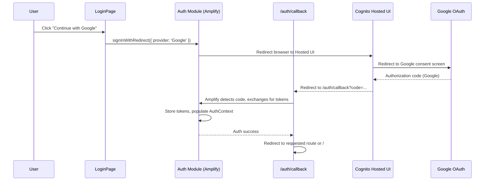
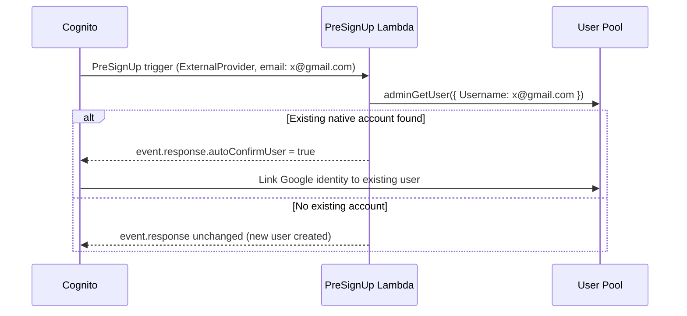

# Design Document: Federated Authentication (Google)

## Overview

This document is an addendum to `login-design.md`. It extends the existing auth architecture with Google federated sign-in using Cognito Identity Federation and Amplify JS v6's `signInWithRedirect`. It also covers the account linking Lambda trigger and the CDK changes required in `AuthStack`.

All design decisions, component conventions, testing patterns, and coding standards from `login-design.md` apply here without exception. This document only specifies the delta — new components, changed interfaces, new properties, and new tests.

### Key Design Decisions

1. **Cognito Hosted UI as the OAuth broker** — The browser redirects to the Cognito-managed OAuth endpoint, which handles the Google OAuth 2.0 dance and returns an authorization code to the app's callback URL. Amplify JS exchanges the code for tokens transparently. This means no custom OAuth logic lives in the frontend or any Lambda, outside of the account linking trigger.
2. **`signInWithRedirect` (full-page redirect, not popup)** — Popups are blocked by most mobile browsers and many desktop security settings. Full-page redirect is the only reliable cross-browser approach and is what Amplify JS v6 recommends.
3. **`/auth/callback` as a dedicated route** — Amplify JS must be initialised before it can process the authorization code in the URL. A dedicated callback route ensures `Amplify.configure()` runs before the code exchange, avoiding race conditions.
4. **PreSignUp Lambda for account linking** — Cognito does not auto-link federated identities to native accounts out of the box. A `PreSignUp` Lambda trigger is the only supported mechanism to link by email match. It runs server-side in Cognito's auth pipeline — no frontend involvement.
5. **Google `client_secret` in Secrets Manager** — The OAuth client secret must never appear in CDK source code or environment variables visible in CI. AWS Secrets Manager is the correct store; the CDK retrieves it via `secretsmanager.Secret.fromSecretNameV2`.
6. **Same `AuthUser` shape** — The `AuthUser` interface is unchanged. After a federated sign-in, `AuthProvider` extracts `userId` (Cognito sub) and `email` from the session identically to the native flow. Downstream components are unaware of which sign-in method was used.

## Architecture

The federated flow adds one new path through the existing architecture. Everything to the left of Cognito is unchanged.



### Account Linking Flow



## Components and Interfaces

### Changes to Existing Components

#### `amplify-config.ts` — Extended

The existing configuration is extended with OAuth settings. The domain and redirect URLs are environment-specific and injected via Vite env vars.

```typescript
const amplifyConfig = {
  Auth: {
    Cognito: {
      userPoolId: import.meta.env.VITE_COGNITO_USER_POOL_ID,
      userPoolClientId: import.meta.env.VITE_COGNITO_USER_POOL_CLIENT_ID,
      // New: OAuth / Hosted UI config for signInWithRedirect
      loginWith: {
        oauth: {
          domain: import.meta.env.VITE_COGNITO_DOMAIN,
          scopes: ['openid', 'email', 'profile'],
          redirectSignIn: [import.meta.env.VITE_OAUTH_REDIRECT_SIGN_IN],
          redirectSignOut: [import.meta.env.VITE_OAUTH_REDIRECT_SIGN_OUT],
          responseType: 'code',
        },
      },
    },
  },
};
```

New environment variables required (add to `.env.example` and Amplify Hosting config):

| Variable | Example value (dev) | Notes |
|---|---|---|
| `VITE_COGNITO_DOMAIN` | `auth.devfin.kioshitechmuta.link` | Cognito custom domain |
| `VITE_OAUTH_REDIRECT_SIGN_IN` | `https://devfin.kioshitechmuta.link/auth/callback` | Must match Cognito callback URL list |
| `VITE_OAUTH_REDIRECT_SIGN_OUT` | `https://devfin.kioshitechmuta.link/login` | Must match Cognito sign-out URL list |

#### `AuthContext` Interface — Extended

One new action is added. All existing actions are unchanged.

```typescript
interface AuthContextValue {
  user: AuthUser | null;
  isAuthenticated: boolean;
  isLoading: boolean;
  // Existing actions (unchanged)
  signIn: (email: string, password: string) => Promise<SignInResult>;
  signUp: (email: string, password: string) => Promise<SignUpResult>;
  confirmSignUp: (email: string, code: string) => Promise<void>;
  resetPassword: (email: string) => Promise<void>;
  confirmResetPassword: (email: string, code: string, newPassword: string) => Promise<void>;
  signOut: () => Promise<void>;
  resendSignUpCode: (email: string) => Promise<void>;
  // New: federated sign-in
  signInWithGoogle: () => Promise<void>;
}
```

`signInWithGoogle` calls `signInWithRedirect({ provider: 'Google' })`. It returns `Promise<void>` because the function initiates a full-page redirect — it never resolves in the current page context. The `isLoading` flag is set to `true` immediately so the button disables; the flag is never reset on this page (the page navigates away).

#### `auth-service.ts` — One new wrapper

```typescript
// New export — wraps Amplify signInWithRedirect
export async function cognitoSignInWithGoogle(): Promise<void>;
```

#### `AuthProvider.tsx` — Callback URL handling

`AuthProvider` must detect when the app loads at `/auth/callback` with a `code` query parameter and allow Amplify JS to complete the token exchange silently. No additional code is required in `AuthProvider` itself — Amplify JS v6 handles this automatically when `Amplify.configure()` has been called before the component mounts. The important constraint is that `amplify-config.ts` must be imported before `AuthProvider` initialises.

The `isLoading` flag remains `true` during the token exchange on the callback route and transitions to `false` once `fetchAuthSession` resolves, triggering the redirect to the intended route. This is identical to the session restoration path that already exists for page reloads.

### New Components

#### `pages/AuthCallbackPage.tsx` — New

A minimal page mounted at `/auth/callback`. Its only job is to render a full-screen loading spinner while Amplify JS processes the authorization code. It never renders any content. Once `isAuthenticated` becomes `true` in `AuthContext`, it redirects to the stored redirect path or `/`.

```typescript
// Route: /auth/callback (public)
// Renders: full-screen spinner
// On isAuthenticated → true: Navigate to redirect path or '/'
// On error param in URL: Navigate to /login with error message in state
```

#### `LoginPage.tsx` — Button addition

The existing `LoginPage` receives one new UI element: the "Continue with Google" button. It is placed above the email/password form, separated by an "or" divider.

```typescript
// Inside LoginPage — addition only, no existing code changes:
<Button
  onClick={handleGoogleSignIn}
  isLoading={isGoogleLoading}
  isDisabled={isGoogleLoading}
  leftIcon={<GoogleIcon />}
  variant="outline"
  width="full"
>
  Continue with Google
</Button>
<Divider />
<Text textAlign="center" color="gray.500" fontSize="sm">or</Text>
<Divider />
// ... existing email + password form unchanged
```

`handleGoogleSignIn` sets local `isGoogleLoading = true`, calls `signInWithGoogle()`, and catches any synchronous errors (e.g. Amplify not configured) to display a toast. It does not reset `isGoogleLoading` — the page navigates away on success.

`GoogleIcon` is a minimal inline SVG of the Google "G" logo (4 coloured path segments). It does not require an external icon library.

### New Infrastructure Components

#### `infra/lib/auth-stack.ts` — Changes

Three additions to the existing `AuthStack`:

**1. Google Identity Provider**

```typescript
const googleProvider = new cognito.UserPoolIdentityProviderGoogle(this, 'GoogleProvider', {
  userPool,
  clientId: googleClientId,         // from CDK context or Secrets Manager
  clientSecretValue: googleSecret.secretValue,
  scopes: ['openid', 'email', 'profile'],
  attributeMapping: {
    email: cognito.ProviderAttribute.GOOGLE_EMAIL,
    // sub maps automatically
  },
});
```

The `client_id` is non-sensitive and may be stored in CDK context (`cdk.json`). The `client_secret` is retrieved from Secrets Manager:

```typescript
const googleSecret = secretsmanager.Secret.fromSecretNameV2(
  this, 'GoogleOAuthSecret', 'laski/google-oauth-client-secret'
);
```

**2. User Pool Domain**

```typescript
const userPoolDomain = new cognito.UserPoolDomain(this, 'CognitoDomain', {
  userPool,
  customDomain: {
    domainName: `auth.${environment.domain}`,
    certificate: acmCert,
  },
});
```

The ACM certificate for `auth.devfin.kioshitechmuta.link` / `auth.appfin.kioshitechmuta.link` must be created in `us-east-1` (CloudFront requirement for Cognito custom domains) and passed in as a cross-region reference. If a custom domain is operationally complex for the initial build, the Cognito-managed prefix domain (`<prefix>.auth.<region>.amazoncognito.com`) may be used as a temporary fallback — it requires no ACM cert. Document the upgrade path.

**3. User Pool Client — OAuth settings**

The existing User Pool Client definition must be extended:

```typescript
const userPoolClient = new cognito.UserPoolClient(this, 'AppClient', {
  userPool,
  // Existing settings preserved
  authFlows: {
    userSrp: true,
    // New:
    userPassword: true,
  },
  // New:
  oAuth: {
    flows: { authorizationCodeGrant: true },
    scopes: [
      cognito.OAuthScope.OPENID,
      cognito.OAuthScope.EMAIL,
      cognito.OAuthScope.PROFILE,
    ],
    callbackUrls: environment.oauthCallbackUrls,   // per-env list
    logoutUrls: environment.oauthLogoutUrls,
  },
  supportedIdentityProviders: [
    cognito.UserPoolClientIdentityProvider.COGNITO,
    cognito.UserPoolClientIdentityProvider.GOOGLE,
  ],
});
// Ensure Google provider is created before the client
userPoolClient.node.addDependency(googleProvider);
```

**4. PreSignUp Lambda trigger**

```typescript
const preSignUpHandler = new NodejsFunction(this, 'PreSignUpHandler', {
  entry: path.resolve(__dirname, '../../back/lambdas/src/auth/pre-sign-up.ts'),
  runtime: Runtime.NODEJS_22_X,
  memorySize: 128,
  timeout: Duration.seconds(5),
  bundling: { minify: true, sourceMap: true },
});

userPool.addTrigger(cognito.UserPoolOperation.PRE_SIGN_UP, preSignUpHandler);

// The trigger needs read access to list users
userPool.grant(preSignUpHandler, 'cognito-idp:AdminGetUser');
```

#### `back/lambdas/src/auth/pre-sign-up.ts` — New Lambda

```typescript
import { PreSignUpTriggerHandler } from 'aws-lambda';
import { CognitoIdentityProviderClient, AdminGetUserCommand } from '@aws-sdk/client-cognito-identity-provider';

const client = new CognitoIdentityProviderClient({});

export const handler: PreSignUpTriggerHandler = async (event) => {
  // Only run linking logic for external (federated) sign-ups
  if (event.triggerSource !== 'PreSignUp_ExternalProvider') {
    return event;
  }

  const email = event.request.userAttributes['email'];
  if (!email) return event;

  try {
    // Check if a native user with this email already exists
    await client.send(new AdminGetUserCommand({
      UserPoolId: event.userPoolId,
      Username: email,
    }));

    // Native user found — auto-confirm and auto-verify to enable linking
    event.response.autoConfirmUser = true;
    event.response.autoVerifyEmail = true;
  } catch (err: unknown) {
    // UserNotFoundException = no existing account, new federated user — no action needed
    const name = (err as { name?: string }).name;
    if (name !== 'UserNotFoundException') {
      // Unexpected error — log but do not block sign-in
      console.error('PreSignUp linking check failed:', err);
    }
  }

  return event;
};
```

## Data Models

### No DynamoDB Changes

Federated users share the same `USER#<cognitoSub>` partition key pattern. The Cognito `sub` for a linked account is the original native account's `sub` — unchanged by linking. No DynamoDB migration is required.

### Updated `AuthUser`

The `AuthUser` interface gains one optional field to allow components to display the sign-in method if needed (e.g. for an account settings page). It is not required by any auth logic.

```typescript
interface AuthUser {
  userId: string;           // Cognito sub (UUID) — unchanged
  email: string;
  identityProvider?: 'Google' | 'Cognito'; // New: populated from ID token 'identities' claim
}
```

### Updated Frontend Project Structure

Additions only:

```
front/
└── src/
    ├── auth/
    │   └── amplify-config.ts       # Extended with OAuth config
    │   └── auth-service.ts         # + cognitoSignInWithGoogle
    │   └── AuthProvider.tsx        # + signInWithGoogle action
    └── pages/
        ├── LoginPage.tsx            # + Google button + divider
        └── AuthCallbackPage.tsx     # New — callback handler page
```

New route added to `routes.tsx`:

```typescript
{ path: '/auth/callback', element: <AuthCallbackPage />, public: true }
```

## Correctness Properties

Properties 1–8 from `login-design.md` are unchanged. The following properties are added for the federated flow.

### Property 9: Google sign-in initiates a redirect

*For any* call to `signInWithGoogle()` in a correctly configured environment, `signInWithRedirect({ provider: 'Google' })` must be called exactly once, and `isLoading` must be set to `true` before the redirect initiates. The function must not resolve or reject — it navigates away.

**Validates: Requirements 7.2, 7.9**

### Property 10: Callback page redirects on authentication

*For any* state where `isAuthenticated` transitions from `false` to `true` while the current route is `/auth/callback`, the `AuthCallbackPage` must navigate away from `/auth/callback` to either the stored redirect path or `/`. It must never remain on `/auth/callback` after authentication is complete.

**Validates: Requirements 7.3**

### Property 11: Error param on callback triggers redirect to login

*For any* URL at `/auth/callback` that contains an `error` query parameter, the `AuthCallbackPage` must navigate to `/login` and must not attempt token exchange or set `isAuthenticated` to `true`.

**Validates: Requirement 7.8**

### Property 12: Federated sign-out clears local session only

*For any* authenticated federated session, calling `signOut()` must result in `user` being null and `isAuthenticated` being false, and must not redirect to any Google-owned URL. The sign-out destination must be the configured `VITE_OAUTH_REDIRECT_SIGN_OUT` URL (the app's `/login` page).

**Validates: Requirements 8.4, 8.5**

### Property 13: AuthUser shape is identical regardless of provider

*For any* authenticated session — whether established via `signIn()` (native) or via the callback URL after `signInWithRedirect()` (federated) — the `user` object in `AuthContext` must be non-null, and `user.userId` must be a non-empty string and `user.email` must be a valid email address. The shape must satisfy the `AuthUser` interface in both cases.

**Validates: Requirement 7.6**

### Property 14: PreSignUp trigger only links on ExternalProvider source

*For any* invocation of the PreSignUp Lambda where `event.triggerSource` is not `'PreSignUp_ExternalProvider'`, the handler must return the `event` object unmodified — `autoConfirmUser` and `autoVerifyEmail` must not be set.

**Validates: Requirement 10.1 (safety bound — native sign-ups must not be auto-confirmed by this trigger)**

### Property 15: Linked account sub is stable

*For any* native Cognito account with sub `S` and email `E`, after a Google sign-in with the same email `E` triggers account linking, subsequent `fetchAuthSession` calls using either sign-in method must return an ID token whose `sub` claim equals `S`. The sub must not change as a result of linking.

**Validates: Requirement 10.3**

## Error Handling

### New Error Cases

The following cases are added to the existing Cognito error mapping table in `login-design.md`:

| Source | Condition | User-Facing Message | Handling location |
|---|---|---|---|
| Callback URL `error` param | Any OAuth error returned by Cognito or Google | "Sign-in with Google failed. Please try again." | `AuthCallbackPage` — reads `error` query param, shows toast, navigates to `/login` |
| `signInWithRedirect` throws synchronously | Amplify not configured, invalid provider | "Could not start Google sign-in. Please try again." | `handleGoogleSignIn` in `LoginPage` — catch block, toast |
| Google consent screen dismissed | User cancels without granting permissions | No error shown — silent return to `/login` | `AuthCallbackPage` — `error=access_denied` maps to silent redirect |
| PreSignUp Lambda throws unexpectedly | Any unhandled exception in the trigger | Cognito surfaces a generic auth error; user sees "An unexpected error occurred." | Logged in CloudWatch; mapped to fallback message in `AuthProvider` |

### `access_denied` Special Case

When the user cancels the Google consent screen, Google returns `error=access_denied` to the callback URL. This must be treated as a silent cancellation (Requirement 7.7), not as a failure — no error toast is shown, the user is simply returned to the Login_Page.

```typescript
// In AuthCallbackPage
const error = searchParams.get('error');
if (error === 'access_denied') {
  navigate('/login'); // silent, no toast
  return;
}
if (error) {
  toast({ title: 'Sign-in with Google failed. Please try again.', status: 'error' });
  navigate('/login');
  return;
}
```

## Testing Strategy

All testing conventions from `login-design.md` apply: Vitest + React Testing Library for unit and component tests, `fast-check` for property-based tests, minimum 100 iterations per property test, tag comments on every property test.

### Property-Based Tests

Each new correctness property maps to one property-based test:

| Property | Test file | Generator strategy |
|---|---|---|
| Property 9 | `auth-service.property.test.ts` | `fc.boolean()` for config validity — mock `signInWithRedirect`, verify call count = 1 and `isLoading` = true |
| Property 10 | `AuthCallbackPage.property.test.tsx` | `fc.boolean()` for auth state transition — verify navigation fires when `isAuthenticated` becomes true |
| Property 11 | `AuthCallbackPage.property.test.tsx` | `fc.string()` for error param values (filtered to non-empty) — verify navigation to `/login`, no auth attempt |
| Property 12 | `AuthProvider.property.test.tsx` | `fc.record()` for federated auth state — verify `user = null`, `isAuthenticated = false`, no Google redirect in navigation |
| Property 13 | `AuthProvider.property.test.tsx` | `fc.oneof(fc.constant('native'), fc.constant('federated'))` for sign-in method — verify `AuthUser` shape in both paths |
| Property 14 | `pre-sign-up.property.test.ts` | `fc.string().filter(s => s !== 'PreSignUp_ExternalProvider')` for trigger source — verify event returned unmodified |
| Property 15 | `pre-sign-up.property.test.ts` | `fc.uuid()` for sub — mock `AdminGetUser` returning existing user with that sub, verify sub unchanged after trigger |

Tag comment format (consistent with existing tests):
```
// Feature: federated-auth, Property {N}: {property_text}
```

### Unit Tests

**`AuthCallbackPage.test.tsx`**
- Renders a loading spinner and nothing else when `isAuthenticated` is false and no error param
- Navigates to `/` when `isAuthenticated` becomes true and no redirect param is stored
- Navigates to the stored redirect path when `isAuthenticated` becomes true and a redirect param exists
- Navigates silently to `/login` on `error=access_denied` — no toast
- Shows error toast and navigates to `/login` on any other `error` param value

**`LoginPage.test.tsx` — additions**
- "Continue with Google" button renders
- "Continue with Google" button calls `signInWithGoogle` on click
- "Continue with Google" button is disabled while `isGoogleLoading` is true
- "or" divider renders between Google button and email/password form
- Existing LoginPage tests are unaffected

**`auth-service.test.ts` — additions**
- `cognitoSignInWithGoogle` calls `signInWithRedirect` with `{ provider: 'Google' }`

**`pre-sign-up.test.ts`** (backend, in `back/lambdas/test/auth/`)
- Returns event unmodified when `triggerSource` is not `PreSignUp_ExternalProvider`
- Sets `autoConfirmUser` and `autoVerifyEmail` when existing user found by email
- Returns event unmodified (no auto-confirm) when `AdminGetUser` throws `UserNotFoundException`
- Returns event unmodified (no auto-confirm) and logs error when `AdminGetUser` throws unexpected error
- Does not throw when `email` attribute is absent from the event

### New Test Files

```
front/
└── src/
    ├── auth/
    │   └── __tests__/
    │       ├── auth-service.test.ts            # Existing + new cognitoSignInWithGoogle test
    │       ├── AuthProvider.property.test.tsx   # Properties 12, 13
    │       └── auth-service.property.test.ts    # Property 9
    └── pages/
        └── __tests__/
            ├── LoginPage.test.tsx               # Existing + Google button tests
            ├── AuthCallbackPage.test.tsx         # New
            └── AuthCallbackPage.property.test.tsx # Properties 10, 11

back/
└── lambdas/
    └── test/
        └── auth/
            ├── pre-sign-up.test.ts              # New
            └── pre-sign-up.property.test.ts     # Properties 14, 15
```

### New Dependencies

No new frontend dependencies are required — `signInWithRedirect` is already part of `aws-amplify/auth` (the same package used for `signIn`). No new devDependencies are required — `fast-check` and Vitest are already present.

New backend dependency (already present in the AWS SDK v3 setup):
```json
{
  "dependencies": {
    "@aws-sdk/client-cognito-identity-provider": "<exact version matching existing aws-sdk packages>"
  }
}
```

The exact version must match the other `@aws-sdk/*` packages already in `back/lambdas/package.json` to avoid JSII conflicts and bundle size regressions.

## Deployment Notes

The following manual steps are required outside of CDK and must be added to the project's deployment runbook:

1. **Create the Google OAuth App** in Google Cloud Console. Set the authorised redirect URI to the Cognito Hosted UI domain: `https://auth.devfin.kioshitechmuta.link/oauth2/idpresponse` (dev) and `https://auth.appfin.kioshitechmuta.link/oauth2/idpresponse` (prod). This URI is managed by Cognito — it is not the app's `/auth/callback`.
2. **Store the Google client secret** in AWS Secrets Manager under the name `laski/google-oauth-client-secret` in both dev (us-west-2) and prod (us-west-1) regions before running `cdk deploy AuthStack`.
3. **Store the Google client ID** in CDK context (`cdk.json`) under `googleOAuthClientId` — it is not sensitive and does not need Secrets Manager.
4. **Create the ACM certificate** for `auth.devfin.kioshitechmuta.link` in `us-east-1` (required for Cognito custom domains, which use CloudFront). Add the ARN to CDK context. Alternatively, use the Cognito-managed prefix domain for the initial deployment and migrate to a custom domain as a follow-up task.
5. **Add the new environment variables** (`VITE_COGNITO_DOMAIN`, `VITE_OAUTH_REDIRECT_SIGN_IN`, `VITE_OAUTH_REDIRECT_SIGN_OUT`) to the Amplify Hosting environment configuration for both dev and main branches.
