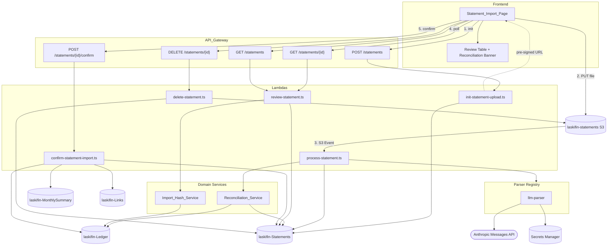

# Design Document — Statement Import & Reconciliation

## Overview

This design realises `statement-import-requirements.md`. The feature ingests two kinds of PDF documents — an **Itaú checking account statement** and an **Itaú credit card bill** — extracts transactions, writes them (on user confirmation) into the existing `laskifin-Ledger` table, and proposes Links between a credit card bill and the corresponding checking-account bill-payment debit using the existing `laskifin-Links` table from the Linking Layer.

Transaction extraction is performed by sending the uploaded PDF directly to the **Anthropic Messages API** (Claude) as a base64-encoded `document` content block. Claude's native PDF support processes each page as text + image, making it robust against complex layouts (two-column credit card bills, varying bank formats) without per-bank regex parsers. The LLM is instructed via a structured system prompt to return transactions in the existing `ExtractedTransaction` JSON schema, and the response is validated with Zod. This approach is **bank-agnostic** — the same prompt works for any bank's PDF. The `bank` field on the Statement record becomes informational context passed to the prompt rather than a parser selector.

The design has three technical pillars:

1. **Asynchronous extraction pipeline** — An S3-event-driven Lambda that sends the uploaded PDF to the Anthropic Messages API via a single LLM parser. Users upload via pre-signed URL and poll for status. The LLM API call takes 5–15 seconds depending on document complexity, well beyond what a synchronous API Gateway response can accommodate (29 s hard limit). Extraction never touches the Ledger; it only populates a draft list on the Statement record.
2. **Draft → confirm workflow** — Users review extracted transactions before anything lands in the Ledger. Confirmation is explicit, per-row, and idempotent. This keeps the user in control and prevents auto-import mistakes from silently corrupting the balance.
3. **Reconciliation as proposal, not mutation** — The reconciler detects the bill-payment ↔ credit-card-bill relationship by amount + date-window + description pattern and produces a `ReconciliationCandidate` on the Statement record. Links are written only when the user confirms. This keeps the feature safe and auditable, and reuses the existing Linking Layer (`laskifin-Links`) without introducing a new link model.

The canonical test case — the two sample PDFs — exercises all three pillars end to end: uploading both statements, auto-extracting ~100 card lines plus ~30 bank lines, detecting that the `ITAU BLACK 3102-2305 -9181.49` debit on 20/04/2026 is the settlement of the R$ 9.181,49 credit card bill due on the same date, and on confirmation writing both sets of Ledger entries plus ~100 Links in a single user action.

## Architecture



### Why this shape

1. **S3-event-driven processing, not a synchronous parse-on-upload**. The LLM API call to Anthropic takes 5–15 seconds depending on document size and complexity. Holding an API Gateway connection open for that duration is wasteful and risks hitting the hard API Gateway limit (29 s). An async pipeline with polling is standard for file-processing workloads on AWS and fits Lambda's execution model cleanly. The Lambda timeout is set to 90 s to accommodate LLM response latency with margin.
2. **Draft transactions stored on the Statement record, not in the Ledger**. Storing drafts directly in the Ledger and marking them with `status = 'draft'` would require every downstream query (list, balance, insights) to filter them out — a cross-cutting concern that leaks into all existing handlers. Keeping drafts on the Statement record isolates them.
3. **Reconciliation is one-shot at extraction time, not continuous**. Recomputing reconciliation candidates every time any Ledger entry changes would be expensive and would require DynamoDB Streams. Instead, reconciliation runs once when a statement is extracted — which is when the user is thinking about it anyway — and the candidates persist on the Statement record until confirmed or dismissed.
4. **Parent = bank debit, child = card charge**. Semantically, the settlement event "pays for" the charges. The existing Linking Layer's directed semantics (`parentSk` → `childSk`) map onto this naturally: the user browsing the bank debit in the transaction detail view sees "This entry pays for: 97 charges" in the LinkWidget.
5. **Deterministic sort keys for Links** are reused from `linking-layer-design.md`. This makes reconciliation idempotent — re-running the same confirmation writes a superset that's safely no-op on collision via `ConditionalCheckFailedException`.

## Data Model

### Updated `laskifin-Statements`

The base schema is defined in `data-model.md`. This feature extends it with the following attributes:

| Attribute | Type | Example | Notes |
|---|---|---|---|
| `pk` | String | `USER#a1b2c3` | Partition key. |
| `sk` | String | `STATEMENT#<uuid>` | Sort key. |
| `statementId` | String | `uuid-v4` | Matches SK suffix. |
| `bank` | String | `ITAU` | Informational — passed to LLM prompt as context. |
| `documentType` | String | `BANK_ACCOUNT` \| `CREDIT_CARD` | Passed to LLM prompt as context. |
| `filename` | String | `extrato-lancamentos_cartao.pdf` | Original filename. |
| `contentType` | String | `application/pdf` | `application/pdf` \| `text/csv`. |
| `s3Key` | String | `statements/a1b2c3/uuid.pdf` | GSI_StatementsByS3Key pk. |
| `status` | String | `processing` | `pending`\|`processing`\|`done`\|`imported`\|`failed`. |
| `extractedCount` | Number | `103` | Populated when `status = done`. |
| `importedCount` | Number | `100` | Populated after Confirm_Import. |
| `errors` | List\<String\> | `[]` | Parser errors. |
| `extractedTransactions` | List\<Object\> | `[...]` | Draft rows — cleared after import. |
| `futureInstallments` | List\<Object\> | `[...]` | Preview of next bills (BR-S15). |
| `reconciliationCandidates` | List\<Object\> | `[{confidence, parentSk, childCount, totalAmount, ...}]` | New — BR-S22..S30. |
| `dueDate` | String | `2026-04-20` | Credit card statement only. Used by `GSI_StatementsByDocumentTypeDueDate`. |
| `totalAmount` | Number | `9181.49` | Credit card statement only. Used for reconciliation matching. |
| `documentTypeDueDate` | String | `CREDIT_CARD#2026-04-20` | New composite GSI SK for reconciliation lookups. |
| `createdAt` | String | ISO 8601 | Upload init timestamp. |
| `updatedAt` | String | ISO 8601 | Last status transition. |

#### New GSIs

| Index | PK | SK | Purpose |
|---|---|---|---|
| `GSI_StatementsByS3Key` | `s3Key` | — | Process_Statement_Handler resolves the Statement record from the S3 event's object key. |
| `GSI_StatementsByDocumentTypeDueDate` | `pk` | `documentTypeDueDate` | Reconciliation_Service, for a given bank statement row date, finds `CREDIT_CARD` statements with `documentTypeDueDate` in the `[date-3d, date+3d]` window. |

### Updated `laskifin-Ledger`

A new sparse GSI for idempotent re-import:

| Index | PK | SK | Projection | Purpose |
|---|---|---|---|---|
| `GSI_LedgerByImportHash` | `pk` | `importHash` | KEYS_ONLY | Confirm_Import_Handler and Review_Handler, before writing, check for an existing Ledger item with the same `importHash` to skip duplicates (BR-S19). Sparse: items without `importHash` (i.e. manually created) are not indexed. |

New attribute on Ledger items written by the import flow only:

| Attribute | Type | Example | Notes |
|---|---|---|---|
| `importHash` | String | `a3b2...` | SHA-256 hex of `userId + source + date + amount + description`. Only present on items imported from a statement. |
| `sourceStatementId` | String | `uuid-v4` | Points back at the Statement that originated the entry. Useful for audit and for the "delete statement → keep ledger" semantic. |

### `laskifin-Links` — no schema change

Reuses the table and GSIs defined in `linking-layer-design.md`. The Confirm_Import_Handler is a new writer, following the same deterministic-sk construction and conditional-write patterns.

### CDK changes to `DataStack`

```typescript
// laskifin-Statements — new table
const statementsTable = new dynamodb.Table(this, 'StatementsTable', {
  tableName: 'laskifin-Statements',
  partitionKey: { name: 'pk', type: dynamodb.AttributeType.STRING },
  sortKey:      { name: 'sk', type: dynamodb.AttributeType.STRING },
  billingMode:  dynamodb.BillingMode.PAY_PER_REQUEST,
  pointInTimeRecovery: true,
});

statementsTable.addGlobalSecondaryIndex({
  indexName:     'GSI_StatementsByS3Key',
  partitionKey:  { name: 's3Key', type: dynamodb.AttributeType.STRING },
  projectionType: dynamodb.ProjectionType.ALL,
});

statementsTable.addGlobalSecondaryIndex({
  indexName:     'GSI_StatementsByDocumentTypeDueDate',
  partitionKey:  { name: 'pk', type: dynamodb.AttributeType.STRING },
  sortKey:       { name: 'documentTypeDueDate', type: dynamodb.AttributeType.STRING },
  projectionType: dynamodb.ProjectionType.ALL,
});

// laskifin-Ledger — new sparse GSI
ledgerTable.addGlobalSecondaryIndex({
  indexName:     'GSI_LedgerByImportHash',
  partitionKey:  { name: 'pk', type: dynamodb.AttributeType.STRING },
  sortKey:       { name: 'importHash', type: dynamodb.AttributeType.STRING },
  projectionType: dynamodb.ProjectionType.KEYS_ONLY,
});

// Exports
new cdk.CfnOutput(this, 'StatementsTableName', {
  value: statementsTable.tableName, exportName: 'StatementsTableName',
});
new cdk.CfnOutput(this, 'StatementsTableArn', {
  value: statementsTable.tableArn,  exportName: 'StatementsTableArn',
});
```

### CDK additions to `ApiStack` (or new `StatementsStack`)

```typescript
// S3 bucket
const statementsBucket = new s3.Bucket(this, 'StatementsBucket', {
  bucketName: 'laskifin-statements',
  encryption: s3.BucketEncryption.S3_MANAGED,
  blockPublicAccess: s3.BlockPublicAccess.BLOCK_ALL,
  versioned: true,
  lifecycleRules: [{
    id: 'glacier-after-90-days',
    enabled: true,
    transitions: [{
      storageClass: s3.StorageClass.GLACIER,
      transitionAfter: cdk.Duration.days(90),
    }],
  }],
  cors: [{
    allowedMethods: [s3.HttpMethods.PUT],
    allowedOrigins: [frontendOrigin],
    allowedHeaders: ['*'],
    maxAge: 3000,
  }],
});

// S3 → Process_Statement_Handler
statementsBucket.addEventNotification(
  s3.EventType.OBJECT_CREATED,
  new s3n.LambdaDestination(processStatementHandler),
  { prefix: 'statements/' },
);
```

## Backend Components

### `back/lambdas/src/statements/init-statement-upload.ts`

```typescript
// POST /statements
// Body: { filename, contentType, documentType: 'BANK_ACCOUNT'|'CREDIT_CARD', bank: 'ITAU' }
// Returns: 202 { statementId, uploadUrl, expiresAt }

const Schema = z.object({
  filename:     z.string().min(1).max(255),
  contentType: z.enum(['application/pdf', 'text/csv']),
  documentType: z.enum(['BANK_ACCOUNT', 'CREDIT_CARD']),
  bank:         z.enum(['ITAU']),
});

export const handler = async (event: APIGatewayProxyEvent): Promise<APIGatewayProxyResult> => {
  const userId = event.requestContext.authorizer?.claims.sub;
  if (!userId) return unauthorized();

  const body = Schema.parse(JSON.parse(event.body ?? '{}'));
  const statementId = randomUUID();
  const ext = body.contentType === 'application/pdf' ? 'pdf' : 'csv';
  const s3Key = `statements/${userId}/${statementId}.${ext}`;
  const now = new Date().toISOString();

  await docClient.send(new PutCommand({
    TableName: process.env.STATEMENTS_TABLE_NAME,
    Item: {
      pk: `USER#${userId}`,
      sk: `STATEMENT#${statementId}`,
      statementId,
      bank: body.bank,
      documentType: body.documentType,
      filename: body.filename,
      contentType: body.contentType,
      s3Key,
      status: 'pending',
      errors: [],
      createdAt: now,
      updatedAt: now,
    },
  }));

  const uploadUrl = await getSignedUrl(s3Client, new PutObjectCommand({
    Bucket: process.env.STATEMENTS_BUCKET_NAME,
    Key:    s3Key,
    ContentType: body.contentType,
  }), { expiresIn: 600 });

  return {
    statusCode: 202,
    body: JSON.stringify({
      statementId, uploadUrl,
      expiresAt: new Date(Date.now() + 600_000).toISOString(),
    }),
  };
};
```

### `back/lambdas/src/statements/process-statement.ts`

Triggered by S3 ObjectCreated. Looks up the Statement via `GSI_StatementsByS3Key`, calls the LLM parser, runs the conservation check (for credit card bills), runs reconciliation, writes results back.

```typescript
import { getParser } from './parsers';
import { reconcile } from './services/reconciliation';

export const handler = async (event: S3Event): Promise<void> => {
  for (const record of event.Records) {
    const s3Key = decodeURIComponent(record.s3.object.key.replace(/\+/g, ' '));
    const stmt  = await findStatementByS3Key(s3Key);
    if (!stmt) {
      console.error('Statement not found for s3Key', s3Key);
      continue;
    }

    await transitionStatus(stmt, 'processing');

    try {
      const bytes  = await downloadFromS3(record.s3.bucket.name, s3Key);
      const parser = getParser(stmt.bank, stmt.documentType);
      const parsed = await parser.parse(bytes);
      // parsed: { extractedTransactions, futureInstallments?, totalAmount?, dueDate? }

      const candidates = await reconcile(stmt, parsed);

      await docClient.send(new UpdateCommand({
        TableName: process.env.STATEMENTS_TABLE_NAME,
        Key:       { pk: stmt.pk, sk: stmt.sk },
        UpdateExpression:
          'SET #status = :done, extractedTransactions = :txs, futureInstallments = :fut, ' +
          'extractedCount = :cnt, reconciliationCandidates = :cand, ' +
          '#total = :total, dueDate = :due, documentTypeDueDate = :ddType, updatedAt = :now',
        ExpressionAttributeNames: { '#status': 'status', '#total': 'totalAmount' },
        ExpressionAttributeValues: {
          ':done':   'done',
          ':txs':    parsed.extractedTransactions,
          ':fut':    parsed.futureInstallments ?? [],
          ':cnt':    parsed.extractedTransactions.length,
          ':cand':   candidates,
          ':total':  parsed.totalAmount  ?? null,
          ':due':    parsed.dueDate       ?? null,
          ':ddType': parsed.dueDate
            ? `${stmt.documentType}#${parsed.dueDate}` : null,
          ':now':    new Date().toISOString(),
        },
      }));
    } catch (err) {
      console.error('Parser failed', err);
      await transitionStatus(stmt, 'failed', [String((err as Error).message)]);
    }
  }
};
```

Note: The `getParser()` call now routes all `(bank, documentType)` combinations to the single LLM parser. The `bank` and `documentType` are passed as context to the LLM prompt, not used to select different parser implementations.

### `back/lambdas/src/statements/review-statement.ts`

`GET /statements/{statementId}`. Fetches the Statement, augments with a `duplicates[]` array by hashing each extracted transaction and batch-querying `GSI_LedgerByImportHash`.

```typescript
export const handler = async (event: APIGatewayProxyEvent): Promise<APIGatewayProxyResult> => {
  const userId = event.requestContext.authorizer?.claims.sub;
  if (!userId) return unauthorized();

  const statementId = event.pathParameters?.statementId;
  if (!statementId) return badRequest('statementId required');

  const pk = `USER#${userId}`;
  const stmt = await docClient.send(new GetCommand({
    TableName: process.env.STATEMENTS_TABLE_NAME,
    Key: { pk, sk: `STATEMENT#${statementId}` },
  }));

  if (!stmt.Item) return notFound('Statement not found');

  const drafts   = (stmt.Item.extractedTransactions ?? []) as ExtractedTransaction[];
  const hashes   = drafts.map(d => buildImportHash(userId, d));
  const existing = await batchQueryLedgerByImportHash(pk, hashes);

  const duplicates = drafts
    .map((d, index) => {
      const h = hashes[index];
      const match = existing.get(h);
      return match ? { index, matchedLedgerSk: match.sk } : null;
    })
    .filter((x): x is NonNullable<typeof x> => x !== null);

  return ok({ ...stmt.Item, duplicates });
};
```

### `back/lambdas/src/statements/confirm-statement-import.ts`

Writes selected Extracted_Transactions to the Ledger, updates MonthlySummary, creates accepted links.

```typescript
export const handler = async (event: APIGatewayProxyEvent): Promise<APIGatewayProxyResult> => {
  const userId = event.requestContext.authorizer?.claims.sub;
  if (!userId) return unauthorized();

  const { statementId } = event.pathParameters ?? {};
  const { selectedIndices, acceptedReconciliationIds } = ConfirmSchema.parse(
    JSON.parse(event.body ?? '{}'),
  );
  if (!statementId) return badRequest('statementId required');
  if (selectedIndices.length === 0) return badRequest('No transactions selected');

  const pk   = `USER#${userId}`;
  const stmt = await getStatement(pk, statementId);
  if (!stmt) return notFound('Statement not found');

  const drafts = stmt.extractedTransactions as ExtractedTransaction[];

  // Step 1: duplicate filtering
  const candidates = selectedIndices.map(i => ({
    index: i,
    tx:    drafts[i],
    hash:  buildImportHash(userId, drafts[i]),
  }));

  const existing  = await batchQueryLedgerByImportHash(pk, candidates.map(c => c.hash));
  const toWrite   = candidates.filter(c => !existing.has(c.hash));
  const skipped   = candidates
    .filter(c => existing.has(c.hash))
    .map(c => ({ index: c.index, matchedSk: existing.get(c.hash)!.sk }));

  // Step 2: write Ledger + MonthlySummary — chunked BatchWrite with retry
  const newLedgerSks: Record<number, string> = {};
  for (const chunk of chunkBy(toWrite, 25)) {
    const now  = new Date().toISOString();
    const items = chunk.map(({ tx, index, hash }) => {
      const sk = buildLedgerSk(tx.date, tx.type);           // TRANS#YYYY-MM#TYPE#uuid
      newLedgerSks[index] = sk;
      return {
        PutRequest: {
          Item: {
            pk, sk,
            description: tx.description,
            amount: tx.amount,
            totalAmount: tx.amount,
            type: tx.type,
            category: tx.category.trim().toLowerCase(),
            source:   tx.source.trim().toLowerCase(),
            date:     tx.date,
            groupId:  tx.groupId ?? randomUUID(),
            installmentNumber: tx.installmentNumber ?? 1,
            installmentTotal:  tx.installmentTotal  ?? 1,
            categoryMonth: `${tx.category.trim().toLowerCase()}#${tx.date.slice(0, 7)}`,
            importHash: hash,
            sourceStatementId: statementId,
            createdAt: now,
          },
        },
      };
    });

    await batchWriteWithRetry(process.env.TABLE_NAME!, items);

    // Update summary per entry (utility from `coding-standards.md`)
    for (const { tx } of chunk) {
      await updateMonthlySummary({
        userId, month: tx.date.slice(0, 7),
        type: tx.type, amount: tx.amount, operation: 'add',
      });
    }
  }

  // Step 3: create accepted links
  const linkResults = await createAcceptedLinks(
    pk, stmt, acceptedReconciliationIds, newLedgerSks,
  );

  // Step 4: finalise Statement record
  await docClient.send(new UpdateCommand({
    TableName: process.env.STATEMENTS_TABLE_NAME,
    Key: { pk, sk: `STATEMENT#${statementId}` },
    UpdateExpression:
      'SET #status = :imported, importedCount = :n, updatedAt = :now ' +
      'REMOVE extractedTransactions',
    ExpressionAttributeNames:  { '#status': 'status' },
    ExpressionAttributeValues: {
      ':imported': 'imported',
      ':n':        toWrite.length,
      ':now':      new Date().toISOString(),
    },
  }));

  return ok({
    imported:   toWrite.length,
    skipped,
    linked:     linkResults.linked,
    linkFailed: linkResults.failed,
  });
};
```

### `back/lambdas/src/statements/delete-statement.ts`

`DELETE /statements/{id}`. Deletes the S3 object and the DDB record. Refuses if `status = 'processing'`.

## Parser Strategy

Parsers live in `back/lambdas/src/statements/parsers/` and share this contract:

```typescript
export interface ExtractedTransaction {
  date: string;              // ISO 8601
  description: string;
  amount: number;            // always positive, sign in `type`
  type: 'INC' | 'EXP';
  source: string;
  category: string;
  installmentNumber?: number;
  installmentTotal?: number;
  groupId?: string;
  meta?: Record<string, unknown>;  // parser-specific extras (e.g. USD, conversion rate)
}

export interface ParseResult {
  extractedTransactions: ExtractedTransaction[];
  futureInstallments?: ExtractedInstallmentPreview[];
  totalAmount?: number;       // credit card only — cross-check
  dueDate?: string;           // credit card only — ISO
  bankAccount?: string;       // bank account only — derived source
}

export interface Parser {
  parse(bytes: Uint8Array): Promise<ParseResult>;
}
```

### `parsers/llm-parser.ts`

A single parser implementation that handles all `(bank × documentType)` combinations by sending the raw PDF to the Anthropic Messages API and receiving structured JSON back.

#### How it works

1. **Retrieve the Anthropic API key** from AWS Secrets Manager at `laski/anthropic-api-key`. The key is cached at module scope for the lifetime of the warm Lambda container (same pattern as the Google OAuth secret in `architecture.md`). The secret name is passed via the `ANTHROPIC_SECRET_NAME` environment variable.

2. **Send the PDF to Claude** as a base64-encoded `document` content block using the `@anthropic-ai/sdk` TypeScript package:
   ```typescript
   const response = await anthropic.messages.create({
     model: 'claude-sonnet-4-6',
     max_tokens: 16384,
     temperature: 0,
     system: buildSystemPrompt(bank, documentType),
     messages: [{
       role: 'user',
       content: [
         {
           type: 'document',
           source: {
             type: 'base64',
             media_type: 'application/pdf',
             data: Buffer.from(bytes).toString('base64'),
           },
         },
         {
           type: 'text',
           text: 'Extract all transactions from this document following the instructions in the system prompt. Return only the JSON object.',
         },
       ],
     }],
   });
   ```

3. **System prompt structure**. The `buildSystemPrompt(bank, documentType)` function constructs a prompt with these sections:
   - **Role**: "You are a financial document parser. Extract every transaction from the uploaded PDF."
   - **Output schema**: The exact `ExtractedTransaction` JSON schema, including all fields and their types.
   - **Document context**: The `bank` and `documentType` values, so the LLM understands the document structure.
   - **Extraction rules for BANK_ACCOUNT**:
     - Extract `source` from the document header (e.g. `agência: NNNN  conta: NNNNN-N` → `itau-corrente-<agencia>-<conta>`).
     - Negative values → `type = 'EXP'`, positive → `type = 'INC'`. `amount` is always `Math.abs(value)`.
     - Set `category = 'uncategorized'` for all rows.
     - Convert dates from `DD/MM/YYYY` to ISO `YYYY-MM-DD`.
   - **Extraction rules for CREDIT_CARD**:
     - Recognise plastic-card section headers (e.g. `KIOSHI IOSIMUTA (final NNNN)`) and set `source` to `itau-black-<NNNN>`.
     - Apply year inference from the document's posting date for `DD/MM` dates (per BR-S17).
     - Detect installment suffixes (e.g. `10/21`) → populate `installmentNumber`, `installmentTotal`, strip suffix from `description`.
     - Extract `category` from the line below each transaction, strip city suffix (`.CAPITAL`), lowercase + trim.
     - International purchases: use BRL value, emit IOF repasse as separate transaction with `category = 'fees'`.
     - Separate `Compras parceladas - próximas faturas` into `futureInstallments` (not `extractedTransactions`).
     - Extract `totalAmount` from `Total desta fatura` and `dueDate` from `Vencimento: DD/MM/YYYY`.
   - **Exclusion rules**: Explicitly list lines that must NOT appear in the output — `SALDO ANTERIOR`, `SALDO TOTAL DISPONÍVEL DIA`, `SALDO DO DIA`, `SALDO FINAL DO PERÍODO`, `Total desta fatura`, `Total da fatura anterior`, `Pagamento efetuado em`, `Saldo financiado`, card-level subtotals (`Lançamentos no cartão (final NNNN) <total>`), international subtotals (`Total transações inter. em R$`).
   - **Output format**: Return a single JSON object with `extractedTransactions`, `futureInstallments`, `totalAmount`, `dueDate`, `bankAccount` fields.

4. **Zod validation** of the LLM response. Parse the JSON from the response text block and validate against the `ParseResult` Zod schema. If validation fails, retry once with a more explicit prompt that includes the validation errors (see Requirement 11 AC 4). If the retry also fails, throw.

5. **Post-processing**:
   - Ensure deterministic ordering of `extractedTransactions` by `(date ascending, order-in-document)`.
   - Normalise `source` and `category` values: `.trim().toLowerCase()`.
   - For installment rows, compute `groupId = uuidv5(normalisedDescription + firstKnownCardDate, NAMESPACE_INSTALLMENT)` deterministically.
   - Ensure `amount` is always `Math.abs(value)` and `type` is correctly set.

6. **Token usage logging**. After each API call, log `input_tokens` and `output_tokens` from the response `usage` field for cost monitoring.

### Conservation check

For credit card bills where `totalAmount` is available, a post-extraction validation step verifies:

```typescript
Math.abs(sum(extractedTransactions.amount) - totalAmount) < 0.01
```

This check runs after the LLM returns and after Zod validation, but before the results are written to the Statement record. If it fails, the parser throws, `process-statement` sets `status = 'failed'`, and the UI surfaces the error with instructions to report it. This is also the property `P-SI-1`.

### `parsers/types.ts`

Exports `ExtractedTransaction`, `ExtractedInstallmentPreview`, `ParseResult`, `Parser`, `BankId`, `DocumentType` — unchanged from the current implementation.

### `parsers/index.ts`

The registry still exists but routes all `(bank, documentType)` combinations to the single LLM parser:

```typescript
import type { BankId, DocumentType, Parser } from './types';
import { llmParser } from './llm-parser';

export function getParser(bank: BankId, documentType: DocumentType): Parser {
  // All combinations route to the LLM parser.
  // bank and documentType are passed as context to the LLM prompt.
  return llmParser(bank, documentType);
}

export * from './types';
```

The `getParser` function signature is preserved so that `process-statement.ts` does not need to change its calling code. The `bank` and `documentType` are forwarded to the LLM parser which uses them to construct the appropriate system prompt.

## Reconciliation Service

File: `back/lambdas/src/statements/services/reconciliation.ts`

Invoked by `process-statement.ts` after a successful parse. Produces `ReconciliationCandidate[]`.

```typescript
interface ReconciliationCandidate {
  candidateId: string;                  // deterministic: hash(parentSk, statementId)
  confidence:  'high' | 'ambiguous' | 'none';
  parentStatementId?: string;
  parentSk?: string;
  parentDescription?: string;
  candidateParents?: Array<{ sk: string; description: string; date: string }>;
  childStatementId: string;
  childCount: number;
  totalAmount: number;
  dateWindow: { from: string; to: string };
}
```

### Algorithm

For a **CREDIT_CARD** statement `S` with `totalAmount = T` and `dueDate = D`:

1. `windowFrom = D - 3 days`, `windowTo = D + 3 days`.
2. Query `laskifin-Ledger` for the user: for each month `YYYY-MM` in the window, issue `Query` with `pk = USER#sub` and `sk begins_with TRANS#YYYY-MM#EXP#`. Filter in-memory where `amount === T` and `date` is inside `[windowFrom, windowTo]` and `description` matches the Itaú bill-payment regex `/(^|\s)(ITAU\s+BLACK|PAG\s+FATURA|FATURA\s+CARTAO|PAGAMENTO\s+CARTAO)/i`.
3. Let `matches` be the filtered list.
   - `matches.length === 1` → `confidence = 'high'`, `parentSk = matches[0].sk`.
   - `matches.length > 1`    → `confidence = 'ambiguous'`, populate `candidateParents`.
   - `matches.length === 0` → `confidence = 'none'`.
4. Return a single candidate with `childCount = extractedTransactions.length`, `totalAmount = T`, `dateWindow = {from, to}`, `childStatementId = S.statementId`.

For a **BANK_ACCOUNT** statement `S`:

1. Filter `S.extractedTransactions` for rows matching the Itaú bill-payment regex with `type = 'EXP'`.
2. For each such row `R`:
   a. Query `GSI_StatementsByDocumentTypeDueDate` for the user: `pk = USER#sub`, `documentTypeDueDate between CREDIT_CARD#<R.date - 3d> and CREDIT_CARD#<R.date + 3d>`.
   b. Filter by `totalAmount === R.amount`.
   c. If exactly one statement matches → `confidence = 'high'`, `parentSk` is the SK that `R` **will** have once imported (computed deterministically or resolved at import time — see `linking-layer-design.md` "deterministic sort key" approach).
   d. Otherwise adjust `confidence` as above.

### Why ±3 days

The Itaú `dueDate` is the settlement date, and the checking-account debit usually appears on the same calendar day. Holidays and weekends can push it ±1–2 days. Three days is a safe window that still avoids spurious matches with the previous or next month's bill.

### What happens when reconciliation is confirmed

In `confirm-statement-import.ts`, for each `candidateId` in `acceptedReconciliationIds`:

1. Look up the candidate from `stmt.reconciliationCandidates`.
2. If `confidence = 'ambiguous'`, the client must supply the chosen `parentSk` in the request body via a separate field `reconciliationChoices: { [candidateId]: parentSk }`.
3. For each newly-imported child SK scoped to this candidate:
   ```typescript
   await linksClient.send(new PutCommand({
     TableName: process.env.LINKS_TABLE_NAME,
     Item: {
       pk,
       sk: buildLinkSk(parentSk, childSk),
       linkId: buildLinkId(parentSk, childSk),
       parentSk, childSk,
       createdAt: new Date().toISOString(),
       origin: 'statement-reconciliation',
       originStatementId: statementId,
     },
     ConditionExpression: 'attribute_not_exists(pk)',
   }));
   ```
4. Catch `ConditionalCheckFailedException` and record as success (link already exists).
5. Other errors → record as `linkFailed` and continue.

## CDK Changes to `ApiStack`

The `ProcessStatementHandler` Lambda definition changes from the regex-parser era:

```typescript
// Process_Statement_Handler — 512 MB / 90 s, S3-triggered
const processStatementHandler = new lambda.NodejsFunction(this, 'ProcessStatementHandler', {
  functionName: `${prefix}-processStatement`,
  entry: path.resolve(__dirname, '../../back/lambdas/src/statements/process-statement.ts'),
  handler: 'handler',
  runtime: Runtime.NODEJS_22_X,
  memorySize: 512,
  timeout: cdk.Duration.seconds(90),
  bundling: {
    minify: true,
    sourceMap: true,
  },
  environment: {
    STATEMENTS_TABLE_NAME: props.statementsTable.tableName,
    STATEMENTS_BUCKET_NAME: statementsBucket.bucketName,
    TABLE_NAME: props.ledgerTable.tableName,
    ANTHROPIC_SECRET_NAME: 'laski/anthropic-api-key',
    CORS_ORIGIN: corsOrigin,
  },
});
props.statementsTable.grantReadWriteData(processStatementHandler);
props.ledgerTable.grantReadData(processStatementHandler);
statementsBucket.grantRead(processStatementHandler, 'statements/*');

// Grant Secrets Manager access for the Anthropic API key
const anthropicSecret = secretsmanager.Secret.fromSecretNameV2(
  this, 'AnthropicSecret', 'laski/anthropic-api-key',
);
anthropicSecret.grantRead(processStatementHandler);
```

Key changes from the previous design:

1. **Removed ESM bundling workaround** — The `format: lambda.OutputFormat.ESM` and `banner` with `createRequire` are no longer needed. The `@anthropic-ai/sdk` package works with standard CJS bundling, unlike `pdfjs-dist` which required ESM.
2. **Added `ANTHROPIC_SECRET_NAME` env var** — The Lambda retrieves the Anthropic API key from Secrets Manager at runtime.
3. **Added `secretsmanager:GetSecretValue` IAM grant** — Via `anthropicSecret.grantRead(processStatementHandler)`.
4. **Increased timeout to 90 s** — The LLM API call takes 5–15 seconds for typical documents, but can take longer for large multi-page credit card bills. 90 s provides comfortable margin.

## Error Handling

- LLM API errors (rate limit, timeout, malformed response) → `status = 'failed'`, `errors[]` populated, user sees retry option.
- Zod validation failure after retry → `status = 'failed'`, error message includes which fields failed validation.
- Conservation check failure → `status = 'failed'`, error message includes the expected vs actual sum.
- S3 download errors → Lambda exits non-zero; S3 retries the event automatically (default 2 retries) and eventually DLQs if configured (recommended: add an SQS DLQ).
- Secrets Manager errors → Lambda fails on cold start; subsequent invocations use cached key.
- Duplicate import → silently skipped with `skipped[]` response.
- Duplicate link → treated as success.
- Confirm_Import BatchWrite UnprocessedItems → exponential backoff up to 3 retries.
- All handlers wrap logic in `try/catch` and return structured JSON per `coding-standards.md`.

## Testing Strategy

Following `coding-standards.md` testing rules:

### Unit tests (Vitest)

- `parsers/llm-parser.test.ts` — Tests the LLM parser's Zod validation and post-processing logic. Uses mocked Anthropic API responses (pre-recorded JSON fixtures) to verify:
  - Correct Zod schema validation of well-formed responses.
  - Rejection and retry on malformed responses (missing fields, wrong types).
  - Post-processing: deterministic ordering, source/category normalisation, groupId computation for installments.
  - Conservation check: passes when sum matches `totalAmount`, throws when it doesn't.
  - Token usage logging is called with correct values.
- `services/reconciliation.test.ts` — given a bank stmt + card stmt pair, assert a `high` candidate. Ambiguous / none cases via mocked data.
- `confirm-statement-import.test.ts` — verify dedup by importHash, MonthlySummary side effects, link creation side effects, partial failure reporting.
- `init-statement-upload.test.ts` — pre-signed URL shape, DDB write, validation errors.

### Integration tests (real Anthropic API)

- `parsers/llm-parser.integration.test.ts` — Calls the real Anthropic API with the sample PDF fixtures. These tests are gated behind an `ANTHROPIC_API_KEY` environment variable and are not run in CI by default. They verify:
  - Bank account fixture: canonical rows from BR §R3 are extracted, no `SALDO*` rows.
  - Credit card fixture: per-card aggregates match (7077.99 / 379.00 / 1603.47 / 116.96 / 4.07 / sum = 9181.49).
  - Installment suffix parsing, international IOF extraction, future-installment separation.

### Property tests (fast-check)

Each property listed in `statement-import-requirements.md` (P-SI-1 … P-SI-6) becomes one file in `test/statements/properties/` with the required tag comment and `numRuns ≥ 100`. Generators:

- `fc.record({...})` for ExtractedTransaction.
- Custom arbitraries in `test/statements/properties/arbitraries.ts` for synthetic transaction data.

### CDK assertion tests (infra/test/statements-stack.test.ts)

Per `coding-standards.md`:

- 5 routes exist with POST/GET/DELETE methods and Cognito authoriser.
- `laskifin-Statements` table exists with both GSIs.
- `laskifin-Ledger` has the new `GSI_LedgerByImportHash` GSI, sparse, KEYS_ONLY projection.
- S3 bucket has BlockPublicAccess.ALL, versioning, lifecycle rule.
- S3 event notification is wired to `process-statement` with prefix `statements/`.
- Lambda memory, timeout (90 s for process-statement), runtime, env vars match the values in Requirement 9.
- `ANTHROPIC_SECRET_NAME` env var is set on `process-statement`.
- Secrets Manager read grant exists on `process-statement`.
- IAM grants are scoped per Requirement 9.

### End-to-end smoke test (manual for MVP)

Upload the two sample PDFs in sequence. Expected outcome:

1. Upload bank statement → status `done` → ~30 extracted rows → no reconciliation candidate (card statement not yet in system).
2. Confirm import of all rows → Ledger gains ~30 entries, one of which is `ITAU BLACK 3102-2305  9181.49 EXP`.
3. Upload card statement → status `done` → extractedCount matches bill total → one reconciliation candidate with `confidence = 'high'` pointing at the bank debit's SK, `childCount ≈ 100`.
4. Accept reconciliation on confirm → Ledger gains ~100 more entries, Links table gains ~100 items, all with `parentSk = <bank debit SK>`.
5. Open the bank debit's transaction detail view → LinkWidget shows "This entry pays for: 100 charges".
6. Open any card charge's detail view → LinkWidget shows "Paid by: ITAU BLACK 3102-2305 — R$ 9.181,49".

## Dependencies

### `back/lambdas/package.json`

| Package | Version | Purpose |
|---------|---------|---------|
| `@anthropic-ai/sdk` | `0.39.0` | Anthropic Messages API client for LLM-based PDF extraction |
| `@aws-sdk/client-s3` | `3.470.0` | S3 operations (GetObject, PutObject, DeleteObject) |
| `@aws-sdk/s3-request-presigner` | `3.470.0` | Pre-signed URL generation for browser-to-S3 upload |
| `@aws-sdk/client-secrets-manager` | `3.470.0` | Retrieve Anthropic API key at runtime |
| `zod` | `4.3.6` | Runtime validation of LLM responses and request bodies |
| `uuid` | `9.0.1` | UUID v4 generation (statementId, groupId) and v5 (deterministic installment groupId) |

Removed from previous design:
- ~~`pdfjs-dist`~~ — No longer needed. The LLM processes the raw PDF directly via its native document support.

### `front/package.json`

No new dependencies — file upload via `fetch(url, { method: 'PUT', body: file })` uses existing fetch client; polling uses existing pattern in `api/client.ts`.

## New Files / Modified Files

### New files

```
back/lambdas/src/statements/
├── init-statement-upload.ts
├── process-statement.ts
├── review-statement.ts
├── confirm-statement-import.ts
├── list-statements.ts
├── delete-statement.ts
├── parsers/
│   ├── index.ts                  # registry: getParser(bank, documentType) → llm-parser
│   ├── llm-parser.ts             # LLM-based extraction via Anthropic Messages API
│   └── types.ts                  # ExtractedTransaction, ParseResult, Parser
├── services/
│   ├── reconciliation.ts
│   └── import-hash.ts            # sha256(userId + source + date + amount + description)
└── shared/
    └── statement-io.ts           # getStatement, transitionStatus, batchQueryByImportHash

front/src/pages/StatementImportPage.tsx
front/src/components/statements/
├── UploadStep.tsx
├── ReviewTable.tsx
└── ReconciliationBanner.tsx
front/src/api/statements.ts
```

### Modified files

- `infra/lib/data-stack.ts` — add `StatementsTable`, add sparse `GSI_LedgerByImportHash`, export names/ARNs via `CfnOutput`.
- `infra/lib/api-stack.ts` — add S3 bucket `laskifin-statements`, six Lambda definitions (process-statement with 90 s timeout, `ANTHROPIC_SECRET_NAME` env var, Secrets Manager grant), five API routes under `/statements`, Cognito authorizer, IAM grants, S3 event notification.
- `infra/bin/infra.ts` — pass new props between stacks, preserve deploy order (`AuthStack → DataStack → ApiStack → FrontendStack`).
- `front/src/router/routes.tsx` — add `/statements/import` route behind `ProtectedRoute`.
- Navigation component — add "Import statement" link.
- `back/lambdas/package.json` — add `@anthropic-ai/sdk` and `@aws-sdk/client-secrets-manager` as exact-pinned dependencies.

### Removed files (from previous regex-parser design)

- ~~`parsers/pdf-text.ts`~~ — pdfjs-dist adapter, no longer needed.
- ~~`parsers/itau-bank-account.ts`~~ — Itaú bank account regex parser, replaced by LLM parser.
- ~~`parsers/itau-credit-card.ts`~~ — Itaú credit card regex parser, replaced by LLM parser.

### Reused files (do not modify)

- `back/lambdas/src/shared/utils.ts` — `withAuth`, `docClient`, `errorResponse`, `successResponse`, `parseJsonBody`, `decodeSk`.
- `back/lambdas/src/shared/update-monthly-summary.ts` — call once per imported Ledger row.
- `back/lambdas/src/links/link-utils.ts` — `buildLinkSk`, `buildLinkId`.
- `front/src/api/client.ts` — `getAuthToken`, `handleResponse`, `API_BASE_URL`.

## Open Questions / Future Work

1. **Auto-categorisation rules** — BR-S5 defers categorisation of bank account rows to a future feature. A rule engine (regex → category) keyed on user preferences would cover the common cases (`ENEL` → `utilities`, `PIX TRANSF KIOSHI` → `transfer`, `FINANC IMOBILIARIO` → `housing`).
2. **PT→EN category translation** — BR-S13 accepts PT values (`ALIMENTAÇÃO`, etc.) in the MVP. A follow-up adds a mapping table so categories match the existing English standard.
3. **Prompt versioning and regression testing** — As the LLM prompt evolves, maintain a versioned prompt registry and a suite of fixture-based regression tests that verify extraction accuracy across prompt changes. Track extraction quality metrics (conservation check pass rate, field completeness) per prompt version.
4. **Cost optimization — prompt caching** — For repeated analysis of similar documents (e.g. monthly statements from the same bank), investigate Anthropic's prompt caching to reduce input token costs. The system prompt is identical across all invocations for the same `(bank, documentType)` pair, making it a strong candidate for caching.
5. **DLQ and retries** — Add an SQS DLQ on the S3 event notification so repeated parser failures don't silently disappear.
6. **Anonymisation on S3** — Uploaded statements contain CPF, account numbers, and full transaction history. Consider stripping or redacting PII after successful parsing, keeping only a reference hash for audit.
