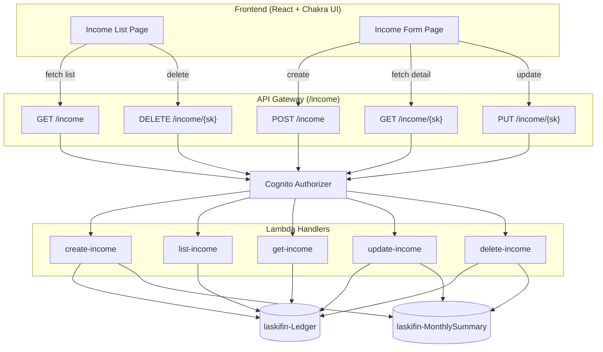

# Design Document — Income CRUD

## Overview

This design covers the full CRUD lifecycle for income entries in LASKI Finances. The system is split into three layers:

1. **Backend**: Five Lambda handlers (create, list, get, update, delete) behind API Gateway with Cognito authorisation, operating on the existing `laskifin-Ledger` and new `laskifin-MonthlySummary` DynamoDB tables.
2. **Frontend**: Two new React pages — an income list page with filters and a create/edit form page — built with Chakra UI and integrated via the existing auth/routing infrastructure.
3. **Infrastructure**: CDK additions to `ApiStack` and `DataStack` wiring the new Lambda functions, API Gateway routes, a new DynamoDB table, a new GSI, and IAM permissions.

This design follows all patterns established in `transaction-crud-design.md`. Differences are called out explicitly. The most significant design challenge unique to income is the **future-only group operation**: updating or deleting all recurrence series entries from a chosen date forward, without touching past entries, using only the existing table schema and no additional GSI.

## Architecture



### Key Design Decisions

1. **Type is always `"INC"` — not a user input**: The income API operates exclusively on `type = "INC"` entries. The `type` field is never accepted in request bodies and is always hardcoded by the handler. This eliminates a class of validation errors and prevents income endpoints from inadvertently touching expense entries.
2. **`GET /income/{sk}` is new (not in original API contract)**: The original `api-contract.md` specifies only four income endpoints (no get-by-key). The edit form requires single-item retrieval to pre-populate fields. This endpoint is added as a necessary gap-fill; it follows the identical pattern of `get-transaction.ts` and adds a type guard (`type !== "INC"` → 404).
3. **Future-only group operations use a full partition query + in-Lambda filter**: There is no GSI on `recurringId`. Future-group update/delete works by: (1) `GetItem` on the target `{sk}` to retrieve `recurringId` and `date`; (2) `Query` on `pk = USER#sub, sk begins_with TRANS##INC#` to get all INC entries; (3) filter in Lambda for `recurringId == target.recurringId && date >= target.date`. This is acceptable because a user's income entries per partition are typically small in number (hundreds, not millions). A GSI on `recurringId` is a future optimisation, not a requirement.
4. **`endDate` vs `occurrences` are mutually exclusive** — validated in Zod with a `.refine()` that rejects payloads where both or neither are present in the `recurrence` object. The handler never infers one from the other.
5. **MonthlySummary is always updated alongside Ledger** — income creation adds to `totalIncome`; deletion subtracts from it. Update subtracts old amount and adds new amount per affected month. All operations use DynamoDB `ADD` expressions with `if_not_exists` initialisation, identical to the strategy documented in `data-model.md`.
6. **Recurrence series cap at 500 entries** — weekly recurrence with a multi-year `endDate` could generate thousands of entries. DynamoDB `BatchWriteCommand` handles a maximum of 25 items per call, but the real concern is Lambda timeout (10 s). 500 entries requires ~20 batch calls and is safely within timeout. Beyond 500, the handler returns 400 (Requirement 1.15).
7. **Recurrence edit does not reconfigure the series** — the edit form never shows the recurrence section. Users who want to change frequency or extend an end date must delete the future group and create a new series. This keeps the update handler simple and avoids complex series mutation logic.

## Components and Interfaces

### Backend Components

#### 1. `create-income.ts`

```typescript
// POST /income
// Body: CreateIncomePayload
// Returns: { message, recurringId, entriesCreated }
```

Entry generation logic:

```typescript
function generateEntries(payload: CreateIncomePayload, userId: string): IncomeItem[] {
  const recurringId = uuidv4();
  const baseDate = new Date(payload.date);

  if (!payload.recurrence) {
    // Single one-time entry
    return [buildEntry(payload, baseDate, recurringId, false)];
  }

  const dates = payload.recurrence.occurrences
    ? generateByOccurrences(baseDate, payload.recurrence.frequency, payload.recurrence.occurrences)
    : generateByEndDate(baseDate, payload.recurrence.frequency, new Date(payload.recurrence.endDate!));

  if (dates.length > 500) throw new ValidationError('Recurrence range too large (max 500 entries)');

  return dates.map(date => buildEntry(payload, date, recurringId, true));
}

function generateByOccurrences(start: Date, freq: 'monthly' | 'weekly', n: number): Date[] {
  const dates: Date[] = [];
  for (let i = 0; i < n; i++) {
    dates.push(offsetDate(start, freq, i));
  }
  return dates;
}

function generateByEndDate(start: Date, freq: 'monthly' | 'weekly', end: Date): Date[] {
  const dates: Date[] = [];
  let current = new Date(start);
  let i = 0;
  while (current <= end) {
    dates.push(new Date(current));
    i++;
    current = offsetDate(start, freq, i);
  }
  return dates;
}

// For monthly: always offset from start date (not iteratively) to avoid day-of-month drift
function offsetDate(base: Date, freq: 'monthly' | 'weekly', steps: number): Date {
  if (freq === 'weekly') {
    const d = new Date(base);
    d.setDate(d.getDate() + steps * 7);
    return d;
  }
  const d = new Date(base);
  d.setMonth(d.getMonth() + steps);
  return d;
}
```

MonthlySummary update (per entry):

```typescript
await dynamoDb.send(new UpdateCommand({
  TableName: process.env.SUMMARY_TABLE_NAME,
  Key: { pk: userId, sk: `SUMMARY#${yyyyMm}` },
  UpdateExpression: `
    SET totalIncome = if_not_exists(totalIncome, :zero) + :amount,
        balance = if_not_exists(totalIncome, :zero) + :amount - if_not_exists(totalExpenses, :zero),
        updatedAt = :now
    ADD transactionCount :one
  `,
  ExpressionAttributeValues: {
    ':amount': entry.amount,
    ':zero': 0,
    ':one': 1,
    ':now': new Date().toISOString(),
  },
}));
```

Batch write strategy: if entries > 25, split into chunks of 25 and call `BatchWriteCommand` sequentially. If any chunk fails, log the error and continue (partial success is better than total failure for large series). The response includes the count of successfully written entries.

#### 2. `list-income.ts`

```typescript
// GET /income?month=YYYY-MM&recurring=true|false
// Returns: { income: IncomeItem[] }
```

SK prefix construction:

```typescript
const skPrefix = month ? `TRANS#${month}#INC#` : `TRANS#`;
// Note: without a month filter, the prefix TRANS# returns both INC and EXP entries.
// A FilterExpression on type = "INC" is added when month is absent, to ensure
// only income entries are returned regardless of prefix specificity.
```

When `month` is provided, the prefix `TRANS#<YYYY-MM>#INC#` is already type-specific — no FilterExpression needed. When `month` is absent, use prefix `TRANS#` with `FilterExpression: #type = :inc`. Always add `ScanIndexForward: false`.

When `recurring=true`, append `AND isRecurring = :true` to the FilterExpression.

#### 3. `get-income.ts`

```typescript
// GET /income/{sk}
// Returns: IncomeItem | 404
```

```typescript
const result = await dynamoDb.send(new GetCommand({
  TableName: process.env.TABLE_NAME,
  Key: { pk: userId, sk: decodedSk },
}));

if (!result.Item) return notFound('Income entry not found');
if (result.Item.type !== 'INC') return notFound('Income entry not found');

return { statusCode: 200, body: JSON.stringify(result.Item) };
```

The type guard on line 3 prevents this endpoint from serving expense entries if a caller passes an expense sort key. This is a security boundary, not just a validation.

#### 4. `update-income.ts`

```typescript
// PUT /income/{sk}?updateGroup=false|true
// Body: UpdateIncomePayload
// Returns: updated item (single) or { updated: N } (group)
```

Single update path:

```typescript
await dynamoDb.send(new UpdateCommand({
  TableName: process.env.TABLE_NAME,
  Key: { pk: userId, sk: decodedSk },
  ConditionExpression: 'attribute_exists(pk)',
  UpdateExpression: `SET description = :desc, amount = :amount, #date = :date,
                         #source = :source, category = :cat, categoryMonth = :cm`,
  ExpressionAttributeNames: { '#date': 'date', '#source': 'source' },
  ExpressionAttributeValues: { /* ... */ },
  ReturnValues: 'ALL_NEW',
}));
```

`date` and `source` require `ExpressionAttributeNames` because they are reserved words in DynamoDB expression syntax.

Future-group update path:

```typescript
// Step 1: GetItem on the target sk to retrieve recurringId and current date
const target = await getItem(userId, decodedSk);
if (!target) return notFound('Income entry not found');
if (!target.isRecurring || !target.recurringId) {
  // Not recurring — silently fall back to single update (Requirement 4.8)
  return singleUpdate(userId, decodedSk, payload);
}

// Step 2: Query all INC entries for this user (no month filter — future entries may span many months)
const allIncome = await queryAllByPkPrefix(userId, 'TRANS#', 'INC');

// Step 3: Filter to Future_Group in Lambda
const futureGroup = allIncome.filter(item =>
  item.recurringId === target.recurringId && item.date >= target.date
);

// Step 4: Update each item + update MonthlySummary per affected month
// Process sequentially (not parallel) to avoid DynamoDB write throttling
for (const item of futureGroup) {
  await updateSingleItem(userId, item.sk, payload, item.amount);
  await updateMonthlySummary(userId, item.date, oldAmount: item.amount, newAmount: payload.amount);
}

return { statusCode: 200, body: JSON.stringify({ updated: futureGroup.length }) };
```

#### 5. `delete-income.ts`

```typescript
// DELETE /income/{sk}?deleteGroup=false|true
// Returns: { message, count }
```

Single delete path mirrors `delete-transaction.ts` exactly: `DeleteCommand` with `ConditionExpression: "attribute_exists(pk)"`, then subtract from MonthlySummary.

Future-group delete path:

```typescript
// Step 1: GetItem on target sk
const target = await getItem(userId, decodedSk);
if (!target) return notFound('Income entry not found');
if (!target.isRecurring || !target.recurringId) {
  // Not recurring — silently fall back to single delete (Requirement 5.6)
  return singleDelete(userId, decodedSk, target.amount, target.date);
}

// Step 2 + 3: Query all INC entries, filter to Future_Group (same as update path)
const futureGroup = (await queryAllByPkPrefix(userId, 'TRANS#', 'INC'))
  .filter(item => item.recurringId === target.recurringId && item.date >= target.date);

// Step 4: BatchWriteCommand in chunks of 25
const chunks = chunk(futureGroup, 25);
for (const batch of chunks) {
  await dynamoDb.send(new BatchWriteCommand({
    RequestItems: {
      [process.env.TABLE_NAME!]: batch.map(item => ({
        DeleteRequest: { Key: { pk: userId, sk: item.sk } },
      })),
    },
  }));
}

// Step 5: Update MonthlySummary per affected entry
for (const item of futureGroup) {
  await subtractFromMonthlySummary(userId, item.date, item.amount);
}

return { statusCode: 200, body: JSON.stringify({ message: 'Recurrence deleted', count: futureGroup.length }) };
```

### Zod Schemas

**Backend — Create**:

```typescript
const RecurrenceSchema = z.object({
  frequency: z.enum(['monthly', 'weekly']),
  endDate: z.string().refine(val => !isNaN(Date.parse(val))).optional(),
  occurrences: z.number().int().positive().optional(),
}).refine(
  data => (data.endDate !== undefined) !== (data.occurrences !== undefined),
  { message: 'Provide exactly one of endDate or occurrences' }
);

const CreateIncomeSchema = z.object({
  description: z.string().min(1),
  totalAmount: z.number().positive(),
  date: z.string().refine(val => !isNaN(Date.parse(val))),
  source: z.string().min(1),
  category: z.string().min(1),
  recurrence: RecurrenceSchema.optional(),
  // type is intentionally absent — always set to "INC" by handler
});
```

**Backend — Update**:

```typescript
const UpdateIncomeSchema = z.object({
  description: z.string().min(1),
  amount: z.number().positive(),
  date: z.string().refine(val => !isNaN(Date.parse(val))),
  source: z.string().min(1),
  category: z.string().min(1),
});
```

**Frontend — Form Validation**:

```typescript
const IncomeFormSchema = z.object({
  description: z.string().min(1, 'Description is required'),
  totalAmount: z.number().positive('Amount must be positive'),
  date: z.string().min(1, 'Date is required'),
  source: z.string().min(1, 'Source is required'),
  category: z.string().min(1, 'Category is required'),
  isRecurring: z.boolean().default(false),
  recurrence: z.object({
    frequency: z.enum(['monthly', 'weekly']),
    mode: z.enum(['endDate', 'occurrences']),
    endDate: z.string().optional(),
    occurrences: z.number().int().positive().optional(),
  }).optional(),
}).refine(data => {
  if (!data.isRecurring) return true;
  if (!data.recurrence) return false;
  if (data.recurrence.mode === 'endDate') return !!data.recurrence.endDate;
  return !!data.recurrence.occurrences;
}, { message: 'Recurrence configuration is incomplete', path: ['recurrence'] });
```

### Frontend Components

#### `api/income.ts` — API Client

```typescript
interface IncomeItem {
  pk: string;
  sk: string;
  description: string;
  amount: number;
  totalAmount: number;
  category: string;
  source: string;
  type: 'INC';
  date: string;
  groupId: string;
  recurringId?: string;
  isRecurring?: boolean;
  installmentNumber: number;
  installmentTotal: number;
  categoryMonth: string;
  createdAt: string;
}

interface CreateIncomePayload {
  description: string;
  totalAmount: number;
  date: string;
  source: string;
  category: string;
  recurrence?: {
    frequency: 'monthly' | 'weekly';
    endDate?: string;
    occurrences?: number;
  };
}

interface UpdateIncomePayload {
  description: string;
  amount: number;
  date: string;
  source: string;
  category: string;
}

interface CreateIncomeResponse {
  message: string;
  recurringId: string;
  entriesCreated: number;
}

// Exported functions
export async function listIncome(params?: { month?: string; recurring?: boolean }): Promise<{ income: IncomeItem[] }>;
export async function getIncome(sk: string): Promise<IncomeItem>;
export async function createIncome(payload: CreateIncomePayload): Promise<CreateIncomeResponse>;
export async function updateIncome(sk: string, payload: UpdateIncomePayload, updateGroup?: boolean): Promise<IncomeItem | { updated: number }>;
export async function deleteIncome(sk: string, deleteGroup?: boolean): Promise<{ message: string; count: number }>;
```

All functions attach the Cognito ID token from `useAuth()` as the `Authorization` header. The `sk` parameter is URL-encoded before being used as a path segment (`encodeURIComponent(sk)`).

#### `pages/IncomePage.tsx` — List Page

Follows the same structure as `TransactionsPage.tsx`. Key differences:

- Table columns: date, description, category, source, amount, recurrence badge.
- No type filter (all entries are INC).
- "Show recurring only" toggle replaces the type filter (`recurring=true` query param).
- Delete confirmation dialog has two variants: simple confirm for one-time entries; two-button choice ("Delete this entry only" / "Delete this and all future entries") for recurring entries. The choice is determined by `item.isRecurring`.

```typescript
// Delete dialog logic
function handleDeleteClick(item: IncomeItem) {
  if (!item.isRecurring) {
    openSimpleConfirm(() => deleteIncome(item.sk, false));
  } else {
    openGroupConfirm({
      onSingle: () => deleteIncome(item.sk, false),
      onFuture: () => deleteIncome(item.sk, true),
    });
  }
}
```

#### `pages/IncomeFormPage.tsx` — Create/Edit Form

Routes: `/income/new` (create) and `/income/edit/:sk` (edit).

Create mode specifics:
- Shows the "Recurring income" toggle (off by default).
- When toggle is on, shows the recurrence section with frequency select and mode switch (end date / occurrences).
- On success, shows a toast with `entriesCreated` count: "Salary created — 6 entries added."

Edit mode specifics:
- Fetches from `GET /income/{sk}` to pre-populate.
- Hides the recurrence toggle and recurrence section entirely.
- For recurring entries, shows a read-only "Part of a recurring series" badge.
- On submit, shows a modal asking "Update this entry only" or "Update this and all future entries", which sets `updateGroup`. The modal is skipped for non-recurring entries.

### Infrastructure Changes

#### `DataStack` (`infra/lib/data-stack.ts`)

Two additions:

```typescript
// 1. GSI_MonthlyByCategory on existing laskifin-Ledger table
ledgerTable.addGlobalSecondaryIndex({
  indexName: 'GSI_MonthlyByCategory',
  partitionKey: { name: 'pk', type: dynamodb.AttributeType.STRING },
  sortKey: { name: 'categoryMonth', type: dynamodb.AttributeType.STRING },
  projectionType: dynamodb.ProjectionType.ALL,
});

// 2. New laskifin-MonthlySummary table
const summaryTable = new dynamodb.Table(this, 'MonthlySummaryTable', {
  tableName: 'laskifin-MonthlySummary',
  partitionKey: { name: 'pk', type: dynamodb.AttributeType.STRING },
  sortKey: { name: 'sk', type: dynamodb.AttributeType.STRING },
  billingMode: dynamodb.BillingMode.PAY_PER_REQUEST,
  pointInTimeRecovery: true,
});

// Export for ApiStack
new cdk.CfnOutput(this, 'SummaryTableName', { value: summaryTable.tableName, exportName: 'SummaryTableName' });
new cdk.CfnOutput(this, 'SummaryTableArn',  { value: summaryTable.tableArn,  exportName: 'SummaryTableArn'  });
```

Note: the `laskifin-MonthlySummary` table is also required by the transaction CRUD handlers (`update-transaction.ts` and `delete-transaction.ts`). The DataStack changes listed here serve both features and should be deployed before either income or transaction handlers that reference `SUMMARY_TABLE_NAME` are deployed.

#### `ApiStack` (`infra/lib/api-stack.ts`)

Five new Lambda functions following the existing pattern:

```typescript
const incomeResource = api.root.addResource('income');
const incomeSkResource = incomeResource.addResource('{sk}');

const createIncomeHandler = new NodejsFunction(this, 'CreateIncomeHandler', {
  entry: path.resolve(__dirname, '../../back/lambdas/src/income/create-income.ts'),
  runtime: Runtime.NODEJS_22_X,
  memorySize: 256,
  timeout: Duration.seconds(10),
  bundling: { minify: true, sourceMap: true },
  environment: {
    TABLE_NAME: props.ledgerTableName,
    SUMMARY_TABLE_NAME: props.summaryTableName,
  },
});

// IAM grants
props.ledgerTable.grantWriteData(createIncomeHandler);
props.summaryTable.grantReadWriteData(createIncomeHandler);

props.ledgerTable.grantReadData(listIncomeHandler);
props.ledgerTable.grantReadData(getIncomeHandler);

props.ledgerTable.grantReadWriteData(updateIncomeHandler);
props.summaryTable.grantReadWriteData(updateIncomeHandler);

props.ledgerTable.grantReadWriteData(deleteIncomeHandler);
props.summaryTable.grantReadWriteData(deleteIncomeHandler);

// Routes
incomeResource.addMethod('POST', new LambdaIntegration(createIncomeHandler), { authorizer });
incomeResource.addMethod('GET',  new LambdaIntegration(listIncomeHandler),   { authorizer });
incomeSkResource.addMethod('GET',    new LambdaIntegration(getIncomeHandler),    { authorizer });
incomeSkResource.addMethod('PUT',    new LambdaIntegration(updateIncomeHandler), { authorizer });
incomeSkResource.addMethod('DELETE', new LambdaIntegration(deleteIncomeHandler), { authorizer });
```

#### Lambda file structure

```
back/lambdas/src/
└── income/
    ├── create-income.ts
    ├── list-income.ts
    ├── get-income.ts
    ├── update-income.ts
    └── delete-income.ts
```

## Data Models

### No new DynamoDB tables for income

Income entries use the existing `laskifin-Ledger` schema exactly. No new attributes beyond what is already defined in `data-model.md`. The `isRecurring` and `recurringId` attributes are already specified in the Ledger table definition.

### `IncomeItem` — Full attribute set written at creation

| Attribute | Type | One-time value | Recurring value |
|---|---|---|---|
| `pk` | String | `USER#<sub>` | `USER#<sub>` |
| `sk` | String | `TRANS#YYYY-MM#INC#<uuid>` | `TRANS#YYYY-MM#INC#<uuid>` (unique per entry) |
| `type` | String | `"INC"` | `"INC"` |
| `description` | String | as provided | as provided |
| `amount` | Number | equals `totalAmount` | equals `totalAmount` |
| `totalAmount` | Number | as provided | as provided |
| `source` | String | as provided | as provided |
| `category` | String | as provided | as provided |
| `date` | String | as provided | computed per entry |
| `groupId` | String | newly generated UUID | equals `recurringId` |
| `recurringId` | String | omitted | shared UUID across series |
| `isRecurring` | Boolean | omitted | `true` |
| `installmentNumber` | Number | `1` | `1` |
| `installmentTotal` | Number | `1` | `1` |
| `categoryMonth` | String | `category#YYYY-MM` | `category#YYYY-MM` per entry |
| `createdAt` | String | ISO 8601 timestamp | ISO 8601 timestamp (same for all entries in series) |

### Frontend Project Structure — additions

```
front/src/
├── api/
│   └── income.ts               # New API client module
└── pages/
    ├── IncomePage.tsx           # New list page
    └── IncomeFormPage.tsx       # New form page
```

New routes added to `routes.tsx`:

```typescript
{ path: '/income',          element: <ProtectedRoute><IncomePage /></ProtectedRoute> },
{ path: '/income/new',      element: <ProtectedRoute><IncomeFormPage /></ProtectedRoute> },
{ path: '/income/edit/:sk', element: <ProtectedRoute><IncomeFormPage /></ProtectedRoute> },
```

## Correctness Properties

### Property 1: One-time income creation invariants

*For any* valid payload without a `recurrence` field, the Create_Income_Handler must produce exactly one entry in the Ledger_Table where: `type = "INC"`, `amount = totalAmount`, `installmentNumber = 1`, `installmentTotal = 1`, `isRecurring` is absent or falsy, `groupId` is a non-empty string, `categoryMonth = category + "#" + YYYY-MM` from the date, and `sk` matches `TRANS#<YYYY-MM>#INC#<uuid>`.

**Validates: Requirements 1.3, 1.10**

### Property 2: Monthly recurrence entry count — occurrences mode

*For any* valid payload with `recurrence.frequency = "monthly"` and `recurrence.occurrences = N` (where N is between 1 and 500), the Create_Income_Handler must produce exactly N entries. Each entry's `date` must be exactly N–1 calendar months after the first entry's date. No two entries may share the same `sk`.

**Validates: Requirements 1.6, 1.9**

### Property 3: Monthly recurrence entry count — endDate mode

*For any* valid payload with `recurrence.frequency = "monthly"` and `recurrence.endDate = E`, the Create_Income_Handler must produce exactly as many entries as there are calendar months between `date` and `E` (inclusive). The last entry's month must be the month of `E`; no entry may have a date after `E`.

**Validates: Requirements 1.5, 1.9**

### Property 4: Weekly recurrence date spacing

*For any* valid payload with `recurrence.frequency = "weekly"` and `recurrence.occurrences = N`, every consecutive pair of entries in the series must have dates exactly 7 days apart. The first entry's date must equal the payload's `date`.

**Validates: Requirements 1.8, 1.9**

### Property 5: Recurrence series key invariants

*For any* Recurrence_Series of N entries produced by the Create_Income_Handler: all entries must share the same `recurringId`, all entries must have `isRecurring = true`, all entries must have `groupId = recurringId`, all `sk` values must be unique, and each `sk` must encode the correct month for that entry's `date`.

**Validates: Requirements 1.9, 1.10**

### Property 6: Type exclusivity — list only returns INC

*For any* mix of INC and EXP entries belonging to the same user, the List_Income_Handler must return only entries where `type = "INC"`, regardless of whether a `month` filter is applied. No EXP entry may appear in any response from `GET /income`.

**Validates: Requirement 2.2**

### Property 7: Type guard on get — no expense cross-access

*For any* sort key belonging to an EXP entry, `GET /income/{sk}` must return HTTP 404 regardless of whether the entry exists in the Ledger_Table. The status code must never be 200 when the item's type is not "INC".

**Validates: Requirement 3.4**

### Property 8: Future-group update isolation

*For any* Recurrence_Series with entries across months M1 ≤ M2 ≤ ... ≤ Mn, when `PUT /income/{sk_at_Mi}?updateGroup=true` is called (for some Mi), all entries with `date >= Mi` must reflect the updated field values, and all entries with `date < Mi` must remain byte-for-byte identical to their state before the update.

**Validates: Requirements 4.5**

### Property 9: Update validation rejects invalid payloads

*For any* update payload where at least one field violates the schema (empty description, non-positive amount, invalid date, empty source, empty category), the Update_Income_Handler must return HTTP 400 and the Ledger_Table must remain unchanged.

**Validates: Requirements 4.3, 4.9**

### Property 10: Future-group delete completeness

*For any* Recurrence_Series and any entry within it at position Mi, when `DELETE /income/{sk_at_Mi}?deleteGroup=true` is called, every entry with `date >= Mi` and `recurringId = target.recurringId` must be absent from the Ledger_Table after the operation. Every entry with `date < Mi` must remain present and unmodified.

**Validates: Requirements 5.2, 5.3**

### Property 11: MonthlySummary totalIncome consistency

*For any* set of income entries belonging to a user across months, after all create and delete operations are complete, for each month M the value of `totalIncome` in `laskifin-MonthlySummary` at `SUMMARY#M` must equal the sum of `amount` across all Ledger entries for that user where `type = "INC"` and `YYYY-MM` from the `date` equals M.

**Validates: Requirements 1.11, 5.4**

### Property 12: Recurrence cap enforcement

*For any* payload that would generate more than 500 entries (e.g. weekly frequency with a 10-year endDate), the Create_Income_Handler must return HTTP 400 and write zero entries to the Ledger_Table.

**Validates: Requirement 1.15**

### Property 13: Non-recurring entries are unaffected by updateGroup flag

*For any* One_Time_Income entry, calling `PUT /income/{sk}?updateGroup=true` must produce the same result as `PUT /income/{sk}?updateGroup=false` — exactly one entry is updated, no other entries are modified.

**Validates: Requirement 4.8**

### Property 14: BRL currency formatting

*For any* numeric amount, the income list page formatting function must produce a string matching BRL format (e.g. `R$ 5.000,00`) — using `pt-BR` locale, currency style, and BRL currency code.

**Validates: Requirement 6.11**

### Property 15: Client-side form validation blocks submission

*For any* form state where at least one required field is empty or invalid (empty description, non-positive amount, missing date, empty source, empty category, or incomplete recurrence config when recurring toggle is on), the Income_Form must display inline error messages and must not send any HTTP request.

**Validates: Requirement 7.4**

## Error Handling

### Backend Error Strategy

All income handlers follow the same error handling contract as transaction handlers:

| Scenario | HTTP Status | Response Body |
|---|---|---|
| Missing Cognito sub | 401 | `{ "error": "Unauthorized" }` |
| Invalid / missing JSON body | 400 | `{ "error": "Invalid request body" }` |
| Zod validation failure | 400 | `{ "error": "Validation failed", "details": ["..."] }` |
| Both `endDate` and `occurrences` provided | 400 | `{ "error": "Validation failed", "details": ["Provide exactly one of endDate or occurrences"] }` |
| Neither `endDate` nor `occurrences` provided | 400 | `{ "error": "Validation failed", "details": ["Provide exactly one of endDate or occurrences"] }` |
| Recurrence range > 500 entries | 400 | `{ "error": "Recurrence range too large (max 500 entries)" }` |
| Item not found (get / update / delete) | 404 | `{ "error": "Income entry not found" }` |
| EXP entry returned from get-income | 404 | `{ "error": "Income entry not found" }` |
| DynamoDB ConditionalCheckFailedException | 404 | `{ "error": "Income entry not found" }` |
| Unexpected error | 500 | `{ "error": "Internal server error" }` |

### Frontend Error Strategy

Identical to the transaction CRUD frontend error strategy: API errors are caught in `api/income.ts` and re-thrown as structured error objects. Form page displays errors inline. List page shows a toast on delete failure. Network errors display "Could not connect to server." Loading states prevent duplicate submissions.

## Testing Strategy

### Approach

Identical to `transaction-crud-design.md`: property-based tests (one per correctness property, minimum 100 iterations each, `fast-check` with Vitest), plus unit tests for specific cases and CDK assertions for infrastructure.

Each test file carries the tag comment:
```
// Feature: income-crud, Property {N}: {property_text}
```

### Backend Property-Based Tests (`back/lambdas/test/income/`)

| Property | Generator strategy |
|---|---|
| Property 1 | `fc.record()` with valid one-time payload shape — verify single-entry invariants |
| Property 2 | `fc.integer({ min: 1, max: 500 })` for N — verify exactly N entries and date spacing |
| Property 3 | `fc.date()` pairs for start/end — verify entry count and last entry month |
| Property 4 | `fc.integer({ min: 1, max: 500 })` for N — verify 7-day gaps between all consecutive entries |
| Property 5 | `fc.integer({ min: 2, max: 500 })` for N — verify all series key invariants |
| Property 6 | `fc.array()` of mixed INC/EXP entries — verify list handler returns only INC |
| Property 7 | `fc.string()` for SK values typed as EXP — verify get handler always returns 404 |
| Property 8 | `fc.integer()` for series length and split position — verify past entries unchanged |
| Property 9 | `fc.record()` with at least one invalid field — verify 400 and no DynamoDB writes |
| Property 10 | `fc.integer()` for series length and split position — verify future entries deleted, past remain |
| Property 11 | `fc.array()` of create/delete operations — verify MonthlySummary totalIncome matches sum |
| Property 12 | Generate payloads that produce > 500 entries — verify 400 and zero writes |
| Property 13 | `fc.record()` for one-time entry + valid update payload — verify only one item changes with updateGroup=true |

### Backend Unit Tests

- Missing auth (401) for each handler.
- Invalid JSON body (400) for create and update.
- Both `endDate` and `occurrences` provided (400).
- Neither `endDate` nor `occurrences` provided when recurrence is present (400).
- Not found (404) for get / update / delete on non-existent sk.
- EXP sk passed to `get-income` (404).
- Empty list returns 200 with empty array.
- `updateGroup=true` on a non-recurring entry updates only that entry.
- `deleteGroup=true` on a non-recurring entry deletes only that entry.
- Recurrence with exactly 500 entries succeeds; 501 entries returns 400.

### Frontend Property-Based Tests

| Property | Test file |
|---|---|
| Property 14 | `IncomePage.property.test.tsx` — `fc.float()` for amounts, verify BRL format |
| Property 15 | `IncomeFormPage.property.test.tsx` — `fc.record()` with invalid field combos, verify no API call |

### Frontend Unit Tests

- Income List Page: renders table columns, loading spinner, empty state, recurring badge on recurring entries, correct delete dialog variant per entry type, filter controls trigger re-fetch.
- Income Form Page: create mode shows recurrence toggle off by default; toggling on shows recurrence section; edit mode hides recurrence section; recurring edit shows updateGroup modal on submit; pre-populates fields in edit mode; shows API error without navigating.

### Infrastructure Tests (`infra/test/`)

- Five income routes exist on the API Gateway.
- Cognito authoriser attached to all five routes.
- Five separate Lambda functions created for income domain.
- IAM permissions per handler match the spec (read-only list/get, write create, read-write update/delete).
- `TABLE_NAME` and `SUMMARY_TABLE_NAME` env vars set on all income Lambda functions.
- `laskifin-MonthlySummary` table exists with correct pk/sk schema.
- `GSI_MonthlyByCategory` exists on the Ledger table.

### Test File Structure

```
back/
└── lambdas/
    └── test/
        └── income/
            ├── create-income.test.ts
            ├── create-income.property.test.ts
            ├── list-income.test.ts
            ├── list-income.property.test.ts
            ├── get-income.test.ts
            ├── get-income.property.test.ts
            ├── update-income.test.ts
            ├── update-income.property.test.ts
            ├── delete-income.test.ts
            └── delete-income.property.test.ts

front/
└── src/
    └── pages/
        └── __tests__/
            ├── IncomePage.test.tsx
            ├── IncomePage.property.test.tsx
            ├── IncomeFormPage.test.tsx
            └── IncomeFormPage.property.test.tsx

infra/
└── test/
    └── income-stack.test.ts
```

### No New Dependencies

All testing dependencies (`fast-check`, `vitest`, `@testing-library/react`) are already present. No new production or dev packages are needed for this feature.
