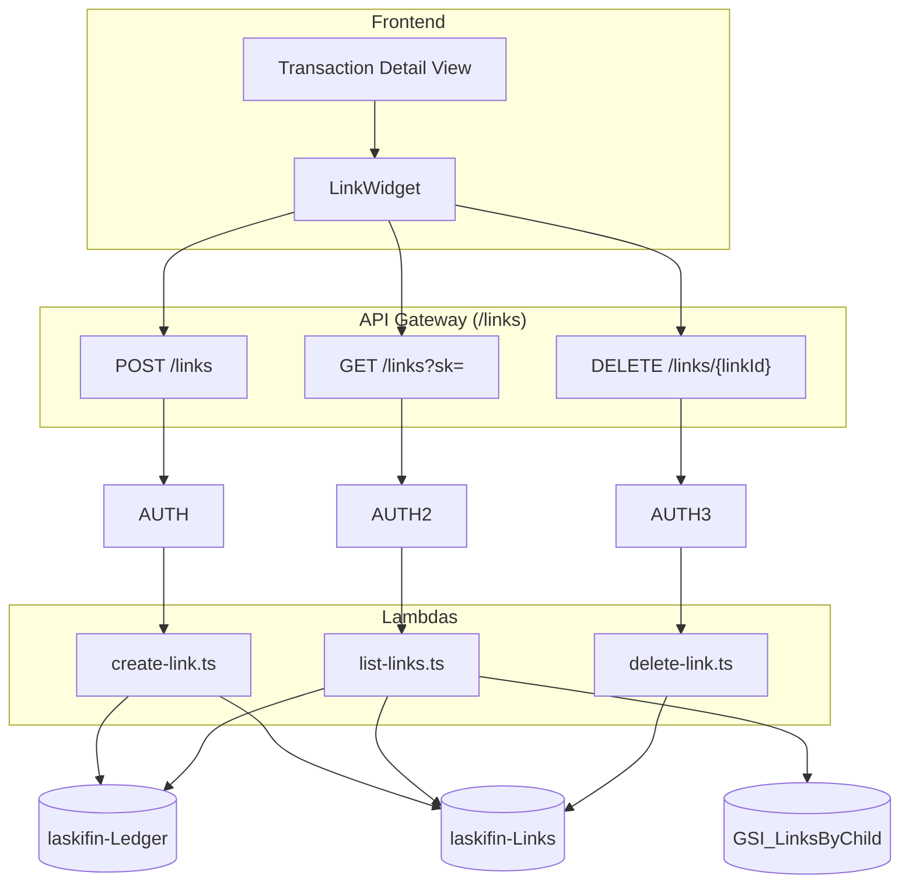

# Design Document — Expense Association (Linking Layer)

## Overview

This design covers the expense association feature: a dedicated `laskifin-Links` DynamoDB table, three Lambda handlers (create, list, delete), and a frontend `LinkWidget` component embedded in the transaction detail view. Links are a thin relationship layer on top of the existing Ledger — they reference Ledger entries by sort key but never modify them.

The central design challenge is the bidirectional read pattern: given a Ledger entry, retrieve all links where it appears as either parent or child. This requires a GSI on the Links table indexed by `childSk` (since the main table is indexed by `parentSk`), enabling both directions to be queried with key conditions rather than scan filters.

## Architecture



### Key Design Decisions

1. **Separate `laskifin-Links` table, not attributes on Ledger items** — Adding link references as attributes on Ledger items would require mutating existing entries every time a link is created or deleted. It would also entangle the link lifecycle with the transaction lifecycle, complicate the delete cascade question (BR-L6 requires no cascade), and break the clean read/write isolation that the existing handlers rely on. A separate table keeps the Ledger immutable from the linking layer's perspective.

2. **One Link item per directed pair (BR-L8)** — Each Link item connects exactly one `parentSk` to one `childSk`. Linking one parent to five children creates five Link items. This is simpler than encoding a child list on the parent item (which would require DynamoDB list-append operations and complicates the "find all parents of child X" query). It also makes deletion atomic per-pair with a single `DeleteItem`.

3. **`GSI_LinksByChild` enables the bidirectional read** — The main table is keyed on `pk` (USER#sub) and `sk` (LINK#uuid). To find all links where a given Ledger SK appears as `childSk`, we need a GSI. `GSI_LinksByChild` projects `pk` as its partition key and `childSk` as its sort key — making "all links for user X where childSk = Y" a key-condition query rather than a full-partition scan with FilterExpression.

4. **Stale link tolerance (BR-L6)** — When a Ledger entry is deleted, its links are not automatically removed. The List_Links_Handler silently omits links whose counterpart resolves to nothing in the Ledger (`GetItem` returns no item). This is acceptable because: (a) it avoids the complexity of a delete cascade, (b) stale links are rare in practice (a user would have to delete a transaction that they previously linked), and (c) the UI consequence is simply that the orphaned link disappears from the list view without any error.

5. **Existence check uses two parallel `GetItem` calls, not a query** — The Create_Link_Handler needs to verify that both `parentSk` and `childSk` exist for the authenticated user. Two individual `GetCommand` calls with `pk = USER#sub` and `sk = <the respective sk>` are the most efficient approach — O(1) each. Running them in parallel with `Promise.all` keeps the pre-write latency minimal.

6. **Duplicate link detection uses a conditional write** — Rather than reading the Links table to check for an existing pair before writing (two round trips), the handler uses a single `PutCommand` with `ConditionExpression: "attribute_not_exists(pk)"`. If a Link item with the same `pk` and `sk` (i.e. same `linkId`) already exists, the condition fails. However, `linkId` is a newly generated UUID per request, so this condition always passes for new items. The actual duplicate check (same `parentSk` + `childSk`) is enforced by a separate GSI-based lookup — described below. An alternative considered was using a deterministic composite `sk` (e.g. `LINK#hash(parentSk + childSk)`), which would make duplicate detection a single conditional write. This approach is adopted as the primary design (see `sk` definition below).

7. **Deterministic sort key for idempotent duplicate detection** — Rather than assigning a random UUID as the `sk`, the Links table uses `LINK#<parentSk>#<childSk>` as the sort key (after URL-encoding the embedded sort keys). This makes the `pk + sk` pair unique per (user, parentSk, childSk) triple — a `PutCommand` with `ConditionExpression: "attribute_not_exists(pk)"` will fail with `ConditionalCheckFailedException` if the identical link already exists, returning HTTP 409 without a separate read. The `linkId` exposed to the client is the same deterministic composite string, hashed to a fixed-length identifier for clean URLs.

## Data Model

### Table 4 — `laskifin-Links`

**Status**: New. Add to `DataStack` as part of Phase 2.

**Billing**: PAY_PER_REQUEST. Point-in-time recovery enabled.

| Attribute | Type | Example | Notes |
|---|---|---|---|
| `pk` | String | `USER#a1b2c3` | Partition key. Same `USER#<cognitoSub>` pattern as Ledger. |
| `sk` | String | `LINK#TRANS%232024-06%23EXP%23uuid1#TRANS%232024-06%23EXP%23uuid2` | Sort key. Deterministic: `LINK#<urlEncoded(parentSk)>#<urlEncoded(childSk)>`. Unique per user + pair. |
| `linkId` | String | `abc123...` | URL-safe identifier returned to the client. Derived from the `sk` (e.g. base64url of `sk`, truncated). Used as the path parameter for DELETE. |
| `parentSk` | String | `TRANS#2024-06#EXP#uuid1` | Raw sort key of the Parent_Entry in laskifin-Ledger. |
| `childSk` | String | `TRANS#2024-06#EXP#uuid2` | Raw sort key of the Child_Entry in laskifin-Ledger. GSI_LinksByChild sort key. |
| `createdAt` | String | `2024-06-01T10:00:00Z` | ISO 8601 creation timestamp. |

#### Sort Key Construction

```typescript
function buildLinkSk(parentSk: string, childSk: string): string {
  return `LINK#${encodeURIComponent(parentSk)}#${encodeURIComponent(childSk)}`;
}

function buildLinkId(parentSk: string, childSk: string): string {
  // URL-safe base64 of the deterministic sk, truncated to 43 chars
  const sk = buildLinkSk(parentSk, childSk);
  return Buffer.from(sk).toString('base64url').slice(0, 43);
}
```

`linkId` is deterministic: given the same `parentSk` and `childSk`, it always produces the same value. The DELETE endpoint uses `linkId` as the path parameter, and the handler reconstructs the `pk + sk` from the `linkId` — but since `linkId` is a hash, it stores the raw `pk` and `sk` on the item so DELETE can look it up directly.

**Revised approach**: To allow the DELETE endpoint to look up by `linkId` without a table scan, the `linkId` is added as a GSI key. `GSI_LinksById` has `pk` as its partition key and `linkId` as its sort key — making "find link by user + linkId" a O(1) key-condition query. This is cleaner than trying to reverse the hash.

#### GSIs on `laskifin-Links`

| Index | PK | SK | Purpose |
|-------|----|----|---------|
| `GSI_LinksByChild` | `pk` | `childSk` | Find all links where a given entry appears as a child — enables "what pays for this?" query |
| `GSI_LinksById` | `pk` | `linkId` | Find a link by its client-facing `linkId` — used by the DELETE endpoint |

#### Access Patterns

| Pattern | Table / Index | Key Condition | Use Case |
|---|---|---|---|
| All links where entry is parent | Main table | `pk = USER#sub`, `sk begins_with LINK#<urlEncoded(parentSk)>#` | List asParent |
| All links where entry is child | GSI_LinksByChild | `pk = USER#sub`, `childSk = <targetSk>` | List asChild |
| Look up link by linkId | GSI_LinksById | `pk = USER#sub`, `linkId = <id>` | DELETE endpoint |
| Check if link exists (duplicate) | Main table | `pk = USER#sub`, `sk = LINK#<enc(parent)>#<enc(child)>` | Conditional PutItem |

### Updated `DataStack` CDK

```typescript
// laskifin-Links table
const linksTable = new dynamodb.Table(this, 'LinksTable', {
  tableName: 'laskifin-Links',
  partitionKey: { name: 'pk',  type: dynamodb.AttributeType.STRING },
  sortKey:      { name: 'sk',  type: dynamodb.AttributeType.STRING },
  billingMode: dynamodb.BillingMode.PAY_PER_REQUEST,
  pointInTimeRecovery: true,
});

linksTable.addGlobalSecondaryIndex({
  indexName:     'GSI_LinksByChild',
  partitionKey:  { name: 'pk',      type: dynamodb.AttributeType.STRING },
  sortKey:       { name: 'childSk', type: dynamodb.AttributeType.STRING },
  projectionType: dynamodb.ProjectionType.ALL,
});

linksTable.addGlobalSecondaryIndex({
  indexName:     'GSI_LinksById',
  partitionKey:  { name: 'pk',     type: dynamodb.AttributeType.STRING },
  sortKey:       { name: 'linkId', type: dynamodb.AttributeType.STRING },
  projectionType: dynamodb.ProjectionType.ALL,
});

// Export for ApiStack
new cdk.CfnOutput(this, 'LinksTableName', {
  value:      linksTable.tableName,
  exportName: 'LinksTableName',
});
new cdk.CfnOutput(this, 'LinksTableArn', {
  value:      linksTable.tableArn,
  exportName: 'LinksTableArn',
});
```

## Backend Components

### `create-link.ts`

```typescript
// POST /links
// Body: { parentSk: string, childSk: string }
// Returns: { linkId, parentSk, childSk, createdAt }
```

```typescript
const CreateLinkSchema = z.object({
  parentSk: z.string().min(1),
  childSk:  z.string().min(1),
}).refine(
  data => data.parentSk !== data.childSk,
  { message: 'A transaction cannot be linked to itself' }
);

export const handler = async (event: APIGatewayProxyEvent): Promise<APIGatewayProxyResult> => {
  const userId = event.requestContext.authorizer?.claims.sub;
  if (!userId) return unauthorized();

  let body: z.infer<typeof CreateLinkSchema>;
  try {
    body = CreateLinkSchema.parse(JSON.parse(event.body ?? '{}'));
  } catch (err) {
    if (err instanceof z.ZodError) {
      const selfLinkError = err.errors.find(e => e.message.includes('linked to itself'));
      if (selfLinkError) {
        return { statusCode: 400, body: JSON.stringify({ error: selfLinkError.message }) };
      }
    }
    return { statusCode: 400, body: JSON.stringify({ error: 'Invalid request body' }) };
  }

  const { parentSk, childSk } = body;
  const pk = `USER#${userId}`;

  // Step 1: verify both Ledger entries exist in parallel
  const [parentItem, childItem] = await Promise.all([
    getItem(ledgerClient, process.env.TABLE_NAME!, pk, parentSk),
    getItem(ledgerClient, process.env.TABLE_NAME!, pk, childSk),
  ]);

  if (!parentItem) {
    return { statusCode: 404, body: JSON.stringify({ error: 'Parent entry not found' }) };
  }
  if (!childItem) {
    return { statusCode: 404, body: JSON.stringify({ error: 'Child entry not found' }) };
  }

  // Step 2: build deterministic sk and linkId
  const sk     = buildLinkSk(parentSk, childSk);
  const linkId = buildLinkId(parentSk, childSk);
  const createdAt = new Date().toISOString();

  // Step 3: conditional write — fails with ConditionalCheckFailedException if duplicate
  try {
    await linksClient.send(new PutCommand({
      TableName: process.env.LINKS_TABLE_NAME,
      Item: { pk, sk, linkId, parentSk, childSk, createdAt },
      ConditionExpression: 'attribute_not_exists(pk)',
    }));
  } catch (err) {
    if ((err as { name?: string }).name === 'ConditionalCheckFailedException') {
      return { statusCode: 409, body: JSON.stringify({ error: 'This link already exists' }) };
    }
    throw err;
  }

  return {
    statusCode: 201,
    body: JSON.stringify({ linkId, parentSk, childSk, createdAt }),
  };
};
```

### `list-links.ts`

```typescript
// GET /links?sk=<ledger-sort-key>
// Returns: { sk, asParent: EnrichedLink[], asChild: EnrichedLink[] }
```

```typescript
interface EnrichedLink {
  linkId:      string;
  linkedSk:    string;   // the counterpart's sk (child if caller is parent, parent if caller is child)
  description: string;
  amount:      number;
  type:        'INC' | 'EXP';
  date:        string;
  category:    string;
  source:      string;
  createdAt:   string;
}

export const handler = async (event: APIGatewayProxyEvent): Promise<APIGatewayProxyResult> => {
  const userId = event.requestContext.authorizer?.claims.sub;
  if (!userId) return unauthorized();

  const targetSk = event.queryStringParameters?.sk;
  if (!targetSk) {
    return { statusCode: 400, body: JSON.stringify({ error: 'sk query parameter is required' }) };
  }

  const pk = `USER#${userId}`;

  // Step 1: fetch both directions in parallel
  const [parentLinks, childLinks] = await Promise.all([
    queryAsParent(pk, targetSk),    // main table: sk begins_with LINK#<enc(targetSk)>#
    queryAsChild(pk, targetSk),     // GSI_LinksByChild: childSk = targetSk
  ]);

  // Step 2: collect all counterpart SKs to resolve
  const counterpartSks = [
    ...parentLinks.map(l => l.childSk),
    ...childLinks.map(l => l.parentSk),
  ];

  // Step 3: batch resolve counterpart Ledger entries (deduplicated)
  const uniqueSks = [...new Set(counterpartSks)];
  const ledgerItems = await batchGetLedgerItems(pk, uniqueSks);
  // ledgerItems is a Map<sk, LedgerItem | null>

  // Step 4: enrich and filter stale links
  const asParent = parentLinks
    .map(link => enrich(link, link.childSk, ledgerItems))
    .filter((item): item is EnrichedLink => item !== null);

  const asChild = childLinks
    .map(link => enrich(link, link.parentSk, ledgerItems))
    .filter((item): item is EnrichedLink => item !== null);

  return {
    statusCode: 200,
    body: JSON.stringify({ sk: targetSk, asParent, asChild }),
  };
};

async function queryAsParent(pk: string, targetSk: string): Promise<LinkItem[]> {
  const result = await linksClient.send(new QueryCommand({
    TableName: process.env.LINKS_TABLE_NAME,
    KeyConditionExpression: 'pk = :pk AND begins_with(sk, :prefix)',
    ExpressionAttributeValues: {
      ':pk':     pk,
      ':prefix': `LINK#${encodeURIComponent(targetSk)}#`,
    },
  }));
  return (result.Items ?? []) as LinkItem[];
}

async function queryAsChild(pk: string, targetSk: string): Promise<LinkItem[]> {
  const result = await linksClient.send(new QueryCommand({
    TableName: process.env.LINKS_TABLE_NAME,
    IndexName: 'GSI_LinksByChild',
    KeyConditionExpression: 'pk = :pk AND childSk = :childSk',
    ExpressionAttributeValues: {
      ':pk':      pk,
      ':childSk': targetSk,
    },
  }));
  return (result.Items ?? []) as LinkItem[];
}

async function batchGetLedgerItems(
  pk: string,
  sks: string[]
): Promise<Map<string, LedgerItem | null>> {
  // BatchGetItem supports up to 100 items per call
  const map = new Map<string, LedgerItem | null>();
  if (sks.length === 0) return map;

  const chunks = chunk(sks, 100);
  for (const batch of chunks) {
    const result = await ledgerClient.send(new BatchGetCommand({
      RequestItems: {
        [process.env.TABLE_NAME!]: {
          Keys: batch.map(sk => ({ pk, sk })),
        },
      },
    }));

    for (const item of result.Responses?.[process.env.TABLE_NAME!] ?? []) {
      map.set(item.sk as string, item as LedgerItem);
    }
  }

  // Mark unresolved SKs as null (stale links)
  for (const sk of sks) {
    if (!map.has(sk)) map.set(sk, null);
  }

  return map;
}

function enrich(
  link: LinkItem,
  counterpartSk: string,
  ledgerItems: Map<string, LedgerItem | null>
): EnrichedLink | null {
  const item = ledgerItems.get(counterpartSk);
  if (!item) return null;  // stale link — silently omit

  return {
    linkId:      link.linkId,
    linkedSk:    counterpartSk,
    description: item.description,
    amount:      item.amount,
    type:        item.type as 'INC' | 'EXP',
    date:        item.date,
    category:    item.category,
    source:      item.source,
    createdAt:   link.createdAt,
  };
}
```

### `delete-link.ts`

```typescript
// DELETE /links/{linkId}
// Returns: { message: 'Link deleted' }
```

```typescript
export const handler = async (event: APIGatewayProxyEvent): Promise<APIGatewayProxyResult> => {
  const userId = event.requestContext.authorizer?.claims.sub;
  if (!userId) return unauthorized();

  const linkId = event.pathParameters?.linkId;
  if (!linkId) {
    return { statusCode: 400, body: JSON.stringify({ error: 'linkId path parameter is required' }) };
  }

  const pk = `USER#${userId}`;

  // Step 1: look up the link by linkId via GSI_LinksById
  const queryResult = await linksClient.send(new QueryCommand({
    TableName: process.env.LINKS_TABLE_NAME,
    IndexName: 'GSI_LinksById',
    KeyConditionExpression: 'pk = :pk AND linkId = :linkId',
    ExpressionAttributeValues: { ':pk': pk, ':linkId': linkId },
    Limit: 1,
  }));

  const linkItem = queryResult.Items?.[0];
  if (!linkItem) {
    return { statusCode: 404, body: JSON.stringify({ error: 'Link not found' }) };
  }

  // Step 2: delete by primary key (pk + sk)
  await linksClient.send(new DeleteCommand({
    TableName: process.env.LINKS_TABLE_NAME,
    Key: { pk: linkItem.pk, sk: linkItem.sk },
    ConditionExpression: 'attribute_exists(pk)',  // guard against race condition
  }));

  return { statusCode: 200, body: JSON.stringify({ message: 'Link deleted' }) };
};
```

### Response Shapes

**POST /links → 201:**
```typescript
interface CreateLinkResponse {
  linkId:    string;
  parentSk:  string;
  childSk:   string;
  createdAt: string;
}
```

**GET /links?sk=... → 200:**
```typescript
interface ListLinksResponse {
  sk:       string;
  asParent: EnrichedLink[];  // links where this entry is the parent
  asChild:  EnrichedLink[];  // links where this entry is the child
}

interface EnrichedLink {
  linkId:      string;
  linkedSk:    string;
  description: string;
  amount:      number;
  type:        'INC' | 'EXP';
  date:        string;
  category:    string;
  source:      string;
  createdAt:   string;
}
```

**DELETE /links/{linkId} → 200:**
```typescript
interface DeleteLinkResponse {
  message: 'Link deleted';
}
```

### Lambda File Structure

```
back/lambdas/src/
└── links/
    ├── create-link.ts
    ├── list-links.ts
    └── delete-link.ts
```

### Infrastructure Changes — `ApiStack`

```typescript
const linksResource   = api.root.addResource('links');
const linkIdResource  = linksResource.addResource('{linkId}');

const createLinkHandler = new NodejsFunction(this, 'CreateLinkHandler', {
  entry: path.resolve(__dirname, '../../back/lambdas/src/links/create-link.ts'),
  runtime: Runtime.NODEJS_22_X,
  memorySize: 256,
  timeout: Duration.seconds(10),
  bundling: { minify: true, sourceMap: true },
  environment: {
    TABLE_NAME:       props.ledgerTableName,
    LINKS_TABLE_NAME: props.linksTableName,
  },
});

const listLinksHandler = new NodejsFunction(this, 'ListLinksHandler', {
  entry: path.resolve(__dirname, '../../back/lambdas/src/links/list-links.ts'),
  runtime: Runtime.NODEJS_22_X,
  memorySize: 256,
  timeout: Duration.seconds(10),
  bundling: { minify: true, sourceMap: true },
  environment: {
    TABLE_NAME:       props.ledgerTableName,
    LINKS_TABLE_NAME: props.linksTableName,
  },
});

const deleteLinkHandler = new NodejsFunction(this, 'DeleteLinkHandler', {
  entry: path.resolve(__dirname, '../../back/lambdas/src/links/delete-link.ts'),
  runtime: Runtime.NODEJS_22_X,
  memorySize: 256,
  timeout: Duration.seconds(10),
  bundling: { minify: true, sourceMap: true },
  environment: {
    LINKS_TABLE_NAME: props.linksTableName,
    // TABLE_NAME intentionally omitted — delete handler never touches Ledger
  },
});

// IAM grants
props.ledgerTable.grantReadData(createLinkHandler);
props.linksTable.grantWriteData(createLinkHandler);

props.ledgerTable.grantReadData(listLinksHandler);
props.linksTable.grantReadData(listLinksHandler);

props.linksTable.grantReadWriteData(deleteLinkHandler);

// Routes
linksResource.addMethod('POST', new LambdaIntegration(createLinkHandler), { authorizer });
linksResource.addMethod('GET',  new LambdaIntegration(listLinksHandler),  { authorizer });
linkIdResource.addMethod('DELETE', new LambdaIntegration(deleteLinkHandler), { authorizer });
```

## Frontend Component

### `api/links.ts` — API Client

```typescript
export interface EnrichedLink {
  linkId:      string;
  linkedSk:    string;
  description: string;
  amount:      number;
  type:        'INC' | 'EXP';
  date:        string;
  category:    string;
  source:      string;
  createdAt:   string;
}

export interface ListLinksResponse {
  sk:       string;
  asParent: EnrichedLink[];
  asChild:  EnrichedLink[];
}

export async function listLinks(sk: string): Promise<ListLinksResponse>;
export async function createLink(parentSk: string, childSk: string): Promise<{ linkId: string }>;
export async function deleteLink(linkId: string): Promise<void>;
```

All functions attach the Cognito ID token as the `Authorization` header via `useAuth()`. The `sk` parameter is URL-encoded: `encodeURIComponent(sk)`.

### `components/LinkWidget.tsx`

Embedded inside the transaction detail view (edit form page). Receives the current entry's `sk` as a prop.

```typescript
interface LinkWidgetProps {
  entrySk:          string;
  entryDescription: string;  // shown in the search modal to remind the user what they're linking from
}
```

Internal state:

```typescript
interface LinkWidgetState {
  isLoading:     boolean;
  error:         string | null;
  asParent:      EnrichedLink[];
  asChild:       EnrichedLink[];
  searchOpen:    boolean;
  searchMonth:   string;
  searchResults: TransactionItem[];
  searchLoading: boolean;
  searchError:   string | null;
}
```

#### Layout

```
┌──────────────────────────────────────────────────────────┐
│  Linked transactions                        [+ Add link] │
├──────────────────────────────────────────────────────────┤
│  This entry pays for                                     │
│  ────────────────────────────────────────────────────    │
│  Mercado Livre   EXP   R$ 149,90   12/06/2024  [✕]     │
│  iFood           EXP   R$ 62,00    14/06/2024  [✕]     │
│                                                          │
│  Paid by                                                 │
│  ────────────────────────────────────────────────────    │
│  (empty)                                                 │
└──────────────────────────────────────────────────────────┘
```

When both sections are empty:
```
│  No linked transactions.                                 │
│  Use "Add link" to connect related entries.             │
```

#### Add link modal

Opens a Chakra UI `Modal` with:
- A month filter (`<input type="month">`) defaulting to the current month.
- A text search input filtering results by description (client-side filter on fetched results).
- A scrollable list of matching transactions from `GET /transactions?month=YYYY-MM`.
- The current entry (`entrySk`) is excluded from results.
- Clicking a row calls `createLink(entrySk, selectedSk)` and closes the modal on success.

The search fetches from the existing `GET /transactions` endpoint — no new API is required. The widget re-fetches links after a successful create.

#### Delete confirmation

A Chakra UI `AlertDialog` with "Are you sure you want to remove this link?" and "Remove" / "Cancel" buttons. Calls `deleteLink(linkId)` on confirm. The widget re-fetches links after a successful delete.

#### Error handling

Errors from any operation (list, create, delete) render as an inline `Alert` inside the widget, not as a page-level error or toast. Each operation has its own error state so a failed search doesn't affect the displayed link list.

### Frontend Project Structure — additions

```
front/src/
├── api/
│   └── links.ts              # New API client module
└── components/
    └── LinkWidget.tsx          # New component — embedded in TransactionFormPage and IncomeFormPage
```

The `LinkWidget` is embedded at the bottom of both `TransactionFormPage` and `IncomeFormPage` in edit mode only. It receives the `sk` of the entry being edited as a prop. It is not shown in create mode (a newly created entry has no `sk` yet).

## Correctness Properties

### Property 1: User isolation — no cross-user links

*For any* create or list operation authenticated as user A, the handler must only read and write items in `laskifin-Links` where `pk = USER#A`. No Link item belonging to any other user may be created, returned, or deleted. This is enforced by using the Cognito sub claim as the `pk` in all DynamoDB operations.

**Validates: BR-L1, Requirements 1.7, 2, 3.2**

### Property 2: Self-link is always rejected

*For any* create request where `parentSk === childSk`, the Create_Link_Handler must return HTTP 400 without writing to `laskifin-Links`. This check must occur before any DynamoDB calls.

**Validates: BR-L4, Requirement 1.4**

### Property 3: Non-existent Ledger entries are rejected

*For any* create request where `parentSk` or `childSk` does not resolve to an existing item in `laskifin-Ledger` for the authenticated user, the Create_Link_Handler must return HTTP 404 without writing to `laskifin-Links`. Both entries must be verified before any write.

**Validates: BR-L1, Requirement 1.3**

### Property 4: Duplicate links are rejected with HTTP 409

*For any* create request that would produce a Link with the same `parentSk` and `childSk` as an already-existing Link for the same user, the Create_Link_Handler must return HTTP 409 and must not create a second Link item. The Links table must contain exactly one item for each (user, parentSk, childSk) triple.

**Validates: BR-L5, Requirement 1.5**

### Property 5: List returns complete bidirectional view

*For any* Ledger entry with sort key S and any set of Link items in the table, the List_Links_Handler must return in `asParent` all links where `parentSk = S` for the user, and in `asChild` all links where `childSk = S` for the user. No qualifying link may be omitted from either array (before stale filtering).

**Validates: Requirement 2.1**

### Property 6: Stale links are silently omitted, not errored

*For any* Link item where the counterpart Ledger entry (`childSk` or `parentSk`) has been deleted and no longer exists in `laskifin-Ledger`, the List_Links_Handler must not include that link in the response and must not return an error. The handler returns HTTP 200 with the remaining valid links.

**Validates: BR-L6, Requirement 2.3**

### Property 7: Delete is user-scoped — no cross-user deletion

*For any* delete request for `linkId` X, if no Link exists with `linkId = X` for the authenticated user, the Delete_Link_Handler must return HTTP 404 regardless of whether a Link with that `linkId` exists for another user. HTTP 403 must never be returned.

**Validates: BR-L1, Requirement 3.2**

### Property 8: Deletion does not affect Ledger entries

*For any* Link deleted via the Delete_Link_Handler, the `parentSk` and `childSk` Ledger entries must be identical before and after the delete operation. The handler must not issue any write to `laskifin-Ledger`.

**Validates: BR-L7, Requirement 3.5**

### Property 9: Deterministic linkId is stable

*For any* pair (parentSk, childSk), `buildLinkId(parentSk, childSk)` must always return the same string. Given the same inputs, the function is pure and referentially transparent — no randomness, no side effects.

**Validates: Design decision 7 (idempotent duplicate detection)**

### Property 10: Link count is exactly one per valid create

*For any* successful `POST /links` call, the number of Link items in `laskifin-Links` for the authenticated user with the given (parentSk, childSk) pair must increase by exactly 1. No create request may produce more than one item.

**Validates: BR-L8, Requirement 1.1**

## Error Handling

### Backend Error Table

| Scenario | HTTP Status | Response Body |
|---|---|---|
| Missing Cognito sub | 401 | `{ "error": "Unauthorized" }` |
| Invalid / missing JSON body | 400 | `{ "error": "Invalid request body" }` |
| `parentSk === childSk` | 400 | `{ "error": "A transaction cannot be linked to itself" }` |
| Parent entry not found in Ledger | 404 | `{ "error": "Parent entry not found" }` |
| Child entry not found in Ledger | 404 | `{ "error": "Child entry not found" }` |
| Duplicate link (conditional check failed) | 409 | `{ "error": "This link already exists" }` |
| Missing `sk` query param (list) | 400 | `{ "error": "sk query parameter is required" }` |
| No links found for `sk` | 200 | `{ sk, asParent: [], asChild: [] }` |
| Link not found (delete) | 404 | `{ "error": "Link not found" }` |
| DynamoDB error | 500 | `{ "error": "Internal server error" }` |

### Frontend Error Strategy

All errors render as inline `Alert` components inside `LinkWidget`. No page-level errors, no navigation away. Each operation (list, create, delete) has its own error state. The modal stays open on create failure so the user can retry without reopening it.

## Testing Strategy

### Approach

Property-based tests (one per correctness property, minimum 100 iterations, `fast-check` with Vitest), unit tests for specific cases, and CDK assertions. All test files carry the tag comment:

```
// Feature: linking-layer, Property {N}: {property_text}
```

### Backend Property-Based Tests (`back/lambdas/test/links/`)

| Property | Handler | Generator strategy |
|---|---|---|
| Property 1 | all | `fc.uuid()` for userId — verify all DynamoDB calls use `USER#<userId>` as pk |
| Property 2 | create | `fc.string()` for sk (same value for parent and child) — verify HTTP 400, no writes |
| Property 3 | create | Mock Ledger GetItem to return null for one entry — verify HTTP 404, no Links write |
| Property 4 | create | Mock PutItem to throw `ConditionalCheckFailedException` — verify HTTP 409 |
| Property 5 | list | `fc.array()` of link items with mixed parent/child SK roles — verify both directions returned |
| Property 6 | list | Mix of valid and stale links — verify stale links absent from response, no error |
| Property 7 | delete | `fc.uuid()` for linkId with no matching item — verify HTTP 404, not 403 |
| Property 8 | delete | Verify zero calls to any Ledger DynamoDB table during delete |
| Property 9 | (unit) | `fc.tuple(fc.string(), fc.string())` — verify `buildLinkId` is deterministic (same output for same inputs) |
| Property 10 | create | Successful create — verify exactly 1 PutItem call with matching pk/sk |

### Backend Unit Tests

**`create-link.test.ts`:**
- Missing auth → HTTP 401.
- Invalid JSON → HTTP 400.
- `parentSk === childSk` → HTTP 400 with self-link message.
- Parent not found in Ledger → HTTP 404 with "Parent entry not found".
- Child not found in Ledger → HTTP 404 with "Child entry not found".
- Both exist, no existing link → HTTP 201 with linkId.
- Both exist, link already exists (conditional check fails) → HTTP 409.
- DynamoDB unexpected error → HTTP 500.
- Both Ledger lookups happen in parallel (verify both `GetItem` calls are made regardless of which resolves first).

**`list-links.test.ts`:**
- Missing `sk` param → HTTP 400.
- No links → HTTP 200 with empty arrays.
- Links as parent only → `asParent` populated, `asChild` empty.
- Links as child only → `asChild` populated, `asParent` empty.
- Links in both directions → both arrays populated.
- Stale parent link (childSk entry deleted) → omitted from `asParent`.
- Stale child link (parentSk entry deleted) → omitted from `asChild`.
- Mixed stale and valid links → only valid links returned.

**`delete-link.test.ts`:**
- Missing auth → HTTP 401.
- `linkId` not found → HTTP 404.
- `linkId` found → HTTP 200, DeleteItem called with correct pk/sk.
- After delete, Link no longer in table.

### Frontend Property-Based Tests

| Property | Test file | Generator strategy |
|---|---|---|
| Property 9 | `LinkWidget.property.test.tsx` | `fc.tuple(fc.string(), fc.string())` — verify `buildLinkId` stability (call twice, compare) |

### Frontend Unit Tests (`front/src/components/__tests__/LinkWidget.test.tsx`)

- Renders "No linked transactions" when both arrays are empty.
- Renders asParent rows with description, amount, type badge, date, and remove button.
- Renders asChild rows in the "Paid by" section.
- Remove button opens confirmation dialog.
- Confirm in dialog calls `deleteLink` and re-fetches.
- Cancel in dialog does nothing.
- "Add link" button opens search modal.
- Search modal shows month filter and transaction list.
- Current entry is excluded from search results.
- Clicking a search result calls `createLink` and closes modal on success.
- Create failure keeps modal open and shows error.
- Loading state shown during initial fetch.
- List fetch error shown as inline alert.

### Infrastructure Tests (`infra/test/links-stack.test.ts`)

- `POST /links` route exists.
- `GET /links` route exists.
- `DELETE /links/{linkId}` route exists.
- Cognito authoriser on all three routes.
- Three separate Lambda functions created.
- `create-link` has `grantReadData` on Ledger and `grantWriteData` on Links.
- `list-links` has `grantReadData` on Ledger and `grantReadData` on Links.
- `delete-link` has `grantReadWriteData` on Links and NO grant on Ledger.
- `laskifin-Links` table exists with correct pk/sk schema.
- `GSI_LinksByChild` exists on Links table.
- `GSI_LinksById` exists on Links table.
- `LINKS_TABLE_NAME` set on all three handlers.
- `TABLE_NAME` set on create and list handlers only, NOT on delete handler.

### Test File Structure

```
back/
└── lambdas/
    └── test/
        └── links/
            ├── create-link.test.ts
            ├── create-link.property.test.ts
            ├── list-links.test.ts
            ├── list-links.property.test.ts
            ├── delete-link.test.ts
            └── delete-link.property.test.ts

front/
└── src/
    └── components/
        └── __tests__/
            ├── LinkWidget.test.tsx
            └── LinkWidget.property.test.tsx

infra/
└── test/
    └── links-stack.test.ts
```

### No New Dependencies

All testing and production dependencies are already present.

## Statement Import Considerations

When the statement import pipeline (Phase 3) is implemented, the import handler (`import-statement.ts`) must produce Ledger entries with valid sort keys conforming to the `TRANS#YYYY-MM#EXP#uuid` pattern. This is the prerequisite for linking: a user can only link entries that exist in the Ledger with known sort keys.

The import flow does not create links automatically — link creation is always a user-initiated action. After importing a bank statement that contains a "Bill Payment" entry and separately importing a credit card statement containing the individual charges, the user visits the "Bill Payment" entry in the transaction list, opens the detail view, and manually links it to each relevant credit card charge using the `LinkWidget`. This is the intended UX flow.

The import handler does not need to be modified to support linking — it only needs to correctly write sort keys that the linking layer can reference.
