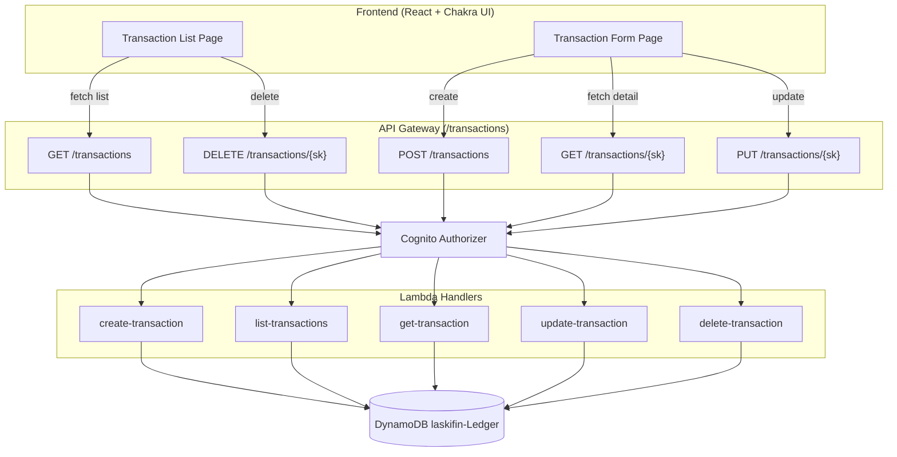

# Design Document — Transaction CRUD

## Overview

This design covers the full CRUD lifecycle for financial transactions in LASKI Finances. The system is split into three layers:

1. **Backend**: Five AWS Lambda handlers (create, list, get, update, delete) behind API Gateway with Cognito authorization, each operating on the existing `laskifin-Ledger` DynamoDB table.
2. **Frontend**: Two new React pages — a transaction list page with filters and a create/edit form page — built with Chakra UI and integrated via the existing auth/routing infrastructure.
3. **Infrastructure**: CDK additions to `ApiStack` wiring the new Lambda functions, API Gateway routes, IAM permissions, and CORS configuration.

The existing `create-transaction.ts` handler already implements the create flow (single + installments). The design extends the backend with four additional handlers and builds the frontend from scratch.

## Architecture



### Key Design Decisions

- **One Lambda per operation**: Follows the existing pattern from `create-transaction.ts`. Each handler has its own file, IAM permissions scoped to its needs, and independent deployment.
- **Reuse existing table and key schema**: No schema migration needed. The `TRANS#YYYY-MM#INC|EXP#uuid` sort key pattern supports all query patterns (by month, by type) via `begins_with` on the sort key.
- **Frontend API layer**: A thin `api/transactions.ts` module centralizes all HTTP calls, keeping page components focused on UI logic.
- **Zod on both sides**: Backend validates with Zod for security; frontend validates with Zod for UX. Schemas are defined independently (no shared package) to keep deployment boundaries clean.

## Components and Interfaces

### Backend Components

#### 1. create-transaction.ts (existing)
Already implemented. Creates single or installment transactions via `PutCommand`.

#### 2. list-transactions.ts (new)

```typescript
// Handler: GET /transactions?month=YYYY-MM&type=INC|EXP
// Query: pk = USER#<sub>, sk begins_with TRANS#[month]#[type]
// Returns: { transactions: TransactionItem[] }
```

- Queries `Ledger_Table` using `QueryCommand` with `KeyConditionExpression`.
- Builds `sk` prefix dynamically: `TRANS#` → `TRANS#2024-06#` → `TRANS#2024-06#EXP#` depending on filters.
- Results sorted by `sk` descending (DynamoDB `ScanIndexForward: false`).

#### 3. get-transaction.ts (new)

```typescript
// Handler: GET /transactions/{sk}
// Query: pk = USER#<sub>, sk = {sk}
// Returns: TransactionItem | 404
```

- Uses `GetCommand` for single-item retrieval.

#### 4. update-transaction.ts (new)

```typescript
// Handler: PUT /transactions/{sk}
// Body: { description, amount, date, type, source, category }
// Uses UpdateCommand with ConditionExpression to verify existence
// Returns: updated TransactionItem | 404
```

- Validates payload with Zod (same field rules as create, minus installments).
- Uses `UpdateCommand` with `ConditionExpression: "attribute_exists(pk)"` to ensure the item exists.
- Updates only the allowed fields: `description`, `amount`, `date`, `type`, `source`, `category`.

#### 5. delete-transaction.ts (new)

```typescript
// Handler: DELETE /transactions/{sk}?deleteGroup=true
// Single delete: DeleteCommand with pk + sk
// Group delete: Query by groupId, then BatchWriteCommand
// Returns: { message } | 404
```

- Single delete: `DeleteCommand` with `ConditionExpression: "attribute_exists(pk)"`.
- Group delete (`deleteGroup=true`): First `GetCommand` to retrieve the item's `groupId`, then `QueryCommand` with `FilterExpression` on `groupId` to find all siblings, then `BatchWriteCommand` to delete all (handling 25-item batch limit).

### Frontend Components

#### 1. api/transactions.ts — API Client

```typescript
interface TransactionItem {
  pk: string;
  sk: string;
  description: string;
  amount: number;
  totalAmount: number;
  category: string;
  source: string;
  type: "INC" | "EXP";
  date: string;
  groupId: string;
  installmentNumber: number;
  installmentTotal: number;
}

interface CreateTransactionPayload {
  description: string;
  totalAmount: number;
  date: string;
  type: "INC" | "EXP";
  source: string;
  category: string;
  installments?: number;
}

interface UpdateTransactionPayload {
  description: string;
  amount: number;
  date: string;
  type: "INC" | "EXP";
  source: string;
  category: string;
}

// Functions: listTransactions, getTransaction, createTransaction, updateTransaction, deleteTransaction
```

All functions attach the Cognito ID token from the auth context as `Authorization` header. The API base URL comes from environment config (`VITE_API_URL`).

#### 2. pages/TransactionsPage.tsx — List Page

- Fetches transactions on mount and on filter change.
- Renders a Chakra UI `Table` with columns: date, description, type badge, category, source, amount, installment info.
- Month filter: `<Input type="month">` bound to `month` query param.
- Type filter: `<Select>` with options All / INC / EXP.
- Action buttons per row: Edit (navigates to form), Delete (opens confirmation dialog).
- "New Transaction" button navigates to `/transactions/new`.
- Formats amounts as BRL (`Intl.NumberFormat('pt-BR', { style: 'currency', currency: 'BRL' })`).
- Formats dates as `DD/MM/YYYY`.

#### 3. pages/TransactionFormPage.tsx — Create/Edit Form

- Route: `/transactions/new` (create) or `/transactions/edit/:sk` (edit).
- Uses Chakra UI form components with Zod client-side validation.
- Create mode: all fields including installments (default 1).
- Edit mode: pre-populates from `getTransaction(sk)`, hides installments field.
- On submit: calls `createTransaction` or `updateTransaction`, navigates to list on success.
- Shows inline validation errors and API error messages.

### Infrastructure Changes (ApiStack)

New Lambda functions added to `api-stack.ts`:

| Function | Route | DynamoDB Permission |
|----------|-------|-------------------|
| `listTransactions` | GET `/transactions` | `grantReadData` |
| `getTransaction` | GET `/transactions/{sk}` | `grantReadData` |
| `updateTransaction` | PUT `/transactions/{sk}` | `grantReadWriteData` |
| `deleteTransaction` | DELETE `/transactions/{sk}` | `grantReadWriteData` |

All functions share the same configuration pattern as the existing `createTransactionHandler`: `NodejsFunction`, Node.js 22.x runtime, 256MB memory, 10s timeout, esbuild bundling with minify + sourceMap, `TABLE_NAME` env var, Cognito authorizer.

The `{sk}` path parameter resource is added under `/transactions` as a child resource.

## Data Models

### DynamoDB Table: laskifin-Ledger (existing)

| Attribute | Type | Description |
|-----------|------|-------------|
| `pk` | String | Partition key: `USER#<cognitoSub>` |
| `sk` | String | Sort key: `TRANS#<YYYY-MM>#<INC\|EXP>#<uuid>` |
| `description` | String | Transaction description (suffixed with `(i/N)` for installments) |
| `amount` | Number | Individual entry amount (`totalAmount / installments`) |
| `totalAmount` | Number | Original purchase amount |
| `category` | String | Transaction category |
| `source` | String | Payment source |
| `type` | String | `"INC"` or `"EXP"` |
| `date` | String | ISO 8601 date string |
| `groupId` | String | UUID grouping installments of the same purchase |
| `installmentNumber` | Number | 1-based installment index |
| `installmentTotal` | Number | Total number of installments |

### Key Access Patterns

| Pattern | Key Condition | Use Case |
|---------|--------------|----------|
| All transactions for user | `pk = USER#sub`, `sk begins_with TRANS#` | List all |
| Transactions by month | `pk = USER#sub`, `sk begins_with TRANS#2024-06#` | Month filter |
| Transactions by month + type | `pk = USER#sub`, `sk begins_with TRANS#2024-06#EXP#` | Month + type filter |
| Single transaction | `pk = USER#sub`, `sk = TRANS#...` | Get / Update / Delete |
| Transactions by source | GSI `GSI_LookupBySource`: `source = X` | Source lookup |

### Zod Schemas

**Backend — Create (existing)**:
```typescript
const CreateTransactionSchema = z.object({
  description: z.string().min(1),
  totalAmount: z.number().positive(),
  installments: z.number().int().min(1).default(1),
  date: z.string().refine((val) => !isNaN(Date.parse(val))),
  category: z.string().min(1),
  source: z.string().min(1),
  type: z.enum(["INC", "EXP"]),
});
```

**Backend — Update (new)**:
```typescript
const UpdateTransactionSchema = z.object({
  description: z.string().min(1),
  amount: z.number().positive(),
  date: z.string().refine((val) => !isNaN(Date.parse(val))),
  category: z.string().min(1),
  source: z.string().min(1),
  type: z.enum(["INC", "EXP"]),
});
```

**Frontend — Form Validation (new)**:
```typescript
const TransactionFormSchema = z.object({
  description: z.string().min(1, "Description is required"),
  totalAmount: z.number().positive("Amount must be positive"),
  date: z.string().min(1, "Date is required"),
  type: z.enum(["INC", "EXP"]),
  source: z.string().min(1, "Source is required"),
  category: z.string().min(1, "Category is required"),
  installments: z.number().int().min(1).default(1),
});
```


## Correctness Properties

*A property is a characteristic or behavior that should hold true across all valid executions of a system — essentially, a formal statement about what the system should do. Properties serve as the bridge between human-readable specifications and machine-verifiable correctness guarantees.*

### Property 1: Installment creation invariants

*For any* valid transaction payload with `installments` N > 1, the Create_Handler should produce exactly N entries in the Ledger_Table where: each entry's `amount` equals `totalAmount / N`, all entries share the same `groupId`, `installmentNumber` ranges sequentially from 1 to N, each entry's `installmentTotal` equals N, each entry's `totalAmount` equals the original payload value, each entry's `date` is offset by the correct number of months from the original date, and each entry's `description` is suffixed with `(i/N)`.

**Validates: Requirements 1.3, 1.4**

### Property 2: Single transaction creation invariants

*For any* valid transaction payload with `installments` omitted or equal to 1, the Create_Handler should produce exactly one entry where `amount` equals `totalAmount`, `installmentNumber` is 1, `installmentTotal` is 1, a `groupId` is assigned, and the `description` matches the input without suffix.

**Validates: Requirements 1.5**

### Property 3: Transaction key format

*For any* transaction created by the Create_Handler, the `pk` should equal `USER#<cognitoSub>` from the request context, and the `sk` should match the pattern `TRANS#<YYYY-MM>#<INC|EXP>#<uuid>` where `YYYY-MM` corresponds to the entry's date and the type segment matches the transaction type.

**Validates: Requirements 1.6, 1.7**

### Property 4: Create validation rejects invalid payloads

*For any* payload where at least one field violates the schema rules (empty description, non-positive totalAmount, invalid date, invalid type, empty source, or empty category), the Create_Handler should return HTTP 400 and not create any entries in the Ledger_Table.

**Validates: Requirements 1.2, 1.9**

### Property 5: List filter correctness

*For any* set of transactions belonging to a user and any combination of `month` and `type` query parameters, the List_Handler should return only transactions whose sort key matches the provided month and/or type filter — no transaction outside the filter criteria should appear in the results.

**Validates: Requirements 2.3, 2.4**

### Property 6: List returns all matching transactions

*For any* authenticated user with N transactions in the Ledger_Table (matching the applied filters), the List_Handler should return exactly N items — no matching transaction should be omitted.

**Validates: Requirements 2.1**

### Property 7: List ordering

*For any* list response containing two or more transactions, the transactions should be sorted by date in descending order — each transaction's date should be greater than or equal to the next transaction's date in the array.

**Validates: Requirements 2.5**

### Property 8: Create-then-get round trip

*For any* transaction successfully created via the Create_Handler, retrieving it via the Get_Handler using the same `sk` should return an item whose `description`, `amount`, `totalAmount`, `category`, `source`, `type`, `date`, `groupId`, `installmentNumber`, and `installmentTotal` all match the values that were written.

**Validates: Requirements 3.1**

### Property 9: Update reflects new values

*For any* existing transaction and any valid update payload, after the Update_Handler processes the request, retrieving the transaction should return the updated `description`, `amount`, `date`, `type`, `source`, and `category` values matching the payload.

**Validates: Requirements 4.1**

### Property 10: Update validation rejects invalid payloads

*For any* update payload where at least one field violates the schema rules (empty description, non-positive amount, invalid date, invalid type, empty source, or empty category), the Update_Handler should return HTTP 400 and the existing transaction should remain unchanged.

**Validates: Requirements 4.3, 4.6**

### Property 11: Update isolation for installment groups

*For any* installment group with N entries, updating one entry via the Update_Handler should leave all other entries in the group unchanged — their `description`, `amount`, `date`, `type`, `source`, and `category` values should be identical before and after the update.

**Validates: Requirements 4.7**

### Property 12: Delete removes item

*For any* existing transaction, after the Delete_Handler processes a DELETE request for that transaction's `sk`, attempting to retrieve it via the Get_Handler should return HTTP 404.

**Validates: Requirements 5.1**

### Property 13: Group delete removes all siblings

*For any* installment group with N entries, when the Delete_Handler receives a DELETE request with `deleteGroup=true` for any entry in the group, all N entries sharing the same `groupId` should be removed from the Ledger_Table, and the response should include the count N.

**Validates: Requirements 5.5**

### Property 14: BRL currency formatting

*For any* numeric amount, the formatting function should produce a string matching BRL currency format (e.g., `R$ 1.234,56`) — specifically, using `pt-BR` locale with currency style and `BRL` currency code.

**Validates: Requirements 6.10**

### Property 15: Client-side form validation

*For any* form submission where at least one required field is empty or invalid (empty description, non-positive amount, missing date, missing type, empty source, or empty category), the Transaction_Form should display inline error messages and not send an API request.

**Validates: Requirements 7.2**

#### Property 16: MonthlySummary totalExpenses reflects all EXP creates

*For any* sequence of `N` EXP entries created via the Create_Handler for a given user and month, the `totalExpenses` in `laskifin-MonthlySummary` for that month must equal the sum of all `amount` values written. No EXP creation may fail to increment `totalExpenses`.

**Validates: Requirements 1.13, Risk R1**

#### Property 17: MonthlySummary remains consistent after update

*For any* existing transaction updated via the Update_Handler with a new `amount`, the `laskifin-MonthlySummary` `totalExpenses` (or `totalIncome`) for the affected month(s) must reflect the net change: old amount removed, new amount added. The running total must equal the sum of all currently-stored entry amounts for that user and month.

**Validates: Requirements 4.10, Risk R1**

#### Property 18: MonthlySummary remains consistent after delete

*For any* transaction deleted via the Delete_Handler, the `laskifin-MonthlySummary` `totalExpenses` (or `totalIncome`) for the affected month must decrease by exactly the deleted entry's `amount`. For group delete of N entries across multiple months, each month's summary must be decremented independently and correctly.

**Validates: Requirements 5.7, Risk R1**

#### Property 19: categoryMonth is always present and normalised

*For any* entry created or updated by a transaction handler, the stored `categoryMonth` must equal `category.trim().toLowerCase() + "#" + YYYY-MM` and the stored `category` must equal `category.trim().toLowerCase()`. Mixed-case or whitespace-padded inputs must never reach DynamoDB.

**Validates: Requirements 1.11, 1.12, 4.8, 4.9, Risk R2, Risk R5**

## Error Handling

### Backend Error Strategy

All Lambda handlers follow a consistent error handling pattern:

| Scenario | HTTP Status | Response Body |
|----------|-------------|---------------|
| Missing Cognito sub claim | 401 | `{ "error": "Unauthorized" }` |
| Invalid/missing JSON body | 400 | `{ "error": "Invalid request body" }` |
| Zod validation failure | 400 | `{ "error": "Validation failed", "details": ["..."] }` |
| Item not found (get/update/delete) | 404 | `{ "error": "Transaction not found" }` |
| DynamoDB conditional check failure | 404 | `{ "error": "Transaction not found" }` |
| Unexpected error | 500 | `{ "error": "Internal server error" }` |

**Implementation rules:**
- Every handler wraps its logic in `try/catch`.
- Caught errors are logged with `console.error` (CloudWatch integration).
- Internal error details (stack traces, DynamoDB error codes) are never exposed to the client.
- Zod validation errors are mapped to user-friendly messages via `issue.message`.
- DynamoDB `ConditionalCheckFailedException` is caught and mapped to 404.

### Frontend Error Strategy

- API errors are caught in the `api/transactions.ts` layer and re-thrown with structured error objects.
- The Transaction Form page displays API error messages inline (below the form) without navigating away.
- The Transaction List page shows a toast notification on delete failure.
- Network errors (no connectivity) display a generic "Could not connect to server" message.
- Loading states prevent duplicate submissions (submit button disabled while request is in flight).

## Testing Strategy

### Dual Testing Approach

This feature uses both unit tests and property-based tests for comprehensive coverage:

- **Unit tests**: Verify specific examples, edge cases, error conditions, and UI rendering.
- **Property-based tests**: Verify universal properties across randomly generated inputs using the correctness properties defined above.

### Property-Based Testing Configuration

- **Library**: `fast-check` (already in `front/package.json` devDependencies; add to `back/lambdas` for backend tests)
- **Framework**: Vitest (frontend), Jest (infrastructure)
- **Minimum iterations**: 100 per property test
- **Tagging**: Each property test must include a comment referencing the design property:
  ```
  // Feature: transaction-crud, Property 1: Installment creation invariants
  ```
- **One test per property**: Each correctness property is implemented by a single property-based test.

### Backend Tests (`back/lambdas/test/transactions/`)

**Property-based tests** (one per correctness property):
- Property 1: Generate random valid payloads with installments > 1, invoke create handler with mocked DynamoDB, verify all installment invariants.
- Property 2: Generate random valid payloads with installments = 1, invoke create handler, verify single-entry invariants.
- Property 3: Generate random valid payloads, invoke create handler, verify pk/sk format on all written items.
- Property 4: Generate random payloads with at least one invalid field, invoke create handler, verify 400 response and no DynamoDB writes.
- Property 5: Generate random transaction sets and filter combinations, invoke list handler, verify all returned items match filters.
- Property 6: Generate random transaction sets, invoke list handler, verify count matches.
- Property 7: Generate random transaction sets, invoke list handler, verify descending date order.
- Property 8: Generate random valid payloads, create then get, verify round-trip equality.
- Property 9: Generate random existing transactions and valid update payloads, update then get, verify new values.
- Property 10: Generate random invalid update payloads, invoke update handler, verify 400 and no change.
- Property 11: Generate random installment groups, update one entry, verify siblings unchanged.
- Property 12: Generate random transactions, delete then get, verify 404.
- Property 13: Generate random installment groups, group delete, verify all removed.

**Unit tests** (specific examples and edge cases):
- Missing auth (401) for each handler.
- Invalid JSON body (400) for create/update.
- Not found (404) for get/update/delete on non-existent sk.
- Empty result set returns 200 with empty array (list handler).
- Group delete with `deleteGroup=true` on a non-installment transaction deletes just that one entry.

### Frontend Tests (`front/src/__tests__/`)

**Property-based tests:**
- Property 14: Generate random numeric amounts, verify BRL formatting output.
- Property 15: Generate random invalid form states, verify validation errors shown and no API call.

**Unit tests** (component rendering and interactions):
- Transaction List Page: renders table columns, shows loading spinner, shows empty state, filter controls trigger re-fetch, delete confirmation dialog appears.
- Transaction Form Page: renders all fields in create mode, hides installments in edit mode, pre-populates in edit mode, shows API error messages, navigates on success.

### Infrastructure Tests (`infra/test/`)

**Unit tests** (CDK assertions):
- Verify all 5 routes exist on the API Gateway.
- Verify Cognito authorizer is attached to all routes.
- Verify 5 separate Lambda functions are created.
- Verify IAM permissions per handler (read-only, write-only, read-write).
- Verify TABLE_NAME environment variable is set on all Lambda functions.
- Verify CORS configuration.


---

## Retrofit: Cross-Cutting Side Effects

> **Context**: This section was added after `data-model.md` and `api-contract.md` were finalised. The original design predates the introduction of `laskifin-MonthlySummary` and the `categoryMonth` GSI attribute. The handlers described below must be retrofitted to include these side effects. They are non-optional — omitting them silently corrupts the balance overview and breaks category-based queries for all existing data.

### Side Effect 1 — `categoryMonth` attribute on every Ledger write

Every handler that writes a new item to `laskifin-Ledger` must include the `categoryMonth` composite attribute at write time. This attribute is the sort key of `GSI_MonthlyByCategory` and must be present on every item for category filtering and top-spending insights to work.

**Formula**: `categoryMonth = category.trim().toLowerCase() + "#" + YYYY-MM`

where `YYYY-MM` is derived from the entry's `date` field.

**Affects**:
- `create-transaction.ts` — add `categoryMonth` to every `PutItem` / `BatchWrite` payload. This handler is already deployed; it must be updated and redeployed.
- `update-transaction.ts` — recalculate and write `categoryMonth` in the `UpdateCommand` whenever `category` or `date` changes.

**Note on normalisation**: `category` and `source` must be normalised with `.trim().toLowerCase()` before being written to DynamoDB. This applies to the stored `category` field itself, not only to `categoryMonth`. This prevents the same category typed as `Food`, `food`, and `Alimentação` from appearing as three separate buckets in insights queries.

---

### Side Effect 2 — `laskifin-MonthlySummary` atomic update on every write

Every handler that creates, updates, or deletes a Ledger entry must also update the corresponding `laskifin-MonthlySummary` item atomically. This table is the data source for `GET /balance` — if any handler skips this step, the balance silently diverges from reality with no error or alarm.

The `SUMMARY_TABLE_NAME` environment variable must be passed to all write handlers in `api-stack.ts`. See Requirement 8 addendum in `transaction-crud-requirements.md`.

#### Shared utility

All write handlers must import and call a shared utility rather than inlining the DynamoDB expression. The utility lives at:

```
back/lambdas/src/shared/update-monthly-summary.ts
```

```typescript
import { DynamoDBDocumentClient, UpdateCommand } from '@aws-sdk/lib-dynamodb';

export type SummaryOperation = 'add' | 'subtract';

export async function updateMonthlySummary(
  client: DynamoDBDocumentClient,
  userId: string,
  date: string,            // ISO 8601 — YYYY-MM derived from this
  amount: number,          // always positive
  type: 'INC' | 'EXP',
  operation: SummaryOperation
): Promise<void> {
  const yyyyMm = date.slice(0, 7);           // "2024-06"
  const sign = operation === 'add' ? 1 : -1;
  const delta = amount * sign;

  const incomeField    = type === 'INC' ? delta : 0;
  const expensesField  = type === 'EXP' ? delta : 0;

  await client.send(new UpdateCommand({
    TableName: process.env.SUMMARY_TABLE_NAME!,
    Key: { pk: userId, sk: `SUMMARY#${yyyyMm}` },
    UpdateExpression: `
      SET totalIncome    = if_not_exists(totalIncome,    :zero) + :incDelta,
          totalExpenses  = if_not_exists(totalExpenses,  :zero) + :expDelta,
          balance        = if_not_exists(totalIncome,    :zero) + :incDelta
                         - (if_not_exists(totalExpenses, :zero) + :expDelta),
          updatedAt      = :now
      ADD transactionCount :countDelta
    `,
    ExpressionAttributeValues: {
      ':incDelta':    incomeField,
      ':expDelta':    expensesField,
      ':countDelta':  sign,             // +1 on add, -1 on subtract
      ':zero':        0,
      ':now':         new Date().toISOString(),
    },
  }));
}
```

#### Handler-specific call sites

**`create-transaction.ts`** — call once per entry written (inside the loop for installments):

```typescript
await updateMonthlySummary(client, userId, entry.date, entry.amount, entry.type, 'add');
```

**`update-transaction.ts`** — subtract old amount, add new amount. Read the existing item first to get the old `amount` and `type`:

```typescript
// After GetItem to fetch the existing entry:
await updateMonthlySummary(client, userId, existing.date, existing.amount, existing.type, 'subtract');
await updateMonthlySummary(client, userId, payload.date,  payload.amount,  payload.type,  'add');
```

If `date` or `type` changed, the two calls target different months or different counters — the utility handles this correctly because each call is independent.

**`delete-transaction.ts`** — subtract the deleted entry's amount. Read the existing item first to get `amount` and `type` before deleting:

```typescript
// After GetItem, before DeleteCommand:
await updateMonthlySummary(client, userId, existing.date, existing.amount, existing.type, 'subtract');
```

For group delete, call once per deleted entry inside the loop.

---

### Side Effect 3 — `SUMMARY_TABLE_NAME` IAM grant

In `api-stack.ts`, the following handlers require `grantReadWriteData` on `laskifin-MonthlySummary` in addition to their existing Ledger grants:

| Handler | Ledger grant (existing) | MonthlySummary grant (new) |
|---------|------------------------|---------------------------|
| `create-transaction` | `grantWriteData` | `grantWriteData` |
| `update-transaction` | `grantReadWriteData` | `grantReadWriteData` |
| `delete-transaction` | `grantReadWriteData` | `grantReadWriteData` |

---

### New unit tests

Add to `back/lambdas/test/transactions/`:

- `create-transaction` writes `categoryMonth` attribute on every created entry (single and installments).
- `create-transaction` normalises `category` to lowercase before writing.
- `create-transaction` calls `updateMonthlySummary` once per entry created.
- `update-transaction` recalculates `categoryMonth` when `category` or `date` changes.
- `update-transaction` calls `updateMonthlySummary` with subtract-then-add when amount changes.
- `update-transaction` calls `updateMonthlySummary` targeting two different months when `date` moves across a month boundary.
- `delete-transaction` calls `updateMonthlySummary` with subtract for each deleted entry.
- `delete-transaction` group delete calls `updateMonthlySummary` N times for N deleted siblings.
- `updateMonthlySummary` with `if_not_exists` correctly initialises a new month item on first write (no pre-existing item → item created with correct values).

Add to `infra/test/`:

- `create-transaction` Lambda has `SUMMARY_TABLE_NAME` env var set.
- `update-transaction` Lambda has `SUMMARY_TABLE_NAME` env var set.
- `delete-transaction` Lambda has `SUMMARY_TABLE_NAME` env var set.
- All three write handlers have `grantReadWriteData` on `laskifin-MonthlySummary`.