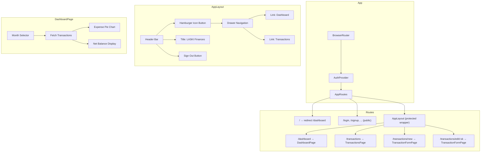
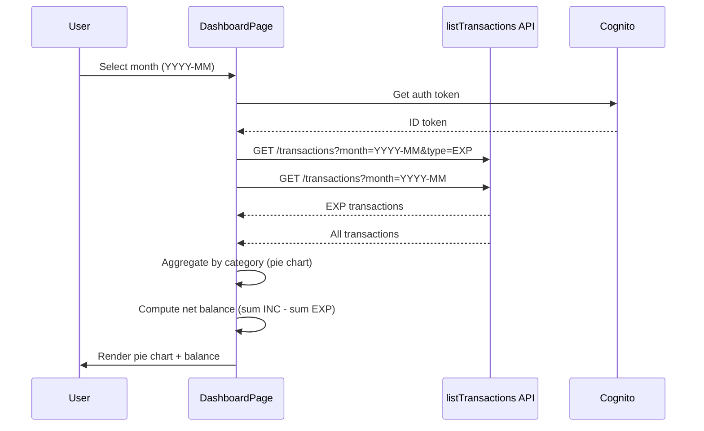

# Design Document: Dashboard Hamburger Menu

## Overview

This feature introduces a persistent application layout with a hamburger-menu-based navigation drawer and a new Dashboard page. The layout wraps all protected routes, providing a header bar with a hamburger icon, the app title, and a sign-out button. The Dashboard page displays a pie chart of expenses grouped by category and a net balance summary (income − expenses) for a user-selected month. The root route `/` redirects to `/dashboard`, replacing the current `HomePage`. Session expiration is enforced via Cognito token validity configuration (1 day) with frontend handling for expired tokens.

### Key Design Decisions

1. **Chakra UI Drawer for navigation** — Chakra UI's `Drawer` component provides an accessible, animated overlay that matches the existing component library. No additional dependency needed.
2. **Recharts for pie chart** — Lightweight, React-native charting library with good TypeScript support. It's the most common choice for React pie charts and integrates cleanly with Chakra UI layouts. New dependency: `recharts`.
3. **Two API calls per month change** — The Dashboard fetches EXP transactions (for the pie chart) and all transactions (for net balance) using the existing `listTransactions` API with `type` and `month` filters. No backend changes required.
4. **Layout component wraps protected routes** — An `AppLayout` component renders the header + drawer and an `<Outlet />` for nested routes, replacing the current flat `ProtectedRoute` wrapping pattern.
5. **CDK change for token validity** — The `AuthStack` Cognito User Pool Client is updated to set `accessTokenValidity` and `idTokenValidity` to 1 day.

## Architecture



### Data Flow



## Components and Interfaces

### New Components

#### `AppLayout` (`front/src/components/AppLayout.tsx`)

Shared layout wrapper for all protected pages. Renders the header bar with hamburger menu, app title, and sign-out button. Uses React Router's `<Outlet />` to render child routes.

```typescript
interface AppLayoutProps {
  // No props — uses useAuth() and React Router hooks internally
}
```

Responsibilities:
- Render a fixed header bar with hamburger icon (left), title (center), sign-out button (right)
- Manage Chakra UI `Drawer` open/close state via `useDisclosure()`
- Render navigation links inside the drawer: "Dashboard" (`/dashboard`) and "Transactions" (`/transactions`)
- Highlight the active link based on current route (`useLocation()`)
- Handle sign-out via `useAuth().signOut()` and redirect to `/login`
- Render `<Outlet />` below the header for nested route content

#### `DashboardPage` (`front/src/pages/DashboardPage.tsx`)

Dashboard page displaying expense pie chart and net balance for a selected month.

```typescript
// No props — fetches data internally using the API client
```

Responsibilities:
- Render a month selector (`<Input type="month" />`) defaulting to current month
- Fetch EXP transactions and all transactions for the selected month
- Aggregate EXP transactions by category for pie chart data
- Compute net balance: sum(INC amounts) − sum(EXP amounts)
- Render pie chart using Recharts `<PieChart>` / `<Pie>`
- Render net balance with color coding (green for positive, red for negative)
- Display individual income and expense totals
- Handle loading, empty, and error states

### Pure Utility Functions

#### `aggregateExpensesByCategory` (`front/src/utils/dashboard.ts`)

```typescript
interface CategoryTotal {
  category: string;
  total: number;
}

function aggregateExpensesByCategory(transactions: TransactionItem[]): CategoryTotal[];
```

Takes an array of EXP transactions and returns an array of `{ category, total }` objects, one per unique category, sorted by total descending.

#### `computeNetBalance` (`front/src/utils/dashboard.ts`)

```typescript
interface BalanceSummary {
  totalIncome: number;
  totalExpenses: number;
  netBalance: number;
}

function computeNetBalance(transactions: TransactionItem[]): BalanceSummary;
```

Takes an array of all transactions (INC + EXP) for a month and returns the income sum, expense sum, and net balance.

#### `getCurrentMonth` (`front/src/utils/dashboard.ts`)

```typescript
function getCurrentMonth(): string; // Returns "YYYY-MM"
```

Returns the current month in `YYYY-MM` format for the default month selector value.

### Modified Components

#### `AppRoutes` (`front/src/router/routes.tsx`)

Updated to:
- Use `AppLayout` as a parent route element for all protected routes
- Add `/dashboard` route rendering `DashboardPage`
- Change `/` redirect target from `/transactions` to `/dashboard`
- Remove `HomePage` import (no longer used)

#### `AuthStack` (`infra/lib/auth-stack.ts`)

Updated to add token validity configuration to the User Pool Client:
- `accessTokenValidity: Duration.days(1)`
- `idTokenValidity: Duration.days(1)`

### Unchanged Components

- `AuthProvider`, `useAuth`, `ProtectedRoute` — no changes needed
- `TransactionsPage`, `TransactionFormPage` — wrapped by `AppLayout` but internally unchanged
- `listTransactions` API client — already supports `month` and `type` filters
- `formatCurrency` — reused for all monetary display

## Data Models

### Existing Models (No Changes)

#### `TransactionItem` (from `front/src/api/transactions.ts`)

```typescript
interface TransactionItem {
  pk: string;
  sk: string;
  description: string;
  amount: number;
  totalAmount: number;
  category: string;
  source: string;
  type: 'INC' | 'EXP';
  date: string;
  groupId: string;
  installmentNumber: number;
  installmentTotal: number;
}
```

### New Models

#### `CategoryTotal`

```typescript
interface CategoryTotal {
  category: string;
  total: number;
}
```

Represents the aggregated expense amount for a single category. Used as input data for the Recharts pie chart.

#### `BalanceSummary`

```typescript
interface BalanceSummary {
  totalIncome: number;
  totalExpenses: number;
  netBalance: number;
}
```

Computed summary of income vs expenses for a given month.


## Correctness Properties

*A property is a characteristic or behavior that should hold true across all valid executions of a system — essentially, a formal statement about what the system should do. Properties serve as the bridge between human-readable specifications and machine-verifiable correctness guarantees.*

### Property 1: Expense aggregation correctness

*For any* array of EXP transactions, `aggregateExpensesByCategory` should return exactly one entry per unique category, and each entry's `total` should equal the sum of `amount` values for that category across all input transactions. The sum of all entry totals should equal the sum of all input amounts.

**Validates: Requirements 2.4, 2.5**

### Property 2: Net balance computation correctness

*For any* array of transactions (mix of INC and EXP), `computeNetBalance` should return a `BalanceSummary` where `totalIncome` equals the sum of all INC transaction amounts, `totalExpenses` equals the sum of all EXP transaction amounts, and `netBalance` equals `totalIncome - totalExpenses`.

**Validates: Requirements 3.1, 3.2**

### Property 3: Balance color coding

*For any* numeric net balance value, the color determination function should return a "surplus" indicator (green) when the value is positive, a "deficit" indicator (red) when the value is negative, and a neutral indicator when the value is zero.

**Validates: Requirements 3.3, 3.4**

## Error Handling

### API Errors on Dashboard

- When `listTransactions` throws an `ApiError`, the `DashboardPage` catches it and displays a user-friendly error message via a Chakra UI `Alert` component.
- A 401 status from the API (expired token) triggers a sign-out and redirect to `/login` with a session-expired message. This is handled by checking the `ApiError.statusCode` in the Dashboard's fetch logic.

### Session Expiration

- The `AuthProvider` already restores sessions on mount via `cognitoGetCurrentUser()`. When the Cognito token expires (after 1 day), this call will fail, setting `user` to `null` and `isAuthenticated` to `false`.
- `ProtectedRoute` already redirects unauthenticated users to `/login` — no changes needed for the redirect flow.
- For mid-session expiration (user is on a page and the token expires during an API call), the Dashboard's error handler catches the 401 and redirects to login.

### Empty Data

- When no EXP transactions exist for a month, `aggregateExpensesByCategory` returns an empty array. The `DashboardPage` checks for this and renders a "No expense data available" message instead of an empty pie chart.
- When no transactions at all exist, `computeNetBalance` returns `{ totalIncome: 0, totalExpenses: 0, netBalance: 0 }`.

### Navigation Errors

- The hamburger menu uses React Router's `useNavigate()` for navigation. Invalid routes fall through to the existing catch-all behavior (no explicit 404 page currently, but the menu only links to known routes).

## Testing Strategy

### Property-Based Tests

Use `fast-check` (already in devDependencies) with Vitest. Each property test runs a minimum of 100 iterations.

| Property | Test Target | Generator Strategy |
|----------|-------------|-------------------|
| Property 1: Expense aggregation | `aggregateExpensesByCategory` | Generate arrays of `TransactionItem` objects with random categories, amounts (positive numbers), and type fixed to `'EXP'` |
| Property 2: Net balance computation | `computeNetBalance` | Generate arrays of `TransactionItem` objects with random types (`'INC'` or `'EXP'`) and random positive amounts |
| Property 3: Balance color coding | Color determination logic | Generate arbitrary numbers (positive, negative, zero) |

Each property test must be tagged with a comment:
- `// Feature: dashboard-hamburger-menu, Property 1: Expense aggregation correctness`
- `// Feature: dashboard-hamburger-menu, Property 2: Net balance computation correctness`
- `// Feature: dashboard-hamburger-menu, Property 3: Balance color coding`

### Unit Tests

Unit tests complement property tests by covering specific examples, edge cases, and integration points:

- **`aggregateExpensesByCategory`**: empty array input, single transaction, multiple transactions in same category
- **`computeNetBalance`**: all INC, all EXP, mixed, empty array, single transaction
- **`getCurrentMonth`**: returns correct format `YYYY-MM`
- **`AppLayout`**: renders header with title, hamburger button, sign-out button; drawer opens/closes; navigation links work; active link highlighting
- **`DashboardPage`**: loading state, error state, empty data message, month selector default value, re-fetch on month change
- **Route configuration**: `/` redirects to `/dashboard`, `/dashboard` renders `DashboardPage`
- **CDK assertion test**: `AuthStack` User Pool Client has `accessTokenValidity` and `idTokenValidity` set to 1 day

### Test File Locations

- `front/src/utils/__tests__/dashboard.test.ts` — unit + property tests for `aggregateExpensesByCategory`, `computeNetBalance`, `getCurrentMonth`, and color coding logic
- `front/src/components/__tests__/AppLayout.test.tsx` — unit tests for layout, drawer, navigation
- `front/src/pages/__tests__/DashboardPage.test.tsx` — unit tests for dashboard page states
- `infra/test/stacks.test.ts` — CDK assertion for token validity (extend existing file)
