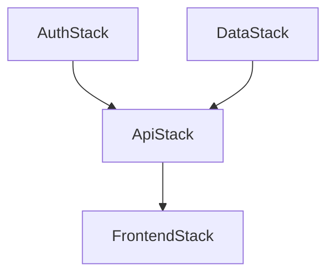

# Design Document: Infrastructure Refactor

## Overview

This design describes the decomposition of the monolithic `InfraCoreStack` into four independent CDK stacks (`AuthStack`, `DataStack`, `ApiStack`, `FrontendStack`), along with dependency version fixes, runtime upgrades, Lambda field migration from Portuguese to English, API Gateway introduction, Amplify Hosting setup, and a consistent resource tagging strategy.

The current state is a single `infra/lib/infracore-stack.ts` file containing Cognito, DynamoDB, and Lambda resources with no API Gateway, no frontend hosting, outdated CDK/runtime versions, and Portuguese field names in the Lambda handler. The target state is a clean multi-stack architecture matching `architecture.md`.

### Key Design Decisions

1. **CfnOutput + Fn.importValue for cross-stack refs** — chosen over direct property passing because it allows independent stack deployment after initial setup and makes exported values visible in CloudFormation console for debugging.
2. **REST API v1 (not HTTP API v2)** — required by the architecture spec; provides native Cognito User Pool Authorizer support without custom Lambda authorizers.
3. **Amplify Hosting via L2 construct (`@aws-cdk/aws-amplify-alpha`)** — the stable `aws-cdk-lib` does not include an L2 Amplify construct yet. The alpha package version must match `aws-cdk-lib` exactly (`2.244.0-alpha.0`) per coding standards. If the alpha package is unavailable or causes JSII conflicts, fall back to `CfnApp`/`CfnBranch`/`CfnDomain` L1 constructs from `aws-cdk-lib/aws-amplify`.
4. **English field migration is a code change only** — the DynamoDB table name and key schema (`pk`, `sk`) remain unchanged. Only the GSI partition key attribute and Lambda handler field names change from Portuguese to English.

## Architecture

### Stack Dependency Graph



Deploy order: `AuthStack` → `DataStack` → `ApiStack` → `FrontendStack`

`AuthStack` and `DataStack` have no dependencies on each other and can deploy in parallel. `ApiStack` depends on both. `FrontendStack` depends on `ApiStack` (for the API URL) and transitively on `AuthStack` (for Cognito config).

### Cross-Stack Reference Map

| Export Name | Source Stack | Consumer Stack | Value |
|-------------|-------------|----------------|-------|
| `${prefix}-user-pool-id-${stage}` | AuthStack | ApiStack, FrontendStack | Cognito User Pool ID |
| `${prefix}-user-pool-client-id-${stage}` | AuthStack | FrontendStack | Cognito User Pool Client ID |
| `${prefix}-ledger-table-name-${stage}` | DataStack | ApiStack | DynamoDB table name |
| `${prefix}-ledger-table-arn-${stage}` | DataStack | ApiStack | DynamoDB table ARN |
| `${prefix}-api-url-${stage}` | ApiStack | FrontendStack | REST API invoke URL |

Where `prefix` = `projectConfig.prefixNameResources` (`laskifin`) and `stage` = `environment.stage`.

### File Layout (Target State)

```
infra/
├── bin/infra.ts                  # CDK app entry point — instantiates all 4 stacks + app-level tags
├── config/
│   ├── environments.ts           # Dev/Prod environment configs (prod region fixed to us-west-1)
│   └── project-config.ts         # appName + prefixNameResources (unchanged)
├── lib/
│   ├── auth-stack.ts             # Cognito User Pool, Client, Domain
│   ├── data-stack.ts             # DynamoDB Ledger table + GSI
│   ├── api-stack.ts              # API Gateway REST API + Lambda + Cognito Authorizer
│   └── frontend-stack.ts         # Amplify Hosting + custom domain + branch config
├── test/
│   ├── auth-stack.test.ts
│   ├── data-stack.test.ts
│   ├── api-stack.test.ts
│   └── frontend-stack.test.ts
├── package.json
└── tsconfig.json

back/lambdas/src/transactions/
└── create-transaction.ts         # Migrated to English field names
```

The old `infra/lib/infracore-stack.ts` is deleted.

## Components and Interfaces

### 1. AuthStack (`infra/lib/auth-stack.ts`)

**Props interface:**
```typescript
interface AuthStackProps extends cdk.StackProps {
  environment: Environment;
  projectConfig: ProjectConfig;
}
```

**Resources created:**
- `cognito.UserPool` — named `${prefix}-user-pool-${stage}`
  - Email sign-in, self-sign-up, password policy (8+ chars, lower/upper/digit/symbol), email-only recovery
- `cognito.UserPoolClient` — named `${prefix}-web-client-${stage}`
  - SRP + password auth flows, no secret
- `cognito.UserPoolDomain` — prefix `${prefix}-auth-${stage}`

**CfnOutput exports:**
- `${prefix}-user-pool-id-${stage}` → `userPool.userPoolId`
- `${prefix}-user-pool-client-id-${stage}` → `userPoolClient.userPoolClientId`
- `${prefix}-user-pool-domain-${stage}` → `userPoolDomain.domainName`

**Stack-level tag:** `stack: auth-stack`

### 2. DataStack (`infra/lib/data-stack.ts`)

**Props interface:**
```typescript
interface DataStackProps extends cdk.StackProps {
  environment: Environment;
  projectConfig: ProjectConfig;
}
```

**Resources created:**
- `dynamodb.Table` — named `${prefix}-Ledger`
  - PK: `pk` (STRING), SK: `sk` (STRING)
  - PAY_PER_REQUEST, pointInTimeRecovery enabled
- GSI `GSI_LookupBySource` — PK: `source` (STRING), SK: `sk` (STRING), ALL projection
  - Note: attribute name changes from `fonte` to `source` (Requirement 2.4)

**CfnOutput exports:**
- `${prefix}-ledger-table-name-${stage}` → `ledgerTable.tableName`
- `${prefix}-ledger-table-arn-${stage}` → `ledgerTable.tableArn`

**Stack-level tag:** `stack: data-stack`

### 3. ApiStack (`infra/lib/api-stack.ts`)

**Props interface:**
```typescript
interface ApiStackProps extends cdk.StackProps {
  environment: Environment;
  projectConfig: ProjectConfig;
}
```

**Resources created:**
- `apigateway.RestApi` — named `${prefix}-api-${stage}`
  - CORS enabled for frontend domain
- `apigateway.CognitoUserPoolsAuthorizer` — using User Pool ID imported via `Fn.importValue`
  - Requires constructing a `UserPool.fromUserPoolId()` reference
- `lambda.NodejsFunction` — `createTransactionHandler`
  - Function name: `${prefix}-createTransaction-${stage}`
  - Runtime: `NODEJS_22_X`, memory: 256 MB, timeout: 10s
  - Bundling: `minify: true`, `sourceMap: true`
  - Entry: `path.resolve(__dirname, '../../back/lambdas/src/transactions/create-transaction.ts')`
  - Environment: `TABLE_NAME` = imported ledger table name
- API resource `/transactions` with `POST` method, Cognito authorizer attached
- IAM: `grantWriteData` on imported ledger table ARN via `Table.fromTableArn()`

**CfnOutput exports:**
- `${prefix}-api-url-${stage}` → `restApi.url`

**Stack-level tag:** `stack: api-stack`

### 4. FrontendStack (`infra/lib/frontend-stack.ts`)

**Props interface:**
```typescript
interface FrontendStackProps extends cdk.StackProps {
  environment: Environment;
  projectConfig: ProjectConfig;
}
```

**Resources created:**
- `amplify.App` (or L1 `CfnApp`) — named `${prefix}-frontend-${stage}`
  - Source: GitHub repository connection (configured via Amplify console or token)
  - Build settings for Vite React app
- Branch configs: `main` and `dev`
- Custom domain via `route53.HostedZone.fromLookup` for `kioshitechmuta.link`
  - `main` → `appfin.kioshitechmuta.link`
  - `dev` → `devfin.kioshitechmuta.link`

**Stack-level tag:** `stack: frontend-stack`

### 5. CDK Entry Point (`infra/bin/infra.ts`)

**Responsibilities:**
- Read environment from CDK context (`-c env=dev`)
- Instantiate all 4 stacks with `environment` and `projectConfig` props
- Add explicit dependencies: `apiStack.addDependency(authStack)`, `apiStack.addDependency(dataStack)`, `frontendStack.addDependency(apiStack)`
- Apply 5 app-level tags via `cdk.Tags.of(app).add(...)`
- Remove all references to `InfraCoreStack`

### 6. Lambda Handler Migration (`back/lambdas/src/transactions/create-transaction.ts`)

**Field name mapping (Portuguese → English):**

| Current (Portuguese) | Target (English) | DynamoDB Attribute |
|---------------------|-------------------|-------------------|
| `descricao` | `description` | `description` |
| `valorTotal` | `totalAmount` | `totalAmount` |
| `parcelas` | `installments` | — (derived) |
| `data` | `date` | `date` |
| `categoria` | `category` | `category` |
| `fonte` | `source` | `source` |
| `tipo` | `type` | `type` |
| `valor` | `amount` | `amount` |

**Additional changes:**
- Sort key pattern: `TRANS#${yearMonth}#${type}#${uuid}` where `type` uses `INC`/`EXP` instead of `REC`/`DESP`
- Each installment item includes: `installmentNumber` (1-based), `installmentTotal`, `totalAmount`
- Response messages in English
- Installment description suffix: `${description} (${i+1}/${installments})`

## Data Models

### DynamoDB Ledger Table Schema

**Table:** `laskifin-Ledger`

| Attribute | Type | Key | Description |
|-----------|------|-----|-------------|
| `pk` | STRING | Partition Key | `USER#<cognitoSub>` |
| `sk` | STRING | Sort Key | `TRANS#<YYYY-MM>#<INC\|EXP>#<uuid>` |
| `description` | STRING | — | Transaction description |
| `amount` | NUMBER | — | Amount for this entry (per-installment if split) |
| `totalAmount` | NUMBER | — | Original total purchase amount |
| `category` | STRING | — | Expense/income category |
| `source` | STRING | GSI PK | Payment source (card, bank, cash) |
| `type` | STRING | — | `INC` or `EXP` |
| `date` | STRING | — | ISO 8601 date |
| `groupId` | STRING | — | Groups installments from same purchase |
| `installmentNumber` | NUMBER | — | 1-based installment index (present on all entries) |
| `installmentTotal` | NUMBER | — | Total installments in group (1 for single transactions) |

**GSI: `GSI_LookupBySource`**

| Attribute | Type | Key |
|-----------|------|-----|
| `source` | STRING | Partition Key |
| `sk` | STRING | Sort Key |

Projection: ALL

### Cross-Stack Export Names

```typescript
// AuthStack exports
`${prefix}-user-pool-id-${stage}`
`${prefix}-user-pool-client-id-${stage}`
`${prefix}-user-pool-domain-${stage}`

// DataStack exports
`${prefix}-ledger-table-name-${stage}`
`${prefix}-ledger-table-arn-${stage}`

// ApiStack exports
`${prefix}-api-url-${stage}`
```

### Environment Configuration (Fixed)

```typescript
export const environments: Record<string, Environment> = {
  dev: {
    account: process.env.CDK_DEFAULT_ACCOUNT || '394379960362',
    region: 'us-west-2',
    stage: 'dev',
  },
  prod: {
    account: process.env.CDK_DEFAULT_ACCOUNT || '',
    region: 'us-west-1',  // Fixed from us-east-1
    stage: 'prod',
  },
};
```

### Dependency Versions (Fixed)

**Root `package.json`:**
```json
{
  "engines": { "node": ">=22.0.0" },
  "workspaces": ["back/*", "front", "infra"],
  "devDependencies": {
    "@types/node": "20.19.27",
    "aws-cdk": "2.244.0",
    "aws-cdk-lib": "2.244.0",
    "constructs": "10.3.0",
    "esbuild": "0.19.11",
    "ts-node": "10.9.2",
    "typescript": "5.9.3"
  }
}
```

**`infra/package.json`:**
```json
{
  "dependencies": {
    "aws-cdk-lib": "2.244.0",
    "constructs": "10.3.0"
  }
}
```

## Correctness Properties

*A property is a characteristic or behavior that should hold true across all valid executions of a system — essentially, a formal statement about what the system should do. Properties serve as the bridge between human-readable specifications and machine-verifiable correctness guarantees.*

### Property 1: Resource naming convention

*For any* stack (AuthStack, DataStack, ApiStack, FrontendStack) and *for any* valid `prefixNameResources` and `stage` combination, all named resources in the synthesized CloudFormation template SHALL follow the pattern `${prefixNameResources}-<resource-type>-${stage}`.

**Validates: Requirements 1.1, 1.2, 1.3, 3.1, 4.1**

### Property 2: Exact dependency versions

*For any* dependency listed in the root `package.json` among `aws-cdk`, `aws-cdk-lib`, `constructs`, `esbuild`, `ts-node`, and `typescript`, the version string SHALL NOT start with `^` or `~`.

**Validates: Requirements 6.1**

### Property 3: App-level tags present on all stacks

*For any* synthesized stack in the CDK app, the CloudFormation template SHALL contain all 5 app-level tags (`project`, `environment`, `managed-by`, `cost-center`, `owner`) with their correct lowercase, hyphen-separated values.

**Validates: Requirements 10.1, 10.2, 10.3, 10.4, 10.5, 10.10**

### Property 4: Stack-level tag matches stack identity

*For any* stack in the CDK app, the synthesized CloudFormation template SHALL contain a `stack` tag whose value matches the stack's lowercase hyphenated identity (e.g., `auth-stack`, `data-stack`, `api-stack`, `frontend-stack`).

**Validates: Requirements 10.6, 10.7, 10.8, 10.9**

### Property 5: Lambda handler produces English-named DynamoDB items with installment metadata

*For any* valid transaction input (with 1 or more installments), the Lambda handler SHALL produce DynamoDB items where every item contains only English field names (`description`, `amount`, `totalAmount`, `category`, `source`, `type`, `date`, `groupId`, `installmentNumber`, `installmentTotal`) and no Portuguese field names.

**Validates: Requirements 8.1, 8.4**

### Property 6: Lambda sort key uses INC/EXP type values

*For any* transaction with type `INC` or `EXP`, the generated sort key SHALL contain the English type value (`INC` or `EXP`) and SHALL NOT contain the legacy Portuguese values (`REC` or `DESP`).

**Validates: Requirements 8.2**

### Property 7: Cross-stack exports are present and correctly named

*For any* stack that defines CfnOutput exports, the synthesized template SHALL contain export names following the pattern `${prefix}-<export-key>-${stage}`, and consumer stacks SHALL reference these exact export names via `Fn.importValue`.

**Validates: Requirements 1.4, 2.3, 3.6, 5.1**

## Error Handling

### CDK Synthesis Errors

- **Missing environment context**: If `-c env=<name>` is not provided or doesn't match a known environment, the entry point throws `Error: Environment configuration for '<name>' not found.`
- **Cross-stack reference failures**: If a stack tries to import a value that hasn't been exported (e.g., deploying ApiStack before AuthStack), CloudFormation will fail with an unresolved import error. The explicit `addDependency` calls prevent this during `cdk deploy --all`.
- **Amplify HostedZone lookup failure**: `HostedZone.fromLookup` requires the hosted zone to exist and the CDK environment (account/region) to be fully resolved. If the zone doesn't exist, synthesis fails. This is expected — the zone is a prerequisite.

### Lambda Handler Errors

- **Missing/invalid request body**: Return `400` with `{ "error": "Invalid request body" }`.
- **Missing userId from authorizer**: Return `401` with `{ "error": "Unauthorized" }`. This shouldn't happen with Cognito authorizer in place, but defensive coding.
- **DynamoDB write failure**: Catch and return `500` with `{ "error": "Internal server error" }`. Log the actual error via `console.error` for CloudWatch.
- **Invalid transaction type**: If `type` is not `INC` or `EXP`, return `400` with `{ "error": "Invalid transaction type. Must be INC or EXP" }`.
- **Invalid installments value**: If `installments` is less than 1 or not an integer, return `400` with validation error.

### Deployment Errors

- **Version mismatch**: If `aws-cdk-lib` versions differ between root and infra `package.json`, JSII type conflicts will occur at synthesis. The fix is ensuring both use `2.244.0` exactly.
- **Workspace path mismatch**: If root `package.json` references `Infra/*` (uppercase) but the directory is `infra/` (lowercase), npm workspace resolution fails on case-sensitive filesystems (Linux). Fixed by using `infra` (lowercase).

## Testing Strategy

### Dual Testing Approach

This feature uses both unit tests and property-based tests for comprehensive coverage:

- **Unit tests** (CDK Template assertions): Verify specific resource configurations, export names, and structural correctness of each synthesized stack.
- **Property-based tests** (fast-check): Verify universal properties across randomized inputs — naming conventions, tag presence, field name correctness, version format.

Both are complementary: unit tests catch concrete configuration bugs, property tests verify general correctness across input space.

### Property-Based Testing Configuration

- **Library**: [fast-check](https://github.com/dubzzz/fast-check) for TypeScript
- **Minimum iterations**: 100 per property test
- **Tag format**: Each test includes a comment referencing the design property:
  ```
  // Feature: infra-refactor, Property N: <property text>
  ```
- Each correctness property is implemented by a single property-based test

### Test Files

| Test File | Scope |
|-----------|-------|
| `infra/test/auth-stack.test.ts` | AuthStack resource config, exports, naming |
| `infra/test/data-stack.test.ts` | DataStack table config, GSI, exports, English field name |
| `infra/test/api-stack.test.ts` | ApiStack API Gateway, Lambda config, authorizer, permissions |
| `infra/test/frontend-stack.test.ts` | FrontendStack Amplify config, branches, domain |
| `infra/test/tags.test.ts` | Property tests for app-level and stack-level tags (Properties 3, 4) |
| `infra/test/naming.test.ts` | Property tests for resource naming convention (Property 1) |
| `back/lambdas/test/create-transaction.test.ts` | Unit + property tests for Lambda handler (Properties 5, 6) |
| `infra/test/dependencies.test.ts` | Property test for exact version format (Property 2), unit tests for workspace config |

### Unit Test Examples

- AuthStack: Verify User Pool has correct password policy, email sign-in, self-sign-up
- DataStack: Verify table has `pk`/`sk` keys, PAY_PER_REQUEST, PITR, GSI with `source` attribute
- ApiStack: Verify REST API exists, Cognito authorizer attached, Lambda has NODEJS_22_X runtime
- FrontendStack: Verify Amplify App exists, no HostedZone creation resource
- Entry point: Verify no references to `InfraCoreStack`, all 4 stacks present
- Environment: Verify prod region is `us-west-1`
- Lambda handler: Verify English response messages, installment description format

### Property Test Mapping

| Property | Test | Generator Strategy |
|----------|------|-------------------|
| P1: Resource naming | Generate random `prefix` + `stage` strings, synthesize stacks, verify all resource names match pattern | `fc.string()` for prefix/stage |
| P2: Exact versions | Generate random version strings with/without `^`/`~`, verify the validation function correctly identifies exact vs. range versions | `fc.oneof(fc.constant('^'), fc.constant('~'), fc.constant('')).chain(prefix => fc.tuple(fc.constant(prefix), fc.nat(), fc.nat(), fc.nat()))` |
| P3: App-level tags | Generate random stage/appName, synthesize, verify all 5 tags present in every stack template | `fc.record({ stage: fc.stringOf(...), appName: fc.stringOf(...) })` |
| P4: Stack-level tags | For each stack type, synthesize and verify `stack` tag value matches expected identity | Combined with P3 generator |
| P5: English fields | Generate random transaction inputs (description, amount, installments 1-12, type), run handler logic, verify output items have only English field names | `fc.record({ description: fc.string(), totalAmount: fc.float(), installments: fc.integer({min:1, max:12}), ... })` |
| P6: Sort key type values | Generate random transactions with type INC or EXP, verify sort key contains the type and not REC/DESP | `fc.oneof(fc.constant('INC'), fc.constant('EXP'))` |
| P7: Cross-stack exports | Generate random prefix/stage, synthesize all stacks, verify export names follow pattern and are consistent | Combined with P1 generator |
