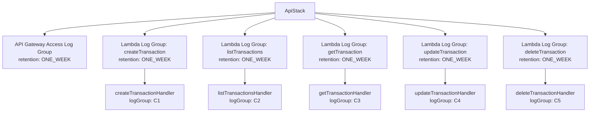

# Design Document: Log Retention Config

## Overview

This feature changes all CloudWatch Log Group retention periods to 1 week (7 days) across the CDK infrastructure. During the preview phase, logs don't need long-term storage, so reducing retention from the current `ONE_MONTH` (30 days) or default (never expire) to `ONE_WEEK` (7 days) minimizes storage costs.

The change is scoped to the `ApiStack`, which is the only stack that creates CloudWatch Log Groups. The other stacks (`AuthStack`, `DataStack`, `FrontendStack`) don't create log groups directly — their AWS services (Cognito, DynamoDB, Amplify) manage logging outside CDK control.

### Current State

| Log Group | Stack | Current Retention | Source |
|-----------|-------|-------------------|--------|
| `/aws/apigateway/laskifin-api` | ApiStack | `ONE_MONTH` (30 days) | Explicit `logs.LogGroup` |
| `/aws/lambda/laskifin-createTransaction` | ApiStack (implicit) | Never expire | Auto-created by AWS Lambda |
| `/aws/lambda/laskifin-listTransactions` | ApiStack (implicit) | Never expire | Auto-created by AWS Lambda |
| `/aws/lambda/laskifin-getTransaction` | ApiStack (implicit) | Never expire | Auto-created by AWS Lambda |
| `/aws/lambda/laskifin-updateTransaction` | ApiStack (implicit) | Never expire | Auto-created by AWS Lambda |
| `/aws/lambda/laskifin-deleteTransaction` | ApiStack (implicit) | Never expire | Auto-created by AWS Lambda |

### Target State

All 6 log groups will have `logs.RetentionDays.ONE_WEEK` (7 days) retention, with Lambda log groups explicitly defined in CDK to take control away from the implicit auto-creation.

## Architecture

The change is purely infrastructure-level within the `ApiStack`. No new stacks, services, or runtime code changes are needed.

### Design Decisions

1. **Explicit Lambda log groups over CDK `logRetention` prop**: The `NodejsFunction` construct supports a `logRetention` property, but it creates a custom resource (Lambda-backed) to set retention on the auto-created log group. Instead, we create explicit `logs.LogGroup` resources and pass them via the `logGroup` property. This is cleaner — no extra Lambda, no custom resource, and full CDK control over the log group lifecycle.

2. **`removalPolicy: DESTROY` on Lambda log groups**: Since these are preview-phase logs with 7-day retention, the log groups should be cleaned up when the stack is deleted. The existing API Gateway log group already uses `DESTROY`.

3. **Naming convention `/aws/lambda/<functionName>`**: Lambda log groups must follow this naming pattern to match what AWS Lambda expects. If the name doesn't match, Lambda will still auto-create its own log group alongside the explicit one.

## Components and Interfaces

### Modified Component: `ApiStack` (`infra/lib/api-stack.ts`)

**Changes:**
1. Update existing `apiLogGroup` retention from `ONE_MONTH` to `ONE_WEEK`
2. Create 5 new `logs.LogGroup` resources (one per Lambda function) with `ONE_WEEK` retention
3. Pass each log group to its corresponding `NodejsFunction` via the `logGroup` property

**Interface** — No changes to the `ApiStack` public interface (`ApiStackProps`, exported `restApi`). This is an internal-only change.

### Unchanged Components

- `AuthStack` — No log groups to configure
- `DataStack` — No log groups to configure
- `FrontendStack` — No log groups to configure
- All Lambda handler source code — No runtime changes needed
- `infra/bin/infra.ts` — No changes to stack instantiation

## Data Models

No data model changes. This feature only modifies CloudWatch Log Group configuration in the CDK infrastructure layer.

## Correctness Properties

*A property is a characteristic or behavior that should hold true across all valid executions of a system — essentially, a formal statement about what the system should do. Properties serve as the bridge between human-readable specifications and machine-verifiable correctness guarantees.*

### Property 1: All log groups use ONE_WEEK retention

*For any* CloudWatch Log Group resource (`AWS::Logs::LogGroup`) in the synthesized ApiStack template, the `RetentionInDays` property should equal `7`.

**Validates: Requirements 1.1, 1.2, 2.1, 3.1**

### Property 2: Lambda log groups follow naming convention and use DESTROY removal policy

*For any* Lambda-associated CloudWatch Log Group in the synthesized ApiStack template, the `LogGroupName` should match the pattern `/aws/lambda/<functionName>` where `<functionName>` corresponds to an existing Lambda function in the stack, AND the CloudFormation `DeletionPolicy` should be `Delete`.

**Validates: Requirements 2.3, 2.4**

### Property 3: Each Lambda function references its explicit log group

*For any* Lambda function (`AWS::Lambda::Function`) in the synthesized ApiStack template, its logging configuration should reference an explicitly defined log group resource rather than relying on AWS auto-creation.

**Validates: Requirements 2.2**

## Error Handling

This feature has minimal error surface since it's a CDK configuration change:

- **Naming mismatch**: If a Lambda log group name doesn't match `/aws/lambda/<functionName>`, Lambda will auto-create a second log group with infinite retention, defeating the purpose. The naming convention property (Property 2) guards against this.
- **Stack deletion**: With `removalPolicy: DESTROY`, log groups are deleted when the stack is torn down. This is intentional for preview phase. When moving to production, retention and removal policies should be revisited.
- **Existing log groups**: If log groups already exist in AWS from previous deployments (with different retention), CDK will update them in-place. CloudFormation handles this natively — no manual cleanup needed.

## Testing Strategy

### Unit Tests (CDK Assertions)

Use `aws-cdk-lib/assertions` `Template` to verify the synthesized CloudFormation template. These tests go in `infra/test/stacks.test.ts`.

Specific example tests:
- Verify the API Gateway log group `/aws/apigateway/laskifin-api` has `RetentionInDays: 7`
- Verify `AuthStack`, `DataStack`, and `FrontendStack` have zero `AWS::Logs::LogGroup` resources (Requirement 3.2)
- Verify the total count of `AWS::Logs::LogGroup` resources in ApiStack is 6 (1 API Gateway + 5 Lambda)

### Property-Based Tests

Use `fast-check` as the property-based testing library. Each property test must run a minimum of 100 iterations and reference its design document property.

- **Feature: log-retention-config, Property 1: All log groups use ONE_WEEK retention** — Generate random subsets of log group logical IDs from the template, verify each has `RetentionInDays: 7`.
- **Feature: log-retention-config, Property 2: Lambda log groups follow naming convention and use DESTROY removal policy** — For all Lambda log group resources, verify naming pattern and deletion policy.
- **Feature: log-retention-config, Property 3: Each Lambda function references its explicit log group** — For all Lambda function resources, verify they reference an explicit log group.

Note: Since CDK template synthesis is deterministic (same code → same template), the property-based tests here operate over the set of resources in the synthesized template rather than over randomly generated inputs. The "for all" quantification is over all resources of a given type in the template. `fast-check` can be used to sample and verify subsets, ensuring the properties hold universally.

### Test Configuration

- Testing framework: Jest (already configured in `infra/jest.config.js`)
- Property-based testing library: `fast-check`
- Minimum iterations per property test: 100
- Each property test must include a comment tag: `Feature: log-retention-config, Property {number}: {property_text}`
